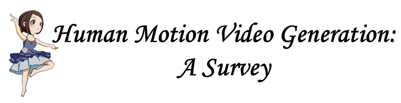
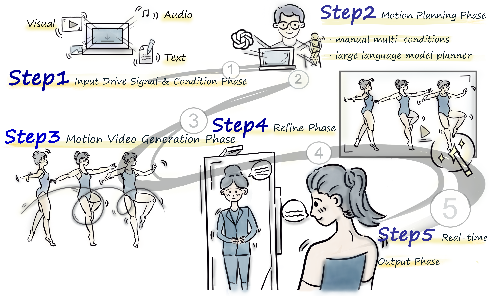
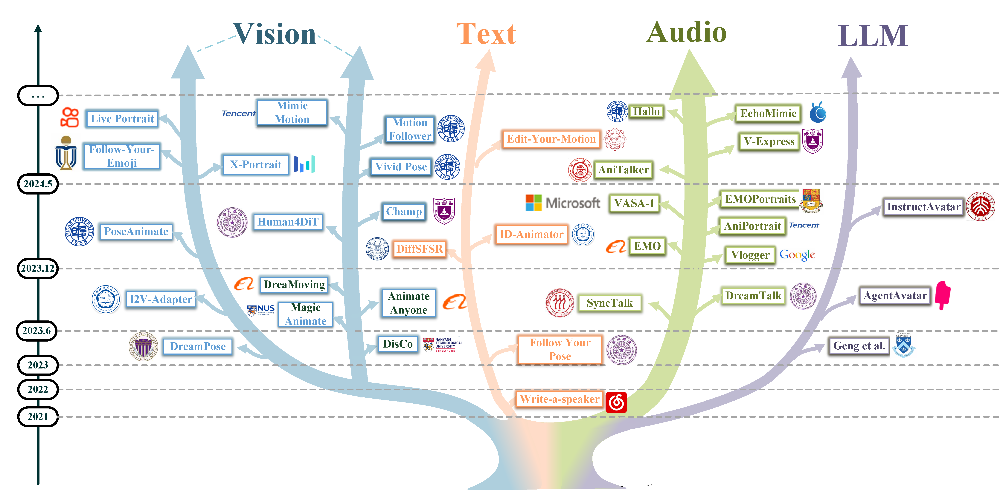

<h1 align="center">🎉 Awesome-Human-Motion-Video-Generation 🔥</h1>

---

<p align="center">
     <a href="assets/Human Motion Video Generation A Survey.pdf">

</p>

<p align="center">
<a href='assets/Human Motion Video Generation A Survey.pdf'>

</a>


<br>


<a href='https://zhuanlan.zhihu.com/p/2672965087'>

</a>
<br>
<br>
You can click on <b> Watch</b> and <b> Star</b> to get the latest updates at any time.
<br>
<br>
<b> Watch</b> Me ! <b> Watch</b> Me ! <b> Watch</b> Me ! 
<br>
<b> Star</b> Me ! <b> Star</b> Me ! <b> Star</b> Me !

---

<details><summary>🎁 >>>>>>>> [English Introduction] <<<<<<<<<< </summary>


> This project provides a thorough summary of the latest advancements in the field of 2D digital human motion video generation, covering papers, datasets, and code repositories.
> 
> The repository is organized into three main conditions: Vision-driven, Text-driven, and Audio-driven, while also considering LLM Planning Papers.
>
> Unlike previous summaries, this project clearly outlines the five key stages in the field of digital human video generation:
> 
> 🌑 Stage 1: Input Phase. Clarifying the driving source (Vision, Text, Audio) and driving region (Part, Holistic), where "Part" mainly refers to the face;
> 
> 🌒 Stage 2: Motion planning Phase. Most work involves feature mapping to learn motion mappings, while a few works use large language models (LLMs) for motion planning;
> 
> 🌓 Stage 3: Motion Video Generation Phase;
> 
> 🌔 Stage 4: Video Refinement Phase, focusing on optimizing specific parts such as the face, lips, teeth, and hands;
> 
> 🌕 Stage 5: Acceleration Phase, aiming to speed up training and deployment inference as much as possible, with the goal of achieving real-time output.
> 
> 🎉 We welcome everyone to contribute your research and submit PRs to collectively advance the technology of human motion video generation. 
> 
> If you have any questions, feel free to contact us at (**WinniyGD@outlook.com**), and we will respond as soon as possible. Additionally, we warmly welcome new members from related fields to join us, learn together, and make endless progress!

</details>


<details><summary>🏆 >>>>>>>> [🧡中文简要介绍💜] <<<<<<<<<< </summary>

<br>

> 
> 
> 本项目认真总结了👍2D数字人动作视频生成👏相关领域的最新进展，包括论文、数据集和代码库。
> 
> Repo以 Vision-driven、Text-driven、Audio-driven 三大方向作以总结，同时考虑 LLM Planning 前沿论文。
> 
> 分类时，我们定义Audio>Text>Vision优先级，当出现文本不出现音频时，归纳为Text-Driven方法，当文本音频同时出现时，归纳为Audio-Driven方法，以此类推。
> 
> 区别于以往的总结，项目明确总结了数字人视频生成领域的五大阶段：
> 
> 🌑 第1阶段 明确驱动源（Vision、Text、Audio）与驱动区域（Part、Holistic），其中Part主要以脸部为主；
> 
> 🌒 第2阶段 动作规划阶段，大多数工作以特征Mapping学习动作映射，少部分工作以大语言模型LLMs进行动作规划；
> 
> 🌓 第3阶段 人体视频生成，大部分工作以Diffusion Models为基础，少部分工作以Transformer为基础；
> 
> 🌔 第4阶段 视频优化阶段，针对脸部、嘴唇、牙齿、手部单独做Refinement优化；
> 
> 🌕 第5阶段 加速输出阶段，尽可能地加速训练与部署推理，目标Real-Time实时输出。

> 🔑本项目由六位核心成员全力推进：
> 
>     - 薛海威（清华大学，负责人）
>     - 罗向阳（清华大学）
>     - 胡璋昊（爱丁堡大学）
>     - 张鑫（西安交通大学）
>     - 向迅之（中国科学院大学）
>     - 戴语琴（南京理工大学）
> 
> 💖核心综述由以下老师全力支持并悉心指导：
> 
>     - 刘健庄老师（中国科学院深圳先进技术研究院）
>     - 张镇嵩博士（华为诺亚2012实验室）
>     - 李明磊博士（零一万物）
>     - 马飞博士（光明实验室）
>     - 吴志勇老师（清华大学/香港中文大学）


> 另外，非常感谢常恒师兄 ( https://github.com/SwiftieH )、余伟江师兄的支持！


> 🎉 欢迎大家贡献自己的研究成果并PR，共同推动人体运动视频生成技术的发展。
> 
> 如有任何问题，可以随时联系邮件（**WinniyGD@outlook.com**），我们会尽快回复。
> 
> 另外，我们非常欢迎有新的相关领域的同学一同加入我们，一起学习，无限进步！

</details>

---

<p align="center">
🍦 Exploring the latest papers in human motion video generation. 🍦
<br>
<br>
<br>

</p>

<br>


---


## Introduction

This work delves into Human Motion Video Generation, covering areas such as Portrait Animation, Dance Video Generation, Text2Face, Text2MotionVideo, and Talking Head. We believe this will be the most comprehensive survey to date on human motion video generation technologies. Please stay tuned! 😘😁😀

It's important to note that for the sake of clarity, we have excluded 3DGS and NeRF technologies (2D-3D-2D) from the scope of this paper.

### ✨You are welcome to provide us your work with a topic related to human motion video generation.✨

If you discover any missing work or have any suggestions, 

please feel free to submit a pull request or contact us ( WinniyGD@outlook.com ). 

We will promptly add the missing papers to this repository.

###  🍔 Highlight 

[1] We decompose human motion video generation into five key phases, covering all subtasks across various driving sources and body regions. To the best of our knowledge, this is the first survey to offer such a comprehensive framework for human motion video generation.

[2] We provide an in-depth analysis of human motion video generation from both motion planning and motion generation perspectives, a
dimension that has been underexplored in existing reviews.

[3] We clearly delineate established baselines and evaluation metrics, offering detailed insights into the key challenges shaping this field.

[4] We present a set of potential future research directions, aimed at inspiring and guiding researchers in the field of human motion video generation.

###  🕑 Timeline




## 🎁 Notes

We are excited to announce the upcoming launch of a new benchmark, including enhanced evaluation metrics, comprehensive datasets, and with a fast implementation for evaluation. However, due to the author's current graduation commitments and tight deadlines, we kindly ask for your patience as we work towards this release. Please stay tuned!


## 💙 News

**[2025/09/05][TOP] IMPORTANT NEWS**

Links:

Arxiv: https://arxiv.org/abs/2509.03883

IEEE Access: https://ieeexplore.ieee.org/document/11106267

Github Repo: https://github.com/Winn1y/Awesome-Human-Motion-Video-Generation

Huggingface link: https://huggingface.co/papers/2509.03883

------------

**[2025/07/26][TOP] IMPORTANT NEWS**

Our paper has been accepted by TPAMI.🎉🎉🎉🎉🎉 Stay tuned for our updates! Here we share the timeline:

🏁 May 30, 2024: Project launch

🏁 June 24, 2024: First draft completed

🏁 August 30, 2024: Final draft completed

🏁 September 1, 2024: Submission

🏁 December 12, 2024: First-round review comments returned

🏁 January 10, 2025: First-round rebuttal submitted

🏁 April 9, 2025: Second-round review comments returned

🏁 May 5, 2025: Second-round rebuttal submitted

🏁 July 26, 2025: Acceptance email received

----


**[2026/02/04] [V18.6 Vision](https://github.com/Winn1y/Awesome-Human-Motion-Video-Generation/): Update Methods.**

[](https://arxiv.org/abs/2602.03796) 3D-Aware Implicit Motion Control for View-Adaptive Human Video Generation (Text, Text2MotionVideo)  【快手科技 Kling 团队、清华大学、中国科学院自动化研究所 】


----


**[2026/02/03] [V18.5 Vision](https://github.com/Winn1y/Awesome-Human-Motion-Video-Generation/tree/18.5): Update Methods.**

[](https://arxiv.org/abs/2602.01538) Making Avatars Interact: Towards Text-Driven Human-Object Interaction for Controllable Talking Avatars (Audio, Audio-Driven Holistic Body Driving)  【清华大学、腾讯 HY 】

[](https://arxiv.org/abs/2602.00702) JoyAvatar: Unlocking Highly Expressive Avatars via Harmonized Text-Audio Conditioning (Audio, Audio-Driven Holistic Body Driving)  【京东科技 】

----


[2026/02/02] [V18.4 Vision](https://github.com/Winn1y/Awesome-Human-Motion-Video-Generation/tree/18.4): Update Methods.

[](https://arxiv.org/abs/2601.22501) MIRRORTALK: Forging Personalized Avatars Via Disentangled Style and Hierarchical Motion Control (Audio, Head Pose Driving)  【平安科技（深圳）有限公司、中国科学技术大学 】

----


[2026/01/29] [V18.3 Vision](https://github.com/Winn1y/Awesome-Human-Motion-Video-Generation/tree/18.3): Update Methods.

[](https://arxiv.org/abs/2601.20564) DiffVC-RT: Towards Practical Real-Time Diffusion-based Perceptual Neural Video Compression (Visual, Pose2Video)  【武汉大学遥感信息工程学院 】

[](https://arxiv.org/abs/2601.20511) Say Cheese! Detail-Preserving Portrait Collection Generation via Natural Language Edits (Text, Text2MotionVideo)  【中国人民大学高瓴人工智能学院 】

----


[2026/01/28] [V18.2 Vision](https://github.com/Winn1y/Awesome-Human-Motion-Video-Generation/tree/18.2): Update Methods.

[](https://arxiv.org/abs/2601.18849) Audio-Driven Talking Face Generation with Blink Embedding and Hash Grid Landmarks Encoding (Audio, Head Pose Driving)  【上海理工大学、英国格拉斯哥大学 】

----

[2026/01/27] [V18.1 Vision](https://github.com/Winn1y/Awesome-Human-Motion-Video-Generation/tree/18.1): Update Methods.

[](https://arxiv.org/abs/2601.17323) SkyReels-V3 Technique Report (Audio, Audio-Driven Holistic Body Driving)  【SkyReels 团队 】

----

[2026/01/26] [V18.0 Vision](https://github.com/Winn1y/Awesome-Human-Motion-Video-Generation/tree/18.0): Update Methods.

[](https://arxiv.org/abs/2601.16429) AlphaFace: High Fidelity and Real-time Face Swapper Robust to Facial Pose (Visual, Portrait Animation)  【ProjectG.AI、剑桥大学、肯特大学、清华大学、等】

----

[2026/01/22] [V17.9 Vision](https://github.com/Winn1y/Awesome-Human-Motion-Video-Generation/tree/17.9): Update Methods.

[](https://arxiv.org/abs/2601.15288) APPLE: Attribute-Preserving Pseudo-Labeling for Diffusion-Based Face Swapping (Visual, Portrait Animation)  【KAIST 人工智能研究所、三星公司 】

----

[2026/01/21] [V17.8 Vision](https://github.com/Winn1y/Awesome-Human-Motion-Video-Generation/tree/17.8): Update Methods.

[](https://arxiv.org/abs/2601.14250) OmniTransfer: All-in-one Framework for Spatio-temporal Video Transfer (Text, Text2MotionVideo)  【字节跳动智能创作实验室 】

[](https://arxiv.org/abs/2601.12876) Exploring Talking Head Models With Adjacent Frame Prior for Speech-Preserving Facial Expression Manipulation (Audio, Lip Synchronization)  【广东工业大学、北京大学、中山大学 】

----

[2026/01/16] [V17.7 Vision](https://github.com/Winn1y/Awesome-Human-Motion-Video-Generation/tree/17.7): Update Methods.

[](https://arxiv.org/abs/2601.10214) Beyond Inpainting: Unleash 3D Understanding for Precise Camera-Controlled Video Generation (Text, Text2MotionVideo)  【清华大学计算机科学与技术系、BNRist 实验室 】

[](https://arxiv.org/abs/2601.10103) FlowAct-R1: Towards Interactive Humanoid Video Generation (Audio, Audio-Driven Holistic Body Driving)  【字节跳动智能创作部门 】

----

[2026/01/07] [V17.6 Vision](https://github.com/Winn1y/Awesome-Human-Motion-Video-Generation/tree/17.6): Update Methods. Happy New Year!🎈🎈🎈

[](https://arxiv.org/abs/2601.02785) DreamStyle: A Unified Framework for Video Stylization (Visual, Pose2Video)  【字节跳动智能创作实验室 】


----


[2026/01/06] [V17.5 Vision](https://github.com/Winn1y/Awesome-Human-Motion-Video-Generation/tree/17.5): Update Methods. Happy New Year!🎈🎈🎈


[](https://arxiv.org/abs/2601.02107) MagicFight: Personalized Martial Arts Combat Video Generation (Visual, Pose2Video)  【深圳先进技术研究院、中国电信云技术有限公司、深圳理工大学 】

[](https://arxiv.org/abs/2601.01847) ESGaussianFace: Emotional and Stylized Audio-Driven Facial Animation via 3D Gaussian Splatting (Audio, Fine-Grained Style and Emotion-Driven Animation)  【上海交通大学、微软亚洲研究院 】

[](https://arxiv.org/abs/2601.01425) DreamID-V:Bridging the Image-to-Video Gap for High-Fidelity Face Swapping via Diffusion Transformer (Visual, Portrait Animation)  【清华大学、字节跳动智能创作实验室 】

[](https://arxiv.org/abs/2601.01352) Slot-ID: Identity-Preserving Video Generation from Reference Videos via Slot-Based Temporal Identity Encoding (Text, Text2Face)  【浙江大学 CAD&CG 国家重点实验室、伦敦大学学院计算机科学系 】


----


[2026/01/02] [V17.4 Vision](https://github.com/Winn1y/Awesome-Human-Motion-Video-Generation/tree/17.4): Update Methods. Happy New Year!🎈🎈🎈


[](https://arxiv.org/abs/2601.00664) Avatar Forcing: Real-Time Interactive Head Avatar Generation for Natural Conversation (Audio, Audio-Driven Holistic Body Driving)


----


[2026/01/01] [V17.3 Vision](https://github.com/Winn1y/Awesome-Human-Motion-Video-Generation/tree/17.3): Update Methods. Happy New Year!🎈🎈🎈


[](https://arxiv.org/abs/2512.25066) From Inpainting to Editing: A Self-Bootstrapping Framework for Context-Rich Visual Dubbing (Audio, Lip Synchronization)

[](https://arxiv.org/abs/2512.24408) DyStream: Streaming Dyadic Talking Heads Generation via Flow Matching-based Autoregressive Model (Audio, Lip Synchronization)

----


[2025/12/31] [V17.2 Vision](https://github.com/Winn1y/Awesome-Human-Motion-Video-Generation/tree/17.2): Update Methods.


[](https://arxiv.org/abs/2512.23576) LiveTalk: Real-Time Multimodal Interactive Video Diffusion via Improved On-Policy Distillation (Audio, Audio-Driven Holistic Body Driving)

[](https://arxiv.org/abs/2512.23379) SoulX-LiveTalk Technical Report (Audio, Audio-Driven Holistic Body Driving)

[](https://arxiv.org/abs/2512.22854) ByteLoom: Weaving Geometry-Consistent Human-Object Interactions through Progressive Curriculum Learning (Audio, Audio-Driven Holistic Body Driving)

[](https://arxiv.org/abs/2512.22310) MoFu: Scale-Aware Modulation and Fourier Fusion for Multi-Subject Video Generation (Visual, Pose2Video)

----

[2025/12/29] [V17.1 Vision](https://github.com/Winn1y/Awesome-Human-Motion-Video-Generation/tree/17.1): Update Methods.


[](https://arxiv.org/abs/2512.22065) StreamAvatar: Streaming Diffusion Models for Real-Time Interactive Human Avatars (Audio, Audio-Driven Holistic Body Driving)

[](https://arxiv.org/abs/2512.21734) Knot Forcing: Taming Autoregressive Video Diffusion Models for Real-time Infinite Interactive Portrait Animation (Audio, Audio-Driven Holistic Body Driving)

[](https://arxiv.org/abs/2512.21905) High-Fidelity and Long-Duration Human Image Animation with Diffusion Transformer (Visual, Pose-Guided Dance Video Generation)

[](https://arxiv.org/abs/2512.21736) SyncAnyone: Implicit Disentanglement via Progressive Self-Correction for Lip-Syncing in the wild (Audio, Lip Synchronization)

----


[2025/12/24] [V17.0 Vision](https://github.com/Winn1y/Awesome-Human-Motion-Video-Generation/tree/17.0): Update Methods.


[](https://arxiv.org/abs/2512.20340) The devil is in the details: Enhancing Video Virtual Try-On via Keyframe-Driven Details Injection (Visual, Try-On Video Generation)

[](https://arxiv.org/abs/2512.20296) TAVID: Text-Driven Audio-Visual Interactive Dialogue Generation (Audio, Lip Synchronization)

----

[2025/12/23] [V16.9 Vision](https://github.com/Winn1y/Awesome-Human-Motion-Video-Generation/tree/16.9): Update Methods.


[](https://arxiv.org/abs/2512.19546) ActAvatar: Temporally-Aware Precise Action Control for Talking Avatars (Audio, Audio-Driven Holistic Body Driving)

[](https://arxiv.org/abs/2512.18772) In-Context Audio Control of Video Diffusion Transformers (Audio, Audio-Driven Holistic Body Driving)

[](https://arxiv.org/abs/2512.18181) MACE-Dance: Motion-Appearance Cascaded Experts for Music-Driven Dance Video Generation (Audio, Audio-Driven Holistic Body Driving)

[](https://arxiv.org/abs/2512.18814) EchoMotion: Unified Human Video and Motion Generation via Dual-Modality Diffusion Transformer (Text, Text2MotionVideo)


----

[2025/12/22] [V16.8 Vision](https://github.com/Winn1y/Awesome-Human-Motion-Video-Generation/tree/16.8): Update Methods.


[](https://arxiv.org/abs/2512.17331) SynergyWarpNet: Attention-Guided Cooperative Warping for Neural Portrait Animation (Visual, Portrait Animation)


----


[2025/12/19] [V16.7 Vision](https://github.com/Winn1y/Awesome-Human-Motion-Video-Generation/tree/16.7): Update Methods.


[](https://arxiv.org/abs/2512.16900) FlashPortrait: 6x Faster Infinite Portrait Animation with Adaptive Latent Prediction (Visual, Portrait Animation)

[](https://arxiv.org/abs/2512.16360) EverybodyDance: Bipartite Graph-Based Identity Correspondence for Multi-Character Animation (Visual, Pose-Guided Dance Video Generation)


----


[2025/12/18] [V16.6 Vision](https://github.com/Winn1y/Awesome-Human-Motion-Video-Generation/tree/16.6): Update Methods.


[](https://arxiv.org/abs/2512.15524) DeX-Portrait: Disentangled and Expressive Portrait Animation via Explicit and Latent Motion Representations (Visual, Portrait Animation)

[](https://arxiv.org/abs/2512.14542) HiFi-Portrait: Zero-shot Identity-preserved Portrait Generation with High-fidelity Multi-face Fusion (Visual, Portrait Animation)

[](https://arxiv.org/abs/2512.14938) TalkVerse: Democratizing Minute-Long Audio-Driven Video Generation (Audio, Head Pose Driving)

[](https://arxiv.org/abs/2512.14056) FacEDiT: Unified Talking Face Editing and Generation via Facial Motion Infilling (Audio, Head Pose Driving)


----


[2025/12/16] [V16.5 Vision](https://github.com/Winn1y/Awesome-Human-Motion-Video-Generation/tree/16.5): Update Methods.


[](https://arxiv.org/abs/2512.13495) Soul: Breathe Life into Digital Human for High-fidelity Long-term Multimodal Animation (Visual, Pose2Video)

[](https://arxiv.org/abs/2512.13465) PoseAnything: Universal Pose-guided Video Generation with Part-aware Temporal Coherence (Visual, Pose2Video)

[](https://arxiv.org/abs/2512.13313) KlingAvatar 2.0 Technical Report (Audio, Audio-Driven Holistic Body Driving)

[](https://arxiv.org/abs/2512.13247) STARCaster: Spatio-Temporal AutoRegressive Video Diffusion for Identity- and View-Aware Talking Portraits (Audio, Head Pose Driving)


----


[2025/12/15] [V16.4 Vision](https://github.com/Winn1y/Awesome-Human-Motion-Video-Generation/tree/16.4): Update Methods.


[](https://arxiv.org/abs/2512.11423) JoyAvatar: Real-time and Infinite Audio-Driven Avatar Generation with Autoregressive Diffusion (Audio, Head Pose Driving)

[](https://arxiv.org/abs/2512.11229) REST: Diffusion-based Real-time End-to-end Streaming Talking Head Generation via ID-Context Caching and Asynchronous Streaming Distillation (Audio, Head Pose Driving)

[](https://arxiv.org/abs/2512.11253) PersonaLive! Expressive Portrait Image Animation for Live Streaming (Visual, Portrait Animation)


----

[2025/12/09] [V16.3 Vision](https://github.com/Winn1y/Awesome-Human-Motion-Video-Generation/tree/16.3): Update Methods.


[](https://arxiv.org/abs/2512.07720) ViSA: 3D-Aware Video Shading for Real-Time Upper-Body Avatar Creation (Visual, Pose2Video)


----

[2025/12/08] [V16.2 Vision](https://github.com/Winn1y/Awesome-Human-Motion-Video-Generation/tree/16.2): Update Methods.


[](https://arxiv.org/abs/2512.05905) SCAIL: Towards Studio-Grade Character Animation via In-Context Learning of 3D-Consistent Pose Representations (Visual, Pose2Video)


----

[2025/12/05] [V16.1 Vision](https://github.com/Winn1y/Awesome-Human-Motion-Video-Generation/tree/16.1): Update Methods.


[](https://arxiv.org/abs/2512.04677) Live Avatar: Streaming Real-time Audio-Driven Avatar Generation with Infinite Length (Audio, Audio-Driven Holistic Body Driving)


----


[2025/12/04] [V16.0 Vision](https://github.com/Winn1y/Awesome-Human-Motion-Video-Generation/tree/16.0): Update Methods.


[](https://arxiv.org/abs/2512.03918) UniMo: Unifying 2D Video and 3D Human Motion with an Autoregressive Framework (Visual, Pose2Video)


----


[2025/12/03] [V15.9 Vision](https://github.com/Winn1y/Awesome-Human-Motion-Video-Generation/tree/15.9): Update Methods.


[](https://arxiv.org/abs/2512.02576) Co-speech Gesture Video Generation via Motion-Based Graph Retrieval (Audio, Audio-Driven Holistic Body Driving)

[](https://arxiv.org/abs/2512.02492) YingVideo-MV: Music-Driven Multi-Stage Video Generation (Audio, Audio-Driven Holistic Body Driving)


----


[2025/12/02] [V15.8 Vision](https://github.com/Winn1y/Awesome-Human-Motion-Video-Generation/tree/15.8): Update Methods.


[](https://arxiv.org/abs/2512.01340) EvalTalker: Learning to Evaluate Real-Portrait-Driven Multi-Subject Talking Humans (Audio, Audio-Driven Holistic Body Driving)

[](https://arxiv.org/abs/2512.00909) TalkingPose: Efficient Face and Gesture Animation with Feedback-guided Diffusion Model (Audio, Audio-Driven Holistic Body Driving)


----


[2025/12/01] [V15.7 Vision](https://github.com/Winn1y/Awesome-Human-Motion-Video-Generation/tree/15.7): Update Methods.


[](https://arxiv.org/abs/2511.22940) One-to-All Animation: Alignment-Free Character Animation and Image Pose Transfer (Visual, Pose2Video)

[](https://arxiv.org/abs/2511.22167) IMTalker: Efficient Audio-driven Talking Face Generation with Implicit Motion Transfer (Audio, Head Pose Driving)

[](https://arxiv.org/abs/2511.23475) AnyTalker: Scaling Multi-Person Talking Video Generation with Interactivity Refinement (Audio, Audio-Driven Holistic Body Driving)


----


[2025/11/25] [V15.6 Vision](https://github.com/Winn1y/Awesome-Human-Motion-Video-Generation/tree/15.6): Update Methods.


[](https://arxiv.org/abs/2511.19320) SteadyDancer: Harmonized and Coherent Human Image Animation with First-Frame Preservation (Visual, Pose-Guided Dance Video Generation)

[](https://arxiv.org/abs/2511.18957) Eevee: Towards Close-up High-resolution Video-based Virtual Try-on (Visual, Try-On Video Generation)


----

[2025/11/11] [V15.5 Vision](https://github.com/Winn1y/Awesome-Human-Motion-Video-Generation/tree/15.5): Update Methods.


[](https://arxiv.org/abs/2511.06833) ConsistTalk: Intensity Controllable Temporally Consistent Talking Head Generation with Diffusion Noise Search (Audio, Head Pose Driving)

----


<details><summary> Historical Update. </summary>


----


[2025/11/10] [V15.4 Vision](https://github.com/Winn1y/Awesome-Human-Motion-Video-Generation/tree/15.4): Update Methods.


[](https://arxiv.org/abs/2511.05432) Shared Latent Representation for Joint Text-to-Audio-Visual Synthesis (Audio, Lip Synchronization)


----


[2025/11/04] [V15.3 Vision](https://github.com/Winn1y/Awesome-Human-Motion-Video-Generation/tree/15.3): Update Methods.


[](https://arxiv.org/abs/2511.00511) ID-Composer: Multi-Subject Video Synthesis with Hierarchical Identity Preservation (Visual, Pose2Video)

[](https://arxiv.org/abs/2511.00293) Multi-View Consistent Human Image Customization via In-Context Learning (Visual, Pose2Video)


----


[2025/11/03] [V15.2 Vision](https://github.com/Winn1y/Awesome-Human-Motion-Video-Generation/tree/15.2): Update Methods.


[](https://arxiv.org/abs/2510.26819) See the Speaker: Crafting High-Resolution Talking Faces from Speech with Prior Guidance and Region Refinement (Audio, Lip Synchronization)


----


[2025/10/28] [V15.1 Vision](https://github.com/Winn1y/Awesome-Human-Motion-Video-Generation/tree/15.1): Update Methods.


[](https://arxiv.org/abs/2510.22810) MAGIC-Talk: Motion-aware Audio-Driven Talking Face Generation with Customizable Identity Control (Audio, Head Pose Driving)

[](https://arxiv.org/abs/2510.23581) Lookahead Anchoring: Preserving Character Identity in Audio-Driven Human Animation (Audio, Head Pose Driving)


----

[2025/10/21] [V15.0 Vision](https://github.com/Winn1y/Awesome-Human-Motion-Video-Generation/tree/15.0): Update Methods.


[](https://arxiv.org/abs/2510.16833) From Mannequin to Human: A Pose-Aware and Identity-Preserving Video Generation Framework for Lifelike Clothing Display (Visual, Try-On Video Generation)


----


[2025/10/17] [V14.9 Vision](https://github.com/Winn1y/Awesome-Human-Motion-Video-Generation/tree/14.9): Update Methods.


[](https://arxiv.org/abs/2510.14255) Identity-Preserving Image-to-Video Generation via Reward-Guided Optimization (Visual, Pose2Video)


----


[2025/10/15] [V14.8 Vision](https://github.com/Winn1y/Awesome-Human-Motion-Video-Generation/tree/14.8): Update Methods.


[](https://arxiv.org/abs/2510.12089) Playmate2: Training-Free Multi-Character Audio-Driven Animation via Diffusion Transformer with Reward Feedback (Audio, Audio-Driven Holistic Body Driving)


----


[2025/10/14] [V14.7 Vision](https://github.com/Winn1y/Awesome-Human-Motion-Video-Generation/tree/14.7): Update Methods.


[](https://arxiv.org/abs/2510.10650) DEMO: Disentangled Motion Latent Flow Matching for Fine-Grained Controllable Talking Portrait Synthesis (Audio, Head Pose Driving)

[](https://arxiv.org/abs/2510.10269) VividAnimator: An End-to-End Audio and Pose-driven Half-Body Human Animation Framework (Audio, Audio-Driven Holistic Body Driving)


----


[2025/10/12] [V14.6 Vision](https://github.com/Winn1y/Awesome-Human-Motion-Video-Generation/tree/14.6): Update Methods.


[](https://arxiv.org/abs/2510.07654) Once Is Enough: Lightweight DiT-Based Video Virtual Try-On via One-Time Garment Appearance Injection (Visual, Try-On Video Generation)


----

[2025/10/09] [V14.5 Vision](https://github.com/Winn1y/Awesome-Human-Motion-Video-Generation/tree/14.5): Update Methods.


[](https://arxiv.org/abs/2510.06612) A Bridge from Audio to Video: Phoneme-Viseme Alignment Allows Every Face to Speak Multiple Languages (Audio, Head Pose Driving)


----


[2025/10/06] [V14.4 Vision](https://github.com/Winn1y/Awesome-Human-Motion-Video-Generation/tree/14.4): Update Methods.


[](https://arxiv.org/abs/2510.02617) Input-Aware Sparse Attention for Real-Time Co-Speech Video Generation (Audio, Audio-Driven Holistic Body Driving)


----


[2025/10/03] [V14.3 Vision](https://github.com/Winn1y/Awesome-Human-Motion-Video-Generation/tree/14.3): Update Methods.


[](https://arxiv.org/abs/2510.01176) Audio Driven Real-Time Facial Animation for Social Telepresence (Audio, Head Pose Driving)


----

[2025/09/30] [V14.2 Vision](https://github.com/Winn1y/Awesome-Human-Motion-Video-Generation/tree/14.2): Update Methods.


[](https://arxiv.org/abs/2509.21887) StableDub: Taming Diffusion Prior for Generalized and Efficient Visual Dubbing (Audio, Lip Synchronization)

[](https://arxiv.org/abs/2509.21574) X-Streamer: Unified Human World Modeling with Audiovisual Interaction (Audio, Head Pose Driving)

[](https://arxiv.org/abs/2509.21541) ControlHair: Physically-based Video Diffusion for Controllable Dynamic Hair Rendering (Visual, Pose2Video)


----


[2025/09/26] [V14.1 Vision](https://github.com/Winn1y/Awesome-Human-Motion-Video-Generation/tree/14.1): Update Methods.


[](https://arxiv.org/abs/2509.19965) SynchroRaMa : Lip-Synchronized and Emotion-Aware Talking Face Generation via Multi-Modal Emotion Embedding (Audio, Head Pose Driving)

[](https://arxiv.org/abs/2509.19749) Talking Head Generation via AU-Guided Landmark Prediction (Audio, Head Pose Driving)

[](https://arxiv.org/abs/2509.20128) KSDiff: Keyframe-Augmented Speech-Aware Dual-Path Diffusion for Facial Animation (Audio, Head Pose Driving)


----

[2025/09/23] [V14.0 Vision](https://github.com/Winn1y/Awesome-Human-Motion-Video-Generation/): Update Methods.


[](https://arxiv.org/abs/2509.17476) Stable Video-Driven Portraits (Visual, Portrait Animation)

[](https://arxiv.org/abs/2509.16630) Follow-Your-Emoji-Faster: Towards Efficient, Fine-Controllable, and Expressive Freestyle Portrait Animation (Visual, Portrait Animation)


----


[2025/09/18] [V13.9 Vision](https://github.com/Winn1y/Awesome-Human-Motion-Video-Generation/tree/13.9): Update Methods.


[](https://arxiv.org/abs/2509.14055) Wan-Animate: Unified Character Animation and Replacement with Holistic Replication (Visual, Pose2Video)


----


[2025/09/16] [V13.8 Vision](https://github.com/Winn1y/Awesome-Human-Motion-Video-Generation/tree/13.8): Update Methods.


[](https://arxiv.org/abs/2509.12052) AvatarSync: Rethinking Talking-Head Animation through Autoregressive Perspective (Audio, Head Pose Driving)


----

[2025/09/12] [V13.7 Vision](https://github.com/Winn1y/Awesome-Human-Motion-Video-Generation/tree/13.7): Update Methods.


[](https://arxiv.org/abs/2509.09595) Kling-Avatar: Grounding Multimodal Instructions for Cascaded Long-Duration Avatar Animation Synthesis (Audio, Audio-Driven Holistic Body Driving)


----


[2025/09/05] [V13.6 Vision](https://github.com/Winn1y/Awesome-Human-Motion-Video-Generation/tree/13.6): Update Methods.


[](https://arxiv.org/abs/2509.01362) Identity-Preserving Text-to-Video Generation via Training-Free Prompt, Image, and Guidance Enhancement (Text, Text2Motion)


----


[2025/08/27] [V13.5 Vision](https://github.com/Winn1y/Awesome-Human-Motion-Video-Generation/tree/13.5): Update Methods.


[](https://arxiv.org/abs/2508.17404) MoCo: Motion-Consistent Human Video Generation via Structure-Appearance Decoupling (Visual, Pose2Video)


----

[2025/08/21] [V13.4 Vision](https://github.com/Winn1y/Awesome-Human-Motion-Video-Generation/tree/13.4): Update Methods.


[](https://arxiv.org/abs/2508.14359) Taming Transformer for Emotion-Controllable Talking Face Generation (Audio, Head Pose Driving)


----

[2025/08/20] [V13.3 Vision](https://github.com/Winn1y/Awesome-Human-Motion-Video-Generation/tree/13.3): Update Methods.

[](https://arxiv.org/abs/2508.14033) InfiniteTalk: Audio-driven Video Generation for Sparse-Frame Video Dubbing (Audio, Audio-Driven Holistic Body Driving)

[](https://arxiv.org/abs/2508.13442) EDTalk++: Full Disentanglement for Controllable Talking Head Synthesis (Audio, Head Pose Driving)


----

[2025/08/19] [V13.2 Vision](https://github.com/Winn1y/Awesome-Human-Motion-Video-Generation/tree/13.2): Update Methods.

[](https://arxiv.org/abs/2508.12163) RealTalk: Realistic Emotion-Aware Lifelike Talking-Head Synthesis (Audio, Head Pose Driving)


----

[2025/08/18] [V13.1 Vision](https://github.com/Winn1y/Awesome-Human-Motion-Video-Generation/tree/13.1): Update Methods.

[](https://arxiv.org/abs/2508.11255) FantasyTalking2: Timestep-Layer Adaptive Preference Optimization for Audio-Driven Portrait Animation (Audio, Audio-Driven Holistic Body Driving)


----

[2025/08/16] [V13.0 Vision](https://github.com/Winn1y/Awesome-Human-Motion-Video-Generation/tree/13.0): Update Methods.

[](https://arxiv.org/abs/2508.10566) HM-Talker: Hybrid Motion Modeling for High-Fidelity Talking Head Synthesis (Audio, Head Pose Driving)


----


[2025/08/14] [V12.9 Vision](https://github.com/Winn1y/Awesome-Human-Motion-Video-Generation/tree/12.9): Update Methods.

[](https://arxiv.org/abs/2508.09959) LIA-X: Interpretable Latent Portrait Animator (Visual, Portrait Animation)

[](https://arxiv.org/abs/2508.09858) HumanGenesis: Agent-Based Geometric and Generative Modeling for Synthetic Human Dynamics (Visual, Pose2Video)

[](https://arxiv.org/abs/2508.09476) From Large Angles to Consistent Faces: Identity-Preserving Video Generation via Mixture of Facial Experts (Text, Text2MotionVideo)

[](https://arxiv.org/abs/2508.09454) Animate-X++: Universal Character Image Animation with Dynamic Backgrounds (Visual, Pose2Video)

[](https://arxiv.org/abs/2508.09383) X-UniMotion: Animating Human Images with Expressive, Unified and Identity-Agnostic Motion Latents (Visual, Pose2Video)


----


[2025/08/13] [V12.8 Vision](https://github.com/Winn1y/Awesome-Human-Motion-Video-Generation/tree/12.8): Update Methods.

[](https://arxiv.org/abs/2508.07597) ShoulderShot: Generating Over-the-Shoulder Dialogue Videos (Text, Text2MotionVideo)

[](https://arxiv.org/abs/2508.07901) Stand-In: A Lightweight and Plug-and-Play Identity Control for Video Generation (Text, Text2MotionVideo)

[](https://arxiv.org/abs/2508.07603) LaVieID: Local Autoregressive Diffusion Transformers for Identity-Preserving Video Creation (Text, Text2MotionVideo)

[](https://arxiv.org/abs/2508.06511) DiTalker: A Unified DiT-based Framework for High-Quality and Speaking Styles Controllable Portrait Animation (Audio, Head Pose Driving)

[](https://arxiv.org/abs/2508.08248) StableAvatar: Infinite-Length Audio-Driven Avatar Video Generation (Audio, Head Pose Driving)

[](https://arxiv.org/abs/2508.05982) AnimateScene: Camera-controllable Animation in Any Scene (Visual, Pose2Video)

[](https://arxiv.org/abs/2508.08588) RealisMotion: Decomposed Human Motion Control and Video Generation in the World Space (Visual, Pose2Video)


----


[2025/08/08] [V12.7 Vision](https://github.com/Winn1y/Awesome-Human-Motion-Video-Generation/tree/12.7): Update Methods.

[](https://arxiv.org/abs/2508.05115) RAP: Real-time Audio-driven Portrait Animation with Video Diffusion Transformer (Audio, Head Pose Driving)


----


[2025/08/07] [V12.6 Vision](https://github.com/Winn1y/Awesome-Human-Motion-Video-Generation/tree/12.6): Update Methods.

[](https://arxiv.org/abs/2508.04049) Motion is the Choreographer: Learning Latent Pose Dynamics for Seamless Sign Language Generation (Visual, Pose2Video)


----

[2025/08/06] [V12.5 Vision](https://github.com/Winn1y/Awesome-Human-Motion-Video-Generation/tree/12.5): Update Methods.

[](https://arxiv.org/abs/2508.03457) READ: Real-time and Efficient Asynchronous Diffusion for Audio-driven Talking Head Generation (Audio, Head Pose Driving)

[](https://arxiv.org/abs/2508.02944) X-Actor: Emotional and Expressive Long-Range Portrait Acting from Audio (Audio, Head Pose Driving)

[](https://arxiv.org/abs/2508.03034) MoCA: Identity-Preserving Text-to-Video Generation via Mixture of Cross Attention (Text, Text2Face)

[](https://arxiv.org/abs/2508.02807) DreamVVT: Mastering Realistic Video Virtual Try-On in the Wild via a Stage-Wise Diffusion Transformer Framework (Visual, Try-On)


----

[2025/08/05] [V12.4 Vision](https://github.com/Winn1y/Awesome-Human-Motion-Video-Generation/tree/12.4): Update Methods.

[](https://arxiv.org/abs/2508.02362) Text2Lip: Progressive Lip-Synced Talking Face Generation from Text via Viseme-Guided Rendering (Text, Text2Face)


----

[2025/08/01] [V12.3 Vision](https://github.com/Winn1y/Awesome-Human-Motion-Video-Generation/tree/12.3): Update Methods.

[](https://arxiv.org/abs/2507.23143) X-NeMo: Expressive Neural Motion Reenactment via Disentangled Latent Attention (Visual, Portrait Animation)


----

[2025/07/29] [V12.2 Vision](https://github.com/Winn1y/Awesome-Human-Motion-Video-Generation/tree/12.2): Update Methods.

[](https://arxiv.org/abs/2507.20953) Mask-Free Audio-driven Talking Face Generation for Enhanced Visual Quality and Identity Preservation (Audio, Head Pose Driving)

[](https://arxiv.org/abs/2507.19836) ChoreoMuse: Robust Music-to-Dance Video Generation with Style Transfer and Beat-Adherent Motion (Audio, Audio-Driven Holistic Body Driving)


----


[2025/07/28] [V12.1 Vision](https://github.com/Winn1y/Awesome-Human-Motion-Video-Generation/tree/12.1): Update Methods.

[](https://arxiv.org/abs/2507.18649) Livatar-1: Real-Time Talking Heads Generation with Tailored Flow Matching (Audio, Head Pose Driving)

[](https://arxiv.org/abs/2507.19225) Face2VoiceSync: Lightweight Face-Voice Consistency for Text-Driven Talking Face Generation (Audio, Head Pose Driving)


----


[2025/07/24] [V12.0 Vision](https://github.com/Winn1y/Awesome-Human-Motion-Video-Generation/tree/12.0): Update Methods.

[](https://arxiv.org/abs/2507.17327) CartoonAlive: Towards Expressive Live2D Modeling from Single Portraits (Visual, Portrait Animation)


----


[2025/07/23] [V11.9 Vision](https://github.com/Winn1y/Awesome-Human-Motion-Video-Generation/tree/11.9): Update Methods.

[](https://arxiv.org/abs/2507.16813) HOComp: Interaction-Aware Human-Object Composition (Visual, Pose2Video)

[](https://arxiv.org/abs/2507.16341) Navigating Large-Pose Challenge for High-Fidelity Face Reenactment with Video Diffusion Model (Visual, Portrait Animation)


----


[2025/07/22] [V11.8 Vision](https://github.com/Winn1y/Awesome-Human-Motion-Video-Generation/tree/11.8): Update Methods.

[](https://arxiv.org/abs/2507.15064) StableAnimator++: Overcoming Pose Misalignment and Face Distortion for Human Image Animation (Visual, Pose-Guided Dance Video Generation)


----

[2025/07/20] [V11.7 Vision](https://github.com/Winn1y/Awesome-Human-Motion-Video-Generation/tree/11.7): Update Methods.

[](https://arxiv.org/abs/2507.12956) FantasyPortrait: Enhancing Multi-Character Portrait Animation with Expression-Augmented Diffusion Transformers (Text, Text2Face)

[](https://arxiv.org/abs/2507.12804) ATL-Diff: Audio-Driven Talking Head Generation with Early Landmarks-Guide Noise Diffusion (Audio, Head Pose Driving)

[](https://arxiv.org/abs/2507.12761) Think-Before-Draw: Decomposing Emotion Semantics & Fine-Grained Controllable Expressive Talking Head Generation (Audio, Head Pose Driving)

[](https://arxiv.org/abs/2507.08307) M2DAO-Talker: Harmonizing Multi-granular Motion Decoupling and Alternating Optimization for Talking-head Generation (Audio, Head Pose Driving)

[](https://arxiv.org/abs/2507.12758) HairShifter: Consistent and High-Fidelity Video Hair Transfer via Anchor-Guided Animation (Visual, Portrait Animation)


----


[2025/07/12] [V11.6 Vision](https://github.com/Winn1y/Awesome-Human-Motion-Video-Generation/tree/11.6): Update Methods.

[](https://arxiv.org/abs/2507.07591) Stable-Hair v2: Real-World Hair Transfer via Multiple-View Diffusion Model (Visual, Portrait Animation)


----

[2025/07/10] [V11.5 Vision](https://github.com/Winn1y/Awesome-Human-Motion-Video-Generation/tree/11.5): Update Methods.

[](https://arxiv.org/abs/2507.06812) Democratizing High-Fidelity Co-Speech Gesture Video Generation (Audio, Audio-Driven Holistic Body Driving)


----


[2025/07/09] [V11.4 Vision](https://github.com/Winn1y/Awesome-Human-Motion-Video-Generation/tree/11.4): Update Methods.

[](https://arxiv.org/abs/2507.06071) MEDTalk: Multimodal Controlled 3D Facial Animation with Dynamic Emotions by Disentangled Embedding (Audio, Head Pose Driving)


----

[2025/07/08] [V11.3 Vision](https://github.com/Winn1y/Awesome-Human-Motion-Video-Generation/tree/11.3): Update Methods.

[](https://arxiv.org/abs/2507.05092) MoDiT: Learning Highly Consistent 3D Motion Coefficients with Diffusion Transformer for Talking Head Generation (Audio, Head Pose Driving)

[](https://arxiv.org/abs/2507.03256) MoDA: Multi-modal Diffusion Architecture for Talking Head Generation (Audio, Head Pose Driving)

[](https://arxiv.org/abs/2507.03905) EchoMimicV3: 1.3B Parameters are All You Need for Unified Multi-Modal and Multi-Task Human Animation (Audio, Audio-Driven Holistic Body Driving)

[](https://arxiv.org/abs/2507.04705) Identity-Preserving Text-to-Video Generation Guided by Simple yet Effective Spatial-Temporal Decoupled Representations (Text, Text2MotionVideo)


----


[2025/07/04] [V11.2 Vision](https://github.com/Winn1y/Awesome-Human-Motion-Video-Generation/tree/11.2): Update Methods.

[](https://arxiv.org/abs/2507.02691) CanonSwap: High-Fidelity and Consistent Video Face Swapping via Canonical Space Modulation (Visual, Portrait Animation)


----


[2025/07/03] [V11.1 Vision](https://github.com/Winn1y/Awesome-Human-Motion-Video-Generation/tree/11.1): Update Methods.

[](https://arxiv.org/abs/2507.01390) FixTalk: Taming Identity Leakage for High-Quality Talking Head Generation in Extreme Cases (Audio, Head Pose Driving)

[](https://arxiv.org/abs/2507.00472) ARIG: Autoregressive Interactive Head Generation for Real-time Conversations (Audio, Head Pose Driving)

[](https://arxiv.org/abs/2506.23552) JAM-Flow: Joint Audio-Motion Synthesis with Flow Matching (Audio, Head Pose Driving)

[](https://arxiv.org/abs/2506.21513) GGTalker: Talking Head Systhesis with Generalizable Gaussian Priors and Identity-Specific Adaptation (Audio, Head Pose Driving)

[](https://arxiv.org/abs/2506.19833) Bind-Your-Avatar: Multi-Talking-Character Video Generation with Dynamic 3D-mask-based Embedding Router (Audio, Head Pose Driving)

[](https://arxiv.org/abs/2507.00334) Populate-A-Scene: Affordance-Aware Human Video Generation (Visual, Pose2Video)

[](https://arxiv.org/abs/2506.23729) Proteus-ID: ID-Consistent and Motion-Coherent Video Customization (Text, Text2MotionVideo)

[](https://arxiv.org/abs/2506.22065) MirrorMe: Towards Realtime and High Fidelity Audio-Driven Halfbody Animation (Audio, Audio-Driven Holistic Body Driving)

[](https://arxiv.org/abs/2506.21270) Video Virtual Try-on with Conditional Diffusion Transformer Inpainter (Visual, Try-On Video Generation)


----


[2025/06/24] [V11.0 Vision](https://github.com/Winn1y/Awesome-Human-Motion-Video-Generation/tree/11.0): Update Methods.

[](https://arxiv.org/abs/2506.18866) OmniAvatar: Efficient Audio-Driven Avatar Video Generation with Adaptive Body Animation (Audio, Audio-Driven Holistic Body Driving)


----


[2025/06/23] [V10.9 Vision](https://github.com/Winn1y/Awesome-Human-Motion-Video-Generation/): Update Methods.

[](https://arxiv.org/abs/2506.16852) Controllable and Expressive One-Shot Video Head Swapping (Visual, Portrait Animation)

[](https://arxiv.org/abs/2506.15838) EchoShot: Multi-Shot Portrait Video Generation (Text, Text2MotionVideo)


----


[2025/06/18] [V10.8 Vision](https://github.com/Winn1y/Awesome-Human-Motion-Video-Generation/tree/10.8): Update Methods.

[](https://arxiv.org/abs/2506.12680) 3D Hand Mesh-Guided AI-Generated Malformed Hand Refinement with Hand Pose Transformation via Diffusion Model (Visual, Pose-Guided Dance Video Generation)

[](https://arxiv.org/abs/2506.11144) AlignHuman: Improving Motion and Fidelity via Timestep-Segment Preference Optimization for Audio-Driven Human Animation (Audio, Audio-Driven Holistic Body Driving)

[](https://arxiv.org/abs/2506.13419) Audio-Visual Driven Compression for Low-Bitrate Talking Head Videos (Audio, Head Pose Driving)


----


[2025/06/13] [V10.7 Vision](https://github.com/Winn1y/Awesome-Human-Motion-Video-Generation/tree/10.7): Update Methods.

[](https://arxiv.org/abs/2506.10468) Low-Barrier Dataset Collection with Real Human Body for Interactive Per-Garment Virtual Try-On (Visual, Try-On Video Generation)

[](https://arxiv.org/abs/2506.10568) DreamActor-H1: High-Fidelity Human-Product Demonstration Video Generation via Motion-designed Diffusion Transformers (Visual, Pose2Video)


----

[2025/06/12] [V10.6 Vision](https://github.com/Winn1y/Awesome-Human-Motion-Video-Generation/tree/10.6): Update Methods.

[](https://arxiv.org/abs/2506.09411) Synthetic Human Action Video Data Generation with Pose Transfer (Visual, Pose2Video)


[](https://arxiv.org/abs/2506.09984) InterActHuman: Multi-Concept Human Animation with Layout-Aligned Audio Conditions (Audio, Audio-Driven Holistic Body Driving)


----


[2025/06/09] [V10.5 Vision](https://github.com/Winn1y/Awesome-Human-Motion-Video-Generation/tree/10.5): Update Methods.

[](https://arxiv.org/abs/2506.05858) ChronoTailor: Harnessing Attention Guidance for Fine-Grained Video Virtual Try-On (Visual, Try-On Video Generation)


[](https://arxiv.org/abs/2506.05806) LLIA -- Enabling Low-Latency Interactive Avatars: Real-Time Audio-Driven Portrait Video Generation with Diffusion Models (Audio, Head Pose Driving)


----


[2025/06/04] [V10.4 Vision](https://github.com/Winn1y/Awesome-Human-Motion-Video-Generation/tree/10.4): Update Methods.

[](https://arxiv.org/abs/2506.01801) OmniV2V: Versatile Video Generation and Editing via Dynamic Content Manipulation (Visual, Pose-Guided Dance Video Generation)


[](https://arxiv.org/abs/2506.00830) SkyReels-Audio: Omni Audio-Conditioned Talking Portraits in Video Diffusion Transformers (Audio, Head Pose Driving)


----


[2025/06/03] [V10.3 Vision](https://github.com/Winn1y/Awesome-Human-Motion-Video-Generation/tree/10.3): Update Methods.

[](https://arxiv.org/abs/2505.24733) DreamDance: Animating Character Art via Inpainting Stable Gaussian Worlds (Visual, Pose-Guided Dance Video Generation)


----


[2025/05/30] [V10.2 Vision](https://github.com/Winn1y/Awesome-Human-Motion-Video-Generation/10.2): Update Methods.

[](https://arxiv.org/abs/2505.22977) HyperMotion: DiT-Based Pose-Guided Human Image Animation of Complex Motions (Visual, Pose-Guided Dance Video Generation)

[](https://arxiv.org/abs/2505.23738) How Animals Dance (When You're Not Looking) (Visual, Pose-Guided Dance Video Generation)

[](https://arxiv.org/abs/2505.23406) Video Editing for Audio-Visual Dubbing (Audio, Lip Synchronization)

[](https://arxiv.org/abs/2505.23525) Hallo4: High-Fidelity Dynamic Portrait Animation via Direct Preference Optimization and Temporal Motion Modulation (Audio, Head Pose Driving)

[](https://arxiv.org/abs/2505.23120) MMGT: Motion Mask Guided Two-Stage Network for Co-Speech Gesture Video Generation (Audio, Audio-Driven Holistic Body Driving)


----


[2025/05/29] [V10.1 Vision](https://github.com/Winn1y/Awesome-Human-Motion-Video-Generation/tree/10.1): Update Methods.

[](https://arxiv.org/abs/2505.22046) LatentMove: Towards Complex Human Movement Video Generation (Visual, Pose-Guided Dance Video Generation)

[](https://arxiv.org/abs/2505.22647) Let Them Talk: Audio-Driven Multi-Person Conversational Video Generation (Audio, Head Pose Driving)

[](https://arxiv.org/abs/2505.22141) FaceEditTalker: Interactive Talking Head Generation with Facial Attribute Editing (Audio, Head Pose Driving)

[](https://arxiv.org/abs/2505.21724) OmniResponse: Online Multimodal Conversational Response Generation in Dyadic Interactions (LLM, Large Lanuge Model Planer)


----


[2025/05/28] [V10.0 Vision](https://github.com/Winn1y/Awesome-Human-Motion-Video-Generation/tree/10.0): Update Methods.

[](https://arxiv.org/abs/2505.21325) MagicTryOn: Harnessing Diffusion Transformer for Garment-Preserving Video Virtual Try-on (Visual, Try-On Video Generation)

[](https://arxiv.org/abs/2505.21448) OmniSync: Towards Universal Lip Synchronization via Diffusion Transformers (Audio, Head Pose Driving)


----


[2025/05/27] [V9.9 Vision](https://github.com/Winn1y/Awesome-Human-Motion-Video-Generation/tree/9.9): Update Methods.

[](https://arxiv.org/abs/2505.18078) DanceTogether! Identity-Preserving Multi-Person Interactive Video Generation (Visual, Video-Guided Dance Video Generation)

[](https://arxiv.org/abs/2505.20156) HunyuanVideo-Avatar: High-Fidelity Audio-Driven Human Animation for Multiple Characters (Visual, Audio-Driven Holistic Body Driving)

[](https://arxiv.org/abs/2505.20255) AniCrafter: Customizing Realistic Human-Centric Animation via Avatar-Background Conditioning in Video Diffusion Models (Visual, Pose2Video)


----


[2025/05/23] [V9.8 Vision](https://github.com/Winn1y/Awesome-Human-Motion-Video-Generation/tree/9.8): Update Methods.

[](https://arxiv.org/abs/2505.15800) Interspatial Attention for Efficient 4D Human Video Generation (Visual, Pose-Guided Dance Video Generation)


----


[2025/05/13] [V9.7 Vision](https://github.com/Winn1y/Awesome-Human-Motion-Video-Generation/tree/9.7): Update Methods.

[](https://arxiv.org/abs/2505.06537) ProFashion: Prototype-guided Fashion Video Generation with Multiple Reference Images (Visual, Try-On Video Generation)


----


[2025/05/09] [V9.6 Vision](https://github.com/Winn1y/Awesome-Human-Motion-Video-Generation/tree/9.6): Update Methods.

[](https://arxiv.org/abs/2505.03730) FlexiAct: Towards Flexible Action Control in Heterogeneous Scenarios (Visual, Video-Guided Dance Video Generation)

[](https://arxiv.org/abs/2505.03603) PAHA: Parts-Aware Audio-Driven Human Animation with Diffusion Model (Audio, Audio-Driven Holistic Body Driving)

[](https://arxiv.org/abs/2505.04512) HunyuanCustom: A Multimodal-Driven Architecture for Customized Video Generation (Audio, Audio-Driven Holistic Body Driving)

----


[2025/05/01] [V9.5 Vision](https://github.com/Winn1y/Awesome-Human-Motion-Video-Generation/tree/9.5): Update Methods.

[](https://arxiv.org/abs/2504.21497) MagicPortrait: Temporally Consistent Face Reenactment with 3D Geometric Guidance (Visual, Portrait Animation)


----


[2025/04/30] [V9.4 Vision](https://github.com/Winn1y/Awesome-Human-Motion-Video-Generation/tree/9.4): Update Methods.


[](https://arxiv.org/abs/2504.14977) RealisDance-DiT: Simple yet Strong Baseline towards Controllable Character Animation in the Wild (Visual, Pose-Guided Dance Video Generation)

[](https://arxiv.org/abs/2504.19834) AnimateAnywhere: Rouse the Background in Human Image Animation (Visual, Pose-Guided Dance Video Generation)

[](https://arxiv.org/abs/2504.19165) IM-Portrait: Learning 3D-aware Video Diffusion for Photorealistic Talking Heads from Monocular Videos (Visual, Portrait Animation)

[](https://arxiv.org/abs/2504.17414) 3DV-TON: Textured 3D-Guided Consistent Video Try-on via Diffusion Models (Visual, Try-On Video Generation)

[](https://arxiv.org/abs/2504.18810) Audio-Driven Talking Face Video Generation with Joint Uncertainty Learning (Audio, Head Pose Driving)

[](https://arxiv.org/abs/2504.18087) Disentangle Identity, Cooperate Emotion: Correlation-Aware Emotional Talking Portrait Generation (Audio, Head Pose Driving)


----


[2025/04/16] [V9.3 Vision](https://github.com/Winn1y/Awesome-Human-Motion-Video-Generation/tree/9.3): Update Methods.


[](https://arxiv.org/abs/2504.11289) UniAnimate-DiT: Human Image Animation with Large-Scale Video Diffusion Transformer (Visual, Pose-Guided Dance Video Generation)

[](https://arxiv.org/abs/2504.10905) InterAnimate: Taming Region-aware Diffusion Model for Realistic Human Interaction Animation (Visual, Portrait Animation)


----

[2025/04/14] [V9.2 Vision](https://github.com/Winn1y/Awesome-Human-Motion-Video-Generation/tree/9.2): Update Methods.


[](https://arxiv.org/abs/2504.08181) TokenMotion: Decoupled Motion Control via Token Disentanglement for Human-centric Video Generation (Visual, Pose-Guided Dance Video Generation)

[](https://arxiv.org/abs/2504.08344) EasyGenNet: An Efficient Framework for Audio-Driven Gesture Video Generation Based on Diffusion Model (Audio, Audio-Driven Holistic Body Driving)


----

[2025/04/09] [V9.1 Vision](https://github.com/Winn1y/Awesome-Human-Motion-Video-Generation/tree/9.1): Update Methods.


[](https://arxiv.org/abs/2504.04126) Multi-identity Human Image Animation with Structural Video Diffusion (Visual, Pose-Guided Dance Video Generation)

[](https://arxiv.org/abs/2504.04842) FantasyTalking: Realistic Talking Portrait Generation via Coherent Motion Synthesis (Audio, Head Pose Driving)

[](https://arxiv.org/abs/2504.05803) SE4Lip: Speech-Lip Encoder for Talking Head Synthesis to Solve Phoneme-Viseme Alignment Ambiguity (Audio, Head Pose Driving)

[](https://arxiv.org/abs/2504.05746) Exploiting Temporal Audio-Visual Correlation Embedding for Audio-Driven One-Shot Talking Head Animation (Audio, Head Pose Driving)

[](https://arxiv.org/abs/2504.04427) FluentLip: A Phonemes-Based Two-stage Approach for Audio-Driven Lip Synthesis with Optical Flow Consistency (Audio, Lip Synchronization)


----


[2025/04/04] [V9.0 Vision](https://github.com/Winn1y/Awesome-Human-Motion-Video-Generation/tree/9.0): Update Methods.


[](https://arxiv.org/abs/2504.01724) DreamActor-M1: Holistic, Expressive and Robust Human Image Animation with Hybrid Guidance (Visual, Video-Guided Dance Video Generation)


[](https://arxiv.org/abs/2504.02433) OmniTalker: Real-Time Text-Driven Talking Head Generation with In-Context Audio-Visual Style Replication (Text, Text2Face)


[](https://arxiv.org/abs/2504.02542) Audio-visual Controlled Video Diffusion with Masked Selective State Spaces Modeling for Natural Talking Head Generation (Audio, Head Pose Driving)


[](https://arxiv.org/abs/2504.02386) VoiceCraft-Dub: Automated Video Dubbing with Neural Codec Language Models (Audio, Head Pose Driving)


----


[2025/04/02] [V8.9 Vision](https://github.com/Winn1y/Awesome-Human-Motion-Video-Generation/tree/8.9): Update Methods.


[](https://arxiv.org/abs/2504.00665) Monocular and Generalizable Gaussian Talking Head Animation (Audio, Head Pose Driving)


----


[2025/04/01] [V8.8 Vision](https://github.com/Winn1y/Awesome-Human-Motion-Video-Generation/tree/8.8): Update Methods.


[](https://arxiv.org/abs/2503.24026) HumanDreamer: Generating Controllable Human-Motion Videos via Decoupled Generation (Text, Text2MotionVideo)

[](https://arxiv.org/abs/2503.22728) Dual Audio-Centric Modality Coupling for Talking Head Generation (Audio, Head Pose Driving)


----


[2025/03/31] [V8.7 Vision](https://github.com/Winn1y/Awesome-Human-Motion-Video-Generation/tree/8.7): Update Methods.


[](https://arxiv.org/abs/2503.22225) Follow Your Motion: A Generic Temporal Consistency Portrait Editing Framework with Trajectory Guidance (Visual, Pose2Video)

[](https://arxiv.org/abs/2503.22179) High-Fidelity Diffusion Face Swapping with ID-Constrained Facial Conditioning (Visual, Portrait Animation)

[](https://arxiv.org/abs/2503.22605) Audio-Plane: Audio Factorization Plane Gaussian Splatting for Real-Time Talking Head Synthesis (Audio, Head Pose Driving)


----


[2025/03/26] [V8.6 Vision](https://github.com/Winn1y/Awesome-Human-Motion-Video-Generation/tree/8.6): Update Methods.


[](https://arxiv.org/abs/2503.19416) EmoHead: Emotional Talking Head via Manipulating Semantic Expression Parameters (Audio, Fine-Grained Style and Emotion-Driven Animation)

[](https://arxiv.org/abs/2503.19383) MVPortrait: Text-Guided Motion and Emotion Control for Multi-view Vivid Portrait Animation (Audio, Fine-Grained Style and Emotion-Driven Animation)

[](https://arxiv.org/abs/2503.19001) DisentTalk: Cross-lingual Talking Face Generation via Semantic Disentangled Diffusion Model (Audio, Fine-Grained Style and Emotion-Driven Animation)

[](https://arxiv.org/abs/2503.19824) AudCast: Audio-Driven Human Video Generation by Cascaded Diffusion Transformers (Audio, Audio-Driven Holistic Body Driving)


----

[2025/03/25] [V8.5 Vision](https://github.com/Winn1y/Awesome-Human-Motion-Video-Generation/tree/8.5): Update Methods.


[](https://arxiv.org/abs/2503.18860) HunyuanPortrait: Implicit Condition Control for Enhanced Portrait Animation (Visual, Portrait Animation)

[](https://arxiv.org/abs/2503.18552) EvAnimate: Event-conditioned Image-to-Video Generation for Human Animation (Visual, Pose-Guided Dance Video Generation)

[](https://arxiv.org/abs/2503.18429) Teller: Real-Time Streaming Audio-Driven Portrait Animation with Autoregressive Motion Generation (Audio, Head Pose Driving)


----


[2025/03/24] [V8.4 Vision](https://github.com/Winn1y/Awesome-Human-Motion-Video-Generation/tree/8.4): Update Methods.


[](https://arxiv.org/abs/2503.16942) Re-HOLD: Video Hand Object Interaction Reenactment via adaptive Layout-instructed Diffusion Model (Visual, Pose2Video)


----


[2025/03/21] [V8.3 Vision](https://github.com/Winn1y/Awesome-Human-Motion-Video-Generation/tree/8.3): Update Methods.


[](https://arxiv.org/abs/2503.15914) Text-Driven Diffusion Model for Sign Language Production (Text, Text2MotionVideo)


----

[2025/03/20] [V8.2 Vision](https://github.com/Winn1y/Awesome-Human-Motion-Video-Generation/tree/8.2): Update Methods.


[](https://arxiv.org/abs/2503.14517) Cafe-Talk: Generating 3D Talking Face Animation with Multimodal Coarse- and Fine-grained Control (Audio, Head Pose Driving)


----


[2025/03/19] [V8.1 Vision](https://github.com/Winn1y/Awesome-Human-Motion-Video-Generation/tree/8.1): Update Methods.

[](https://arxiv.org/abs/2503.14151) Concat-ID: Towards Universal Identity-Preserving Video Synthesis (Text, Text2Face)

[](https://arxiv.org/abs/2503.14295) PC-Talk: Precise Facial Animation Control for Audio-Driven Talking Face Generation (Audio, Head Pose Driving)

[](https://arxiv.org/abs/2503.14505) MusicInfuser: Making Video Diffusion Listen and Dance (Audio, Audio-Driven Holistic Body Driving)

----


[2025/03/18] [V8.0 Vision](https://github.com/Winn1y/Awesome-Human-Motion-Video-Generation/tree/8.0): Update Methods.

[](https://arxiv.org/abs/2503.11571) RASA: Replace Anyone, Say Anything -- A Training-Free Framework for Audio-Driven and Universal Portrait Video Editing (Audio, Head Pose Driving)

[](https://arxiv.org/abs/2503.12689) MagicID: Hybrid Preference Optimization for ID-Consistent and Dynamic-Preserved Video Customization (Text, Text2MotionVideo)

[](https://arxiv.org/abs/2503.11978) Snapmoji: Instant Generation of Animatable Dual-Stylized Avatars (Visual, Portrait Animation)

----


[2025/03/15] [V7.9 Vision](https://github.com/Winn1y/Awesome-Human-Motion-Video-Generation/tree/7.9): Update Methods.

[](https://arxiv.org/abs/2503.10096) Semantic Latent Motion for Portrait Video Generation (Visual, Portrait Animation)

[](https://arxiv.org/abs/2503.09942) Cosh-DiT: Co-Speech Gesture Video Synthesis via Hybrid Audio-Visual Diffusion Transformers (Audio, Audio-Driven Holistic Body Driving)

----


[2025/03/13] [V7.8 Vision](https://github.com/Winn1y/Awesome-Human-Motion-Video-Generation/tree/7.8): Update Methods.

[](https://arxiv.org/abs/2503.09154) SwapAnyone: Consistent and Realistic Video Synthesis for Swapping Any Person into Any Video (Visual, Pose2Video)

[](https://arxiv.org/abs/2503.08714) Versatile Multimodal Controls for Whole-Body Talking Human Animation (Audio, Audio-Driven Holistic Body Driving)

----


[2025/03/11] [V7.7 Vision](https://github.com/Winn1y/Awesome-Human-Motion-Video-Generation/tree/7.7): Update Methods.

[](https://arxiv.org/abs/2503.06505) DynamicID: Zero-Shot Multi-ID Image Personalization with Flexible Facial Editability (Text, Text2Face)

----

[2025/03/07] [V7.6 Vision](https://github.com/Winn1y/Awesome-Human-Motion-Video-Generation/tree/7.6): Update Methods.

[](https://arxiv.org/abs/2503.04067) FREAK: Frequency-modulated High-fidelity and Real-time Audio-driven Talking Portrait Synthesis (Audio, Head Pose Driving)

----


[2025/03/05] [V7.5 Vision](https://github.com/Winn1y/Awesome-Human-Motion-Video-Generation/tree/7.5): Update Methods.

[](https://arxiv.org/abs/2503.00740) FaceShot: Bring Any Character into Life (Visual, Portrait Animation)

[](https://arxiv.org/abs/2503.01715) KeyFace: Expressive Audio-Driven Facial Animation for Long Sequences via KeyFrame Interpolation (Audio, Head Pose Driving)

----


[2025/02/28] [V7.4 Vision](https://github.com/Winn1y/Awesome-Human-Motion-Video-Generation/tree/7.4): Update Methods.

[](https://arxiv.org/abs/2502.19894) High-Fidelity Relightable Monocular Portrait Animation with Lighting-Controllable Video Diffusion Model (Visual, Portrait Animation)

[](https://arxiv.org/abs/2502.20387) InsTaG: Learning Personalized 3D Talking Head from Few-Second Video (Audio, Head Pose Driving)

----

[2025/02/26] [V7.3 Vision](https://github.com/Winn1y/Awesome-Human-Motion-Video-Generation/tree/7.3): Update Methods.

[](https://arxiv.org/abs/2502.13995) FantasyID: Face Knowledge Enhanced ID-Preserving Video Generation (Text, Text2MotionVideo)


----


[2025/02/25] [V7.2 Vision](https://github.com/Winn1y/Awesome-Human-Motion-Video-Generation/tree/7.2): Update Methods.

[](https://arxiv.org/abs/2502.17414) X-Dancer: Expressive Music to Human Dance Video Generation (Audio, Audio-Driven Holistic Body Driving)

[](https://arxiv.org/abs/2502.17198) Dimitra: Audio-driven Diffusion model for Expressive Talking Head Generation (Audio, Head Pose Driving)


----


[2025/02/21] [V7.1 Vision](https://github.com/Winn1y/Awesome-Human-Motion-Video-Generation/tree/7.1): Update Methods.

[](https://arxiv.org/abs/2502.14178) NeRF-3DTalker: Neural Radiance Field with 3D Prior Aided Audio Disentanglement for Talking Head Synthesis (Audio, Head Pose Driving)


----


[2025/02/18] [V7.0 Vision](https://github.com/Winn1y/Awesome-Human-Motion-Video-Generation/tree/7.0): Update Methods.

[](https://arxiv.org/abs/2502.12080) HumanGif: Single-View Human Diffusion with Generative Prior (Visual, Pose-Guided Dance Video Generation)

[](https://arxiv.org/abs/2502.11515) SayAnything: Audio-Driven Lip Synchronization with Conditional Video Diffusion (Audio, Head Pose Driving)

[](https://arxiv.org/abs/2502.10841) SkyReels-A1: Expressive Portrait Animation in Video Diffusion Transformers (Audio, Head Pose Driving)


----


[2025/02/16] [V6.9 Vision](https://github.com/Winn1y/Awesome-Human-Motion-Video-Generation/tree/6.9): Update Methods.

[](https://arxiv.org/abs/2502.09533) Long-Term TalkingFace Generation via Motion-Prior Conditional Diffusion Model (Audio, Head Pose Driving)


----


[2025/02/13] [V6.8 Vision](https://github.com/Winn1y/Awesome-Human-Motion-Video-Generation/tree/6.8): Update Methods.

[](https://arxiv.org/abs/2502.08189) AnyCharV: Bootstrap Controllable Character Video Generation with Fine-to-Coarse Guidance (Visual, Pose-Guided Dance Video Generation)


----


[2025/02/12] [V6.7 Vision](https://github.com/Winn1y/Awesome-Human-Motion-Video-Generation/tree/6.7): Update Methods. Happy 2025 !!🍟

[](https://arxiv.org/abs/2502.07239) Contextual Gesture: Co-Speech Gesture Video Generation through Context-aware Gesture Representation (Audio, Audio-Driven Holistic Body Driving)

[](https://arxiv.org/abs/2502.07203) Playmate: Flexible Control of Portrait Animation via 3D-Implicit Space Guided Diffusion (Audio, Fine-Grained Style and Emotion-Driven Animation)


----


[2025/02/11] [V6.6 Vision](https://github.com/Winn1y/Awesome-Human-Motion-Video-Generation/tree/6.6): Update Methods. Happy 2025 !!🍟

[](https://arxiv.org/abs/2502.06145) Animate Anyone 2: High-Fidelity Character Image Animation with Environment Affordance (Visal, Pose-Guided Dance Video Generation)


----

[2025/02/10] [V6.5 Vision](https://github.com/Winn1y/Awesome-Human-Motion-Video-Generation/tree/6.5): Update Methods. Happy 2025 !!🍟

[](https://arxiv.org/abs/2502.04847) HumanDiT: Pose-Guided Diffusion Transformer for Long-form Human Motion Video Generation (Visal, Pose2Video)


----

[2025/02/04] [V6.4 Vision](https://github.com/Winn1y/Awesome-Human-Motion-Video-Generation/tree/6.4): Update Methods. Happy 2025 !!🍟

[](https://arxiv.org/abs/2502.00654) EmoTalkingGaussian: Continuous Emotion-conditioned Talking Head Synthesis (Audio, Head Pose Driving)

[](https://arxiv.org/abs/2502.01061) OmniHuman-1: Rethinking the Scaling-Up of One-Stage Conditioned Human Animation Models (Audio, Audio-Driven Holistic Body Driving)


----

[2025/02/03] [V6.3 Vision](https://github.com/Winn1y/Awesome-Human-Motion-Video-Generation/tree/6.3): Update Methods. Happy 2025 !!🍟

[](https://arxiv.org/abs/2501.18801) Every Image Listens, Every Image Dances: Music-Driven Image Animation (Audio, Audio-Driven Holistic Body Driving)


----


[2025/01/30] [V6.2 Vision](https://github.com/Winn1y/Awesome-Human-Motion-Video-Generation/tree/6.2): Update Methods. Happy 2025 !!🍟

[](https://arxiv.org/abs/2501.17718) Learning Semantic Facial Descriptors for Accurate Face Animation (Visual, Portrait Animation)


----


[2025/01/28] [V6.1 Vision](https://github.com/Winn1y/Awesome-Human-Motion-Video-Generation/tree/6.1): Update Methods. Happy 2025 !!🍟

[](https://arxiv.org/abs/2501.14646) SyncAnimation: A Real-Time End-to-End Framework for Audio-Driven Human Pose and Talking Head Animation (Audio, Head Pose Driving)


----


[2025/01/24] [V6.0 Vision](https://github.com/Winn1y/Awesome-Human-Motion-Video-Generation/tree/6.0): Update Methods. Happy New Year🍟

[](https://arxiv.org/abs/2501.13452) EchoVideo: Identity-Preserving Human Video Generation by Multimodal Feature Fusion (Text, Text2MotionVideo)


----

[2025/01/22] [V5.9 Vision](https://github.com/Winn1y/Awesome-Human-Motion-Video-Generation/tree/5.9): Update Methods. Happy New Year🎀

[](https://arxiv.org/abs/2501.11325) CatV2TON: Taming Diffusion Transformers for Vision-Based Virtual Try-On with Temporal Concatenation (Visual, Try-On Video Generation)

[](https://arxiv.org/abs/2501.10687) EMO2: End-Effector Guided Audio-Driven Avatar Video Generation (Audio, Audio-Driven Holistic Body Driving)


----

[2025/01/20] [V5.8 Vision](https://github.com/Winn1y/Awesome-Human-Motion-Video-Generation/tree/5.8): Update Methods. Happy New Year🎀

[](https://arxiv.org/abs/2501.10021) X-Dyna: Expressive Dynamic Human Image Animation (Visual, Pose-Guided Dance Video Generation)

[](https://arxiv.org/abs/2501.10020) Textoon: Generating Vivid 2D Cartoon Characters from Text Descriptions (Text, Text2Motion)


----

[2025/01/18] [V5.7 Vision](https://github.com/Winn1y/Awesome-Human-Motion-Video-Generation/tree/5.7): Update Methods. Happy New Year🎀

[](https://arxiv.org/abs/2501.08682) RealVVT: Towards Photorealistic Video Virtual Try-on via Spatio-Temporal Consistency (Visual, Try-On Video Generation)

[](https://arxiv.org/abs/2501.08553) DynamicFace: High-Quality and Consistent Video Face Swapping using Composable 3D Facial Priors (Visual, Portrait Animation)


----

[2025/01/16] [V5.6 Vision](https://github.com/Winn1y/Awesome-Human-Motion-Video-Generation/tree/5.6): Update Methods. Happy New Year🎀


[](https://arxiv.org/abs/2501.06438) Qffusion: Controllable Portrait Video Editing via Quadrant-Grid Attention Learning (Visual, Portrait Animation)


----


[2025/01/14] [V5.5 Vision](https://github.com/Winn1y/Awesome-Human-Motion-Video-Generation/tree/5.5): Update Methods. Happy New Year🎀

[](https://arxiv.org/abs/2501.04586) Identity-Preserving Video Dubbing Using Motion Warping (Audio, Lip Synchronization)

----

[2025/01/13] [V5.4 Vision](https://github.com/Winn1y/Awesome-Human-Motion-Video-Generation/tree/5.4): Update Methods. Happy New Year🎀

[](https://arxiv.org/abs/2501.01790) Ingredients: Blending Custom Photos with Video Diffusion Transformers (Text, Text2MotionVideo)

[](https://arxiv.org/abs/2501.03931) Magic Mirror: ID-Preserved Video Generation in Video Diffusion Transformers (Text, Text2MotionVideo)


----

[2025/01/12] [V5.3 Vision](https://github.com/Winn1y/Awesome-Human-Motion-Video-Generation/tree/5.3): Update Methods. Happy New Year🎀


[](https://arxiv.org/abs/2501.01808) MoEE: Mixture of Emotion Experts for Audio-Driven Portrait Animation (Audio, Head Pose Driving)


----

[2025/01/11] [V5.2 Vision](https://github.com/Winn1y/Awesome-Human-Motion-Video-Generation/tree/5.2): Update Methods. Happy New Year🎀

[](https://arxiv.org/abs/2412.19860) UniAvatar: Taming Lifelike Audio-Driven Talking Head Generation with Comprehensive Motion and Lighting Control (Audio, Head Pose Driving)

----

[2025/01/10] [V5.1 Vision](https://github.com/Winn1y/Awesome-Human-Motion-Video-Generation/tree/5.1): Update Methods. Happy New Year🎀

[](https://arxiv.org/abs/2412.19489) RAIN: Real-time Animation of Infinite Video Stream (Visual, Portrait Animation)

[](https://arxiv.org/abs/2412.19645) VideoMaker: Zero-shot Customized Video Generation with the Inherent Force of Video Diffusion Models (Text, Text2Face)

----

[2025/01/06] [V5.0 Vision](https://github.com/Winn1y/Awesome-Human-Motion-Video-Generation/tree/5.0): Update Methods. Happy New Year🎀

[](https://arxiv.org/abs/2412.17290) Free-viewpoint Human Animation with Pose-correlated Reference Selection (Visual, Pose-Guided Dance Video Generation)

[](https://arxiv.org/abs/2412.16212) ManiVideo: Generating Hand-Object Manipulation Video with Dexterous and Generalizable Grasping (Visual, Pose2Video)

[](https://arxiv.org/abs/2412.16495) Follow-Your-MultiPose: Tuning-Free Multi-Character Text-to-Video Generation via Pose Guidance (Text, Text2MotionVideo)

----

[2025/01/04] [V4.9 Vision](https://github.com/Winn1y/Awesome-Human-Motion-Video-Generation/tree/4.9): Update Methods. Happy New Year🎀

[](https://arxiv.org/abs/2412.14531) Consistent Human Image and Video Generation with Spatially Conditioned Diffusion (Visual, Pose-Guided Dance Video Generation)

----

[2024/12/17] [V4.8 Vision](https://github.com/Winn1y/Awesome-Human-Motion-Video-Generation/tree/4.8): Update Methods.

[](https://arxiv.org/abs/2412.11279) VividFace: A Diffusion-Based Hybrid Framework for High-Fidelity Video Face Swapping (Visual, Portrait Animation)

[](https://arxiv.org/abs/2412.09892) VQTalker: Towards Multilingual Talking Avatars through Facial Motion Tokenization (Audio, Fine-Grained Style and Emotion-Driven Animation)

[](https://arxiv.org/abs/2412.09822) Dynamic Try-On: Taming Video Virtual Try-on with Dynamic Attention Mechanism (Visual, Try-On Video Generation)

[](https://arxiv.org/abs/2412.10178) SwiftTry: Fast and Consistent Video Virtual Try-On with Diffusion Models (Visual, Try-On Video Generation)


----

[2024/12/15] [V4.7 Vision](https://github.com/Winn1y/Awesome-Human-Motion-Video-Generation/tree/4.7): Update Methods.

[](https://arxiv.org/abs/2412.09262) LatentSync: Audio Conditioned Latent Diffusion Models for Lip Sync (Audio, Lip Synchronization)

[](https://arxiv.org/abs/2412.09296) GoHD: Gaze-oriented and Highly Disentangled Portrait Animation with Rhythmic Poses and Realistic Expression (Audio, Head Pose Driving)

[](https://arxiv.org/abs/2412.07754) PortraitTalk: Towards Customizable One-Shot Audio-to-Talking Face Generation (Audio, Head Pose Driving)

[](https://arxiv.org/abs/2412.04000) IF-MDM: Implicit Face Motion Diffusion Model for High-Fidelity Realtime Talking Head Generation (Audio, Head Pose Driving)

[](https://arxiv.org/abs/2412.04037) INFP: Audio-Driven Interactive Head Generation in Dyadic Conversations (Audio, Head Pose Driving)

[](https://arxiv.org/abs/2412.04448) MEMO: Memory-Guided Diffusion for Expressive Talking Video Generation (Audio, Head Pose Driving)

[](https://arxiv.org/abs/2412.09349) DisPose: Disentangling Pose Guidance for Controllable Human Image Animation (Visual, Pose-Guided Dance Video Generation)


----

[2024/12/11] [V4.6 Vision](https://github.com/Winn1y/Awesome-Human-Motion-Video-Generation/tree/4.6): Update Methods.

[](https://arxiv.org/abs/2412.03021) PEMF-VVTO: Point-Enhanced Video Virtual Try-on via Mask-free Paradigm (Visual, Try-On Video Generation)

[](https://arxiv.org/abs/2412.03430) SINGER: Vivid Audio-driven Singing Video Generation with Multi-scale Spectral Diffusion Model (Audio, Head Pose Driving)

[](https://arxiv.org/abs/2412.01254) EmojiDiff: Advanced Facial Expression Control with High Identity Preservation in Portrait Generation (Visual, Portrait Animation)

[](https://arxiv.org/abs/2412.00733) Hallo3: Highly Dynamic and Realistic Portrait Image Animation with Diffusion Transformer Networks (Visual, Portrait Animation)

[](https://arxiv.org/abs/2412.01064) FLOAT: Generative Motion Latent Flow Matching for Audio-driven Talking Portrait (Visual, Portrait Animation)

[](https://arxiv.org/abs/2412.00397) DreamDance: Animating Human Images by Enriching 3D Geometry Cues from 2D Poses (Visual, Pose-Guided Dance Video Generation)


----

[2024/12/02] [V4.5 Vision](https://github.com/Winn1y/Awesome-Human-Motion-Video-Generation/tree/4.5): Update Methods.

[](https://arxiv.org/abs/2411.19525) LokiTalk: Learning Fine-Grained and Generalizable Correspondences to Enhance NeRF-based Talking Head Synthesis (Audio, Head Pose Driving)

[](https://arxiv.org/abs/2411.19509) Ditto: Motion-Space Diffusion for Controllable Realtime Talking Head Synthesis (Audio, Head Pose Driving)

[](https://arxiv.org/abs/2411.19459) Fleximo: Towards Flexible Text-to-Human Motion Video Generation (Text, Text2MotionVideo)


----

[2024/11/28] [V4.4 Vision](https://github.com/Winn1y/Awesome-Human-Motion-Video-Generation/tree/4.4): Update Methods.

[](https://arxiv.org/abs/2411.18293) HiFiVFS: High Fidelity Video Face Swapping (Visual, Portrait Animation)

[](https://arxiv.org/abs/2411.18281) MotionCharacter: Identity-Preserving and Motion Controllable Human Video Generation (Text, Text2Face)

[](https://arxiv.org/abs/2411.17440) Identity-Preserving Text-to-Video Generation by Frequency Decomposition (Text, Text2Face)

[](https://arxiv.org/abs/2411.17383) AnchorCrafter: Animate CyberAnchors Saling Your Products via Human-Object Interacting Video Generation (Visual, Pose2Video)

[](https://arxiv.org/abs/2411.17048) PersonalVideo: High ID-Fidelity Video Customization without Dynamic and Semantic Degradation (Text, Text2Face)

[](https://arxiv.org/abs/2411.16748) LetsTalk: Latent Diffusion Transformer for Talking Video Synthesis (Audio, Fine-Grained Style and Emotion-Driven Animation)

[](https://arxiv.org/abs/2411.16726) EmotiveTalk: Expressive Talking Head Generation through Audio Information Decoupling and Emotional Video Diffusion (Audio, Fine-Grained Style and Emotion-Driven Animation)

[](https://arxiv.org/abs/2411.16331) Sonic: Shifting Focus to Global Audio Perception in Portrait Animation (Audio, Fine-Grained Style and Emotion-Driven Animation)

[](https://arxiv.org/abs/2411.17697) StableAnimator: High-Quality Identity-Preserving Human Image Animation (Visual, Pose-Guided Dance Video Generation)

----

[2024/11/25] [V4.3 Vision](https://github.com/Winn1y/Awesome-Human-Motion-Video-Generation/tree/4.3): Update Methods.

[](https://arxiv.org/abs/2411.15028) FloAt: Flow Warping of Self-Attention for Clothing Animation Generation (Visual, Try-On Video Generation)

----

[2024/11/18] [V4.2 Vision](https://github.com/Winn1y/Awesome-Human-Motion-Video-Generation/tree/4.2): Update Methods.

[](https://arxiv.org/abs/2411.10061) EchoMimicV2: Towards Striking, Simplified, and Semi-Body Human Animation (Audio, Audio-Driven Holistic Body Driving)

----

[2024/11/15 !WoW! More Star 100 🌟🌟🌟] [V4.1 Vision](https://github.com/Winn1y/Awesome-Human-Motion-Video-Generation/tree/4.1): Update Methods.

[](https://arxiv.org/abs/2411.09209) JoyVASA: Portrait and Animal Image Animation with Diffusion-Based Audio-Driven Facial Dynamics and Head Motion Generation (Audio, Fine-Grained Style and Emotion-Driven Animation)

[](https://arxiv.org/abs/2411.09268) LES-Talker: Fine-Grained Emotion Editing for Talking Head Generation in Linear Emotion Space (Audio, Fine-Grained Style and Emotion-Driven Animation)


----


[2024/11/14][V4.0 Vision](https://github.com/Winn1y/Awesome-Human-Motion-Video-Generation/tree/4.0): Update Methods.

[](https://arxiv.org/abs/2411.08656) MikuDance: Animating Character Art with Mixed Motion Dynamics (Visual, Pose-Guided Dance Video Generation)


----

[2024/11/04][V3.9 Vision](https://github.com/Winn1y/Awesome-Human-Motion-Video-Generation/tree/3.9): Update Methods.

[](https://arxiv.org/abs/2411.00225) Fashion-VDM (Visual, Try-On Video Generation)

[](https://arxiv.org/abs/2411.00652) Towards High-fidelity Head Blending with Chroma Keying for Industrial Applications (Visual, Portrait Animation)

----


[2024/11/01][V3.8 Vision](https://github.com/Winn1y/Awesome-Human-Motion-Video-Generation/tree/3.8): Update Methods.

[](https://arxiv.org/abs/2410.23836) Stereo-Talker (Audio, Audio-Driven Holistic Body Driving)


----

[2024/10/29][V3.7 Vision](https://github.com/Winn1y/Awesome-Human-Motion-Video-Generation/tree/3.7): Update Methods.

[](https://arxiv.org/abs/2410.20974) MovieCharacter (Visual, Pose2Video)

----

[2024/10/24 Happy Coding Day!][V3.6 Vision](https://github.com/Winn1y/Awesome-Human-Motion-Video-Generation/tree/3.6): Update Methods.

[](https://arxiv.org/abs/2410.17262) EmoGene (Audio, Fine-Grained Style and Emotion-Driven Animation)

<a href='https://zhuanlan.zhihu.com/p/2672965087'>

</a>
Find the Chinese version notes of the survey, welcome to pay attention.

----


[2024/10/21][V3.5 Vision](https://github.com/Winn1y/Awesome-Human-Motion-Video-Generation/tree/3.5): Update Methods.

[](https://arxiv.org/abs/2410.14283) Takin-ADA: Emotion Controllable Audio-Driven Animation with Canonical and Landmark Loss Optimization (Audio, Fine-Grained Style and Emotion-Driven Animation)


----

[2024/10/18][V3.4 Vision](https://github.com/Winn1y/Awesome-Human-Motion-Video-Generation/tree/3.4): Update Methods.

[](https://arxiv.org/abs/2410.13726) DAWN: Dynamic Frame Avatar with Non-autoregressive Diffusion Framework for Talking Head Video Generation (Audio, Head Pose Driving)


----

[2024/10/15][V3.3 Vision](https://github.com/Winn1y/Awesome-Human-Motion-Video-Generation/tree/3.3): Update Methods.

[](https://arxiv.org/abs/2410.10821) Tex4D (Text, Text2MotionVideo)

[](https://arxiv.org/abs/2410.10696) TALK-Act: Enhance Textural-Awareness for 2D Speaking Avatar Reenactment with Diffusion Model (Audio, Audio-Driven Holistic Body Driving)

[](https://arxiv.org/abs/2410.10306) Animate-X: Universal Character Image Animation with Enhanced Motion Representation (Visual, Pose-Guided Dance Video Generation)

[](https://arxiv.org/abs/2410.10122) MuseTalk: Real-Time High Quality Lip Synchronization with Latent Space Inpainting (Audio, Lip Synchronization)


----

[2024/10/11][V3.2 Vision](https://github.com/Winn1y/Awesome-Human-Motion-Video-Generation/tree/3.2): Update Methods.

[](https://arxiv.org/abs/2410.07718) Hallo2: Long-Duration and High-Resolution Audio-Driven Portrait Image Animation (Audio, Fine-Grained Style and Emotion-Driven Animation)

----

[2024/10/10][V3.1 Vision](https://github.com/Winn1y/Awesome-Human-Motion-Video-Generation/tree/3.1): Update Methods.

[](https://arxiv.org/abs/2410.06734) MimicTalk: Mimicking a personalized and expressive 3D talking face in minutes (Audio, Fine-Grained Style and Emotion-Driven Animation)


----

[2024/10/08][V3.0 Vision](https://github.com/Winn1y/Awesome-Human-Motion-Video-Generation/tree/6945e3940e301a095027f4170fead4162c74a2cf): Update Methods.

[](https://arxiv.org/abs/2410.04221) TANGO (Audio, Audio-Driven Holistic Body Driving)


----

[2024/10/04]🎉🎉🎉[V2.9 Vision](https://github.com/Winn1y/Awesome-Human-Motion-Video-Generation/tree/6945e3940e301a095027f4170fead4162c74a2cf) I'm glad that our article is publicly available on [TechRxiv](https://www.techrxiv.org/users/836049/articles/1228135-human-motion-video-generation-a-survey). We welcome your attention and citations. The version on arXiv is still on hold, and we will update it when it becomes available.

```text
@article{xue2024human,
  title={Human Motion Video Generation: A Survey}, 
  author={Xue, Haiwei and Luo, Xiangyang and Hu, Zhanghao and Zhang, Xin and Xiang, Xunzhi and Dai, Yuqin and Liu, Jianzhuang and Zhang, Zhensong and Li, Minglei and Yang, Jian and Ma, Fei and Wu, Zhiyong and Yang, Changpeng and Dai, Zonghong and Yu, Fei Richard},
  journal={IEEE Transactions on Pattern Analysis and Machine Intelligence}, 
  year={2025},
  doi={10.1109/TPAMI.2025.3594034}
}
```


----


[2024/10/03][V2.8 Vision](https://github.com/Winn1y/Awesome-Human-Motion-Video-Generation/tree/8032833cda3433cd611df9482405755277fc9843): Update Methods.

[](https://arxiv.org/abs/2410.00990) LaDTalk: Latent Denoising for Synthesizing Talking Head Videos with High Frequency Details (Audio, Head Pose Driving)


----

[2024/10/02][V2.7 Vision](https://github.com/Winn1y/Awesome-Human-Motion-Video-Generation/tree/7145d2c803c87db4eae4157b73128e36e854f306): Update Methods.

[](https://arxiv.org/abs/2409.19911) Replace Anyone in Videos (Visual, Video-Guided Dance Video Generation)

[](https://arxiv.org/abs/2409.19580) High Quality Human Image Animation using Regional Supervision and Motion Blur Condition (Visual, Pose-Guided Dance Video Generation)


----


[2024/09/27][V2.6 Vision](https://github.com/Winn1y/Awesome-Human-Motion-Video-Generation/tree/2f4d88b7cfe0b2374895a62a85425fc4c74eeb73): Update Methods.

[](https://arxiv.org/abs/2409.18083) SVP (Visual, Portrait Animation)

[](https://arxiv.org/abs/2409.17674) Self-Supervised Learning of Deviation in Latent Representation for Co-speech Gesture Video Generation (Audio, Audio-Driven Holistic Body Driving)


----


[2024/09/25][V2.5 Vision](https://github.com/Winn1y/Awesome-Human-Motion-Video-Generation/tree/6fc21a485fe89ddf6f19eb9babf16c2d5cd1d8d4): Update Methods.

[](https://arxiv.org/abs/2409.16160) MIMO (Visual, Pose-Guided Dance Video Generation)


-----

[2024/09/24][V2.4 Vision](https://github.com/Winn1y/Awesome-Human-Motion-Video-Generation/tree/23ab99584b094c07376c6ba10ba1a95810924f78): Update Methods.

[](https://arxiv.org/abs/2409.15179) MIMAFace (Audio, Fine-Grained Style and Emotion-Driven Animation)

----


[2024/09/23][V2.3 Vision](https://github.com/Winn1y/Awesome-Human-Motion-Video-Generation/tree/95f8ece322ccd016095b67a06d281b63c6edc811): Update Methods.

[](https://arxiv.org/abs/2409.13268) JoyHallo (Audio, Fine-Grained Style and Emotion-Driven Animation)

----

[2024/09/19] [V2.2 Vision](https://github.com/Winn1y/Awesome-Human-Motion-Video-Generation/tree/9426f769250fe1c67fdfa976da737ca8932578f8): Update Methods.

[](https://arxiv.org/abs/2409.12156) JEAN (Audio, Head Pose Driving)


----

[2024/09/17] [V2.1 Vision](https://github.com/Winn1y/Awesome-Human-Motion-Video-Generation/tree/ef620143ea96facd46db5b1308d2046d4e1e1729): Update Methods.

[](https://arxiv.org/abs/2409.09326) LawDNet (Audio, Lip Synchronization)

[](https://arxiv.org/abs/2409.09292) StyleTalk++ (Audio, Fine-Grained Style and Emotion-Driven Animation)


----

[2024/09/13] [V2.0 Vision](https://github.com/Winn1y/Awesome-Human-Motion-Video-Generation/tree/2639c3c503d453983a986d0d935ac68f72a644b7): Update Methods.

[](https://arxiv.org/abs/2409.07649) DiffTED (Audio, Audio-Driven Holistic Body Driving)


----

[2024/09/12] [V1.9 Vision](https://github.com/Winn1y/Awesome-Human-Motion-Video-Generation/tree/8bbe098242b96558a29eda76f5c7f334491e879b): Update Methods.

[](https://arxiv.org/abs/2409.07255) EMOdiffhead (Audio, Fine-Grained Animation)

----

[2024/09/11] [V1.8 Vision](https://github.com/Winn1y/Awesome-Human-Motion-Video-Generation/tree/d519044e825da261475e9fb4bcbda8073dd6f97f): Update Methods.

[](https://arxiv.org/abs/2409.06202) RealisDance (Visual, Pose-Guided Dance Video Generation)

----

[2024/09/10] [V1.7 Vision](https://github.com/Winn1y/Awesome-Human-Motion-Video-Generation/tree/81c993d26fa2e3fa67763a1ad1aafd5943a5005c): Update Methods.

[](https://arxiv.org/abs/2409.05089) Leveraging WaveNet for Dynamic Listening Head Modeling from Speech (Audio, Lip Synchronization)

[](https://arxiv.org/abs/2409.05330) KAN-Based Fusion of Dual-Domain for Audio-Driven Facial Landmarks Generation (Audio, Lip Synchronization)

[](https://arxiv.org/abs/2409.05379) PersonaTalk (Audio, Lip Synchronization)

----

[2024/09/06] [V1.6 Vision](https://github.com/Winn1y/Awesome-Human-Motion-Video-Generation/tree/efe3d0e4321817e53f25c0ed01a7a701201f6859): Update Methods.

[](https://arxiv.org/abs/2409.03270) SVP (Audio, Fine-Grained Animation)

[](https://arxiv.org/abs/2409.03605) SegTalker (Audio, Lip Synchronization)

----

[2024/09/05] [V1.5 Vision](https://github.com/Winn1y/Awesome-Human-Motion-Video-Generation/tree/48a6be9665c56a2cee63d95413cfb1641bd86881): Update Methods.

[](https://arxiv.org/abs/2409.02634) Loopy (Audio, Fine-Grained Animation)

[](https://arxiv.org/abs/2409.02657) PoseTalk (Audio, Fine-Grained Animation)


----

[2024/09/04] [V1.4 Vision](https://github.com/Winn1y/Awesome-Human-Motion-Video-Generation/tree/db000f0d47f495281ce76952fd29a354e5bbdecc): Update Methods.

[](https://arxiv.org/abs/2409.01876) CyberHost (Audio, Holistic Human Driving)

----

[2024/08/28] [V1.3 Vision](https://github.com/Winn1y/Awesome-Human-Motion-Video-Generation/tree/5155e40204b06cc14f2c6ed48f482bcd1101b2cc): Update Methods.

[](https://arxiv.org/abs/2408.14975) MegActor-Σ (Audio, Fine-Grained Animation)

[](https://arxiv.org/abs/2408.15159) Rafael Azevedo et al. (Text, Text2Face)

----

[2024/08/27] [V1.2 Vision](https://github.com/Winn1y/Awesome-Human-Motion-Video-Generation/tree/5165410301c52c2313efc5a006cc3429660b49bb): Update Methods.

[](https://arxiv.org/abs/2408.13674) GenCA (Text, Text2Face)

----

[2024/08/26] [V1.1 Vision](https://github.com/Winn1y/Awesome-Human-Motion-Video-Generation/tree/f804350c23fa9e3d8f77334fd0e33e193d2ea351): Update Methods.

[](https://arxiv.org/abs/2408.13049)  G3FA (Vision, Portrait Animation)

</details>

----

[2024/08/21] V1.0 Vision: Initialize the repository. If you find it helpful to you, welcome to star and share our work.


----

🧨🧨🧨🧨🧨🧨🧨🧨🧨🧨🧨🧨🧨🧨🧨🧨🧨🧨🧨🧨🧨🧨🧨🧨🧨🧨🧨🧨🧨🧨🧨🧨

**从2026年01月01日起，为便于快速更新follow最新的工作，下方的表格将不再更新，仅在上方快速推送。**

**Starting from January 1, 2026, to facilitate quick updates and follow the latest works, the table below will no longer be updated and will only be quickly pushed in the news section above.**

🧨🧨🧨🧨🧨🧨🧨🧨🧨🧨🧨🧨🧨🧨🧨🧨🧨🧨🧨🧨🧨🧨🧨🧨🧨🧨🧨🧨🧨🧨🧨🧨

----


## Vision Guidance

<details><summary>Part (Face) || Portrait Animation</summary>


|  **Date**  |                                                  **Title**                                                  |                                        **arXiv Link**                                       | **Motion  Representation** |   **Backbone**  |                  **Venue**                 |
|:----------:|:-----------------------------------------------------------------------------------------------------------:|:-------------------------------------------------------------------------------------------:|:--------------------------:|:---------------:|:------------------------------------------:|
| 2024 06 04 |               Follow-Your-Emoji: Fine-Controllable and Expressive Freestyle Portrait Animation              | [](https://arxiv.org/abs/2406.01900) |          KeyPoint          | Diffusion Model |              SIGGRAPH ASIA2024             |
| 2024 07 05 |              LivePortrait: Efficient Portrait Animation with Stitching and Retargeting Control              | [](https://arxiv.org/abs/2407.03168) |          KeyPoint          | Encoder-Decoder |                    arXiv                   |
| 2024 07 09 |                   MobilePortrait: Real-Time One-Shot Neural Head Avatars on Mobile Devices                  | [](https://arxiv.org/abs/2407.05712) |          KeyPoint          | Diffusion Model |                    arXiv                   |
| 2023 10 16 |                   Expression Domain Translation Network for Cross-domain Head Reenactment                   | [](https://arxiv.org/abs/2310.10073) |     3D Parameterization    | Encoder-Decoder |                 ICASSP 2024                |
| 2023 03 26 |                OTAvatar : One-shot Talking Face Avatar with Controllable Tri-plane Rendering                | [](https://arxiv.org/abs/2303.14662) |     3D Parameterization    | Encoder-Decoder |                  CVPR 2023                 |
| 2023 03 27 |                          OmniAvatar: Geometry-Guided Controllable 3D Head Synthesis                         | [](https://arxiv.org/abs/2303.15539) |           Latent           |       GAN       |                  CVPR 2023                 |
| 2023 12 04 |                     Unsupervised High-Resolution Portrait Gaze Correction and Animation                     | [](https://arxiv.org/abs/2207.00256) |           Latent           |       GAN       | IEEE Transactions on Image Processing 2022 |
| 2024 06 08 |                    MegActor: Harness the Power of Raw Video for Vivid Portrait Animation                    | [](https://arxiv.org/abs/2405.20851) |           Latent           | Diffusion Model |                    arXiv                   |
| 2024 05 31 |                 X-Portrait: Expressive Portrait Animation with Hierarchical Motion Attention                | [](https://arxiv.org/abs/2403.15931) |           Latent           | Diffusion Model |              ACM SIGGRAPH 2024             |
| 2024 08 26 |                                 G3FA: Geometry-guided GAN for Face Animation                                | [](https://arxiv.org/abs/2408.13049) |           Latent           |       GAN       |                    arXiv                   |
| 2024 09 27 |                                            Stable Video Portraits                                           | [](https://arxiv.org/abs/2409.18083) |     3D Parameterization    | Diffusion Model |                  ECCV 2024                 |
| 2024 11 04 |              Towards High-fidelity Head Blending with Chroma Keying for Industrial Applications             | [](https://arxiv.org/abs/2411.00652) |           Region           | Encoder-Decoder |                  WACV 2024                 |
| 2024 11 28 |                                  HiFiVFS: High Fidelity Video Face Swapping                                 | [](https://arxiv.org/abs/2411.18293) |           Latent           | Encoder-Decoder |                    arXiv                   |
| 2024 12 02 |     EmojiDiff: Advanced Facial Expression Control with High Identity Preservation in Portrait Generation    | [](https://arxiv.org/abs/2412.01254) |           Latent           | Diffusion Model |                    arXiv                   |
| 2024 12 15 |             VividFace: A Diffusion-Based Hybrid Framework for High-Fidelity Video Face Swapping             | [](https://arxiv.org/abs/2412.11279) |           Latent           | Diffusion Model |                    arXiv                   |
| 2024 12 27 |                              RAIN: Real-time Animation of Infinite Video Stream                             | [](https://arxiv.org/abs/2412.19489) |           Latent           | Diffusion Model |                    arXiv                   |
| 2025 01 11 |              Qffusion: Controllable Portrait Video Editing via Quadrant-Grid Attention Learning             | [](https://arxiv.org/abs/2501.06438) |           Latent           | Diffusion Model |                    arXiv                   |
| 2025 01 15 |        DynamicFace: High-Quality and Consistent Video Face Swapping using Composable 3D Facial Priors       | [](https://arxiv.org/abs/2501.08553) |           Latent           | Diffusion Model |                    arXiv                   |
| 2025 01 29 |                       Learning Semantic Facial Descriptors for Accurate Face Animation                      | [](https://arxiv.org/abs/2501.17718) |           Latent           | Diffusion Model |                    arxiv                   |
| 2025 02 27 |   High-Fidelity Relightable Monocular Portrait Animation with Lighting-Controllable Video Diffusion Model   | [](https://arxiv.org/abs/2502.19894) |           Latent           | Diffusion Model |                    arxiv                   |
| 2025 03 13 |                             Semantic Latent Motion for Portrait Video Generation                            | [](https://arxiv.org/abs/2503.10096) |           Latent           | Diffusion Model |                    arxiv                   |
| 2025 03 02 |                                   FaceShot: Bring Any Character into Life                                   | [](https://arxiv.org/abs/2503.00740) |           Latent           | Diffusion Model |                    arxiv                   |
| 2025 03 15 |                       Snapmoji: Instant Generation of Animatable Dual-Stylized Avatars                      | [](https://arxiv.org/abs/2503.11978) |           Latent           | Diffusion Model |                    arxiv                   |
| 2025 03 24 |                 HunyuanPortrait: Implicit Condition Control for Enhanced Portrait Animation                 | [](https://arxiv.org/abs/2503.18860) |           Latent           | Diffusion Model |                    arxiv                   |
| 2025 03 28 |                High-Fidelity Diffusion Face Swapping with ID-Constrained Facial Conditioning                | [](https://arxiv.org/abs/2503.22179) |           Latent           | Diffusion Model |                    arxiv                   |
| 2025 04 15 |         InterAnimate: Taming Region-aware Diffusion Model for Realistic Human Interaction Animation         | [](https://arxiv.org/abs/2504.10905) |           Latent           | Diffusion Model |                    arxiv                   |
| 2025 04 27 |    IM-Portrait: Learning 3D-aware Video Diffusion for Photorealistic Talking Heads from Monocular Videos    | [](https://arxiv.org/abs/2504.19165) |           Latent           | Diffusion Model |                    arxiv                   |
| 2025 04 30 |               MagicPortrait: Temporally Consistent Face Reenactment with 3D Geometric Guidance              | [](https://arxiv.org/abs/2504.21497) |           Latent           | Diffusion Model |                    arxiv                   |
| 2025 06 20 |                           Controllable and Expressive One-Shot Video Head Swapping                          | [](https://arxiv.org/abs/2506.16852) |           Latent           | Diffusion Model |                    arxiv                   |
| 2025 07 03 |          CanonSwap: High-Fidelity and Consistent Video Face Swapping via Canonical Space Modulation         | [](https://arxiv.org/abs/2507.02691) |           Latent           | Diffusion Model |                    arxiv                   |
| 2025 07 10 |                  Stable-Hair v2: Real-World Hair Transfer via Multiple-View Diffusion Model                 | [](https://arxiv.org/abs/2507.07591) |           Latent           | Diffusion Model |                    arxiv                   |
| 2025 07 17 |          HairShifter: Consistent and High-Fidelity Video Hair Transfer via Anchor-Guided Animation          | [](https://arxiv.org/abs/2507.12758) |           Latent           | Diffusion Model |                    arxiv                   |
| 2025 07 22 |        Navigating Large-Pose Challenge for High-Fidelity Face Reenactment with Video Diffusion Model        | [](https://arxiv.org/abs/2507.16341) |           Latent           | Diffusion Model |                    arxiv                   |
| 2025 07 23 |                    CartoonAlive: Towards Expressive Live2D Modeling from Single Portraits                   | [](https://arxiv.org/abs/2507.17327) |           Latent           | Diffusion Model |                    arxiv                   |
| 2025 07 30 |                X-NeMo: Expressive Neural Motion Reenactment via Disentangled Latent Attention               | [](https://arxiv.org/abs/2507.23143) |           Latent           | Diffusion Model |                    arxiv                   |
| 2025 09 20 | Follow-Your-Emoji-Faster: Towards Efficient, Fine-Controllable, and Expressive Freestyle Portrait Animation | [](https://arxiv.org/abs/2509.16630) |           Latent           | Diffusion Model |                    arxiv                   |
| 2025 09 22 |                                        Stable Video-Driven Portraits                                        | [](https://arxiv.org/abs/2509.17476) |           Latent           | Diffusion Model |                    arxiv                   |
| 2025 08 13 |                                LIA-X: Interpretable Latent Portrait Animator                                | [](https://arxiv.org/abs/2508.09959) |           Latent           | Diffusion Model |                      0                     |
| 2025 12 12 |                     PersonaLive! Expressive Portrait Image Animation for Live Streaming                     | [](https://arxiv.org/abs/2512.11253) |           Latent           | Diffusion Model |                    arxiv                   |
| 2025 12 17 | DeX-Portrait: Disentangled and Expressive Portrait Animation via Explicit and Latent Motion Representations | [](https://arxiv.org/abs/2512.15524) |           Latent           | Diffusion Model |                    arxiv                   |
| 2025 12 16 |     HiFi-Portrait: Zero-shot Identity-preserved Portrait Generation with High-fidelity Multi-face Fusion    | [](https://arxiv.org/abs/2512.14542) |           Latent           | Diffusion Model |                  CVPR 2025                 |
| 2025 12 18 |             FlashPortrait: 6x Faster Infinite Portrait Animation with Adaptive Latent Prediction            | [](https://arxiv.org/abs/2512.16900) |           Latent           | Diffusion Model |                    arxiv                   |
| 2025 12 19 |              SynergyWarpNet: Attention-Guided Cooperative Warping for Neural Portrait Animation             | [](https://arxiv.org/abs/2512.17331) |           Latent           | Diffusion Model |                    arxiv                   |
| 2024 03 23 |                                FaceOff: A Video-to-Video Face Swapping System                               | [](https://arxiv.org/abs/2208.09788) |           Latent           | Encoder-Decoder |                  WACV 2023                 |


</details>


<details><summary>Holistic Human || Video-Guided Dance Video Generation </summary>


|  **Date**  |                                         **Title**                                         |                                        **arXiv Link**                                       | **Motion  Representation** |   **Backbone**  |                       **Venue**                      |
|:----------:|:-----------------------------------------------------------------------------------------:|:-------------------------------------------------------------------------------------------:|:--------------------------:|:---------------:|:----------------------------------------------------:|
| 2018 08 22 |                                    Everybody dance now                                    | [](https://arxiv.org/abs/1808.07371) |          KeyPoint          |       GAN       |                       ICCV 2019                      |
| 2023 07 02 |      Bidirectional Temporal Diffusion Model for Temporally Consistent Human Animation     | [](https://arxiv.org/abs/2307.00574) |           Region           | Diffusion Model |                         arXiv                        |
| 2023 02 22 |          Human MotionFormer: Transferring Human Motions with Vision Transformers          | [](https://arxiv.org/abs/2302.11306) |          KeyPoint          | Encoder-Decoder |                         arXiv                        |
| 2024 10 02 |                                  Replace Anyone in Videos                                 | [](https://arxiv.org/abs/2409.19911) |          KeyPoint          | Diffusion Model |                         arXiv                        |
| 2025 04 02 | DreamActor-M1: Holistic, Expressive and Robust Human Image Animation with Hybrid Guidance | [](https://arxiv.org/abs/2504.01724) |           Region           | Diffusion Model |                         arXiv                        |
| 2025 05 06 |            FlexiAct: Towards Flexible Action Control in Heterogeneous Scenarios           | [](https://arxiv.org/abs/2505.03730) |           Region           | Diffusion Model |                         arXiv                        |
| 2025 05 23 |        DanceTogether! Identity-Preserving Multi-Person Interactive Video Generation       | [](https://arxiv.org/abs/2505.18078) |           Region           | Diffusion Model |                         arXiv                        |
| 2024 06 24 |                         Do As I Do: Pose Guided Human Motion Copy                         | [](https://arxiv.org/abs/2406.16601) |          KeyPoint          |       GAN       | IEEE Transactions on Dependable and Secure Computing |


</details>
  


<details><summary>Holistic Human || Pose-Guided Dance Video Generation </summary>


|   **Date**  |                                                   **Title**                                                  |                                        **arXiv Link**                                       | **Motion  Representation** |   **Backbone**  |   **Venue**  |
|:-----------:|:------------------------------------------------------------------------------------------------------------:|:-------------------------------------------------------------------------------------------:|:--------------------------:|:---------------:|:------------:|
|  2023 06 30 |                                                     DisCo                                                    | [](https://arxiv.org/abs/2307.00040) |          KeyPoint          | Diffusion Model |   CVPR2024   |
|  2023 10 20 |                                              Dance Your Latents                                              | [](https://arxiv.org/abs/2310.14780) |          KeyPoint          | Diffusion Model |     arxiv    |
|  2023 11 18 |                                                   MagicPose                                                  | [](https://arxiv.org/abs/2311.12052) |          KeyPoint          | Diffusion Model |   ICML2024   |
|  2023 11 27 |                                                 MagicAnimate                                                 | [](https://arxiv.org/abs/2311.16498) |           Region           | Diffusion Model |   CVPR2024   |
|  2023 11 28 |                                                Animate Anyone                                                | [](https://arxiv.org/abs/2311.17117) |          KeyPoint          | Diffusion Model |   CVPR2024   |
|  2023 12 08 |                                                  DreaMoving                                                  | [](https://arxiv.org/abs/2312.05107) |          KeyPoint          | Diffusion Model |     arxiv    |
|  2023 12 27 |                                                  I2V-Adapter                                                 | [](https://arxiv.org/abs/2312.16693) |          KeyPoint          | Diffusion Model | SIGGRAPH2024 |
|  2024 05 26 |         Disentangling Foreground and Background Motion for Enhanced Realism in Human Video Generation        | [](https://arxiv.org/abs/2405.16393) |          KeyPoint          | Diffusion Model |     arxiv    |
|  2024 05 28 |                VividPose: Advancing Stable Video Diffusion for Realistic Human Image Animation               | [](https://arxiv.org/abs/2405.18156) |          KeyPoint          | Diffusion Model |     arxiv    |
| 2024 05 30  |                  MotionFollower: Editing Video Motion via Lightweight Score-Guided Diffusion                 | [](https://arxiv.org/abs/2405.20325) |          KeyPoint          | Diffusion Model |     arxiv    |
|  2024 06 03 |            UniAnimate: Taming Unified Video Diffusion Models for Consistent Human Image animation            | [](https://arxiv.org/abs/2406.01188) |          KeyPoint          | Diffusion Model |     arxiv    |
|  2024 06 05 |       Follow-Your-Pose v2: Multiple-Condition Guided Character Image Animation for Stable Pose Control       | [](https://arxiv.org/abs/2406.03035) |          KeyPoint          | Diffusion Model |     arxiv    |
|  2024 05 27 |                   Human4DiT: Free-view Human Video Generation with 4D Diffusion Transformer                  | [](https://arxiv.org/abs/2405.17405) |     3D Parameterization    |   Transformer   |     arxiv    |
|  2024 01 19 |                                  Synthesizing Moving People with 3D Control                                  | [](https://arxiv.org/abs/2401.10889) |     3D Parameterization    | Diffusion Model |     arxiv    |
|  2024 03 21 |             Champ: Controllable and Consistent Human Image Animation with 3D Parametric Guidance             | [](https://arxiv.org/abs/2403.14781) |     3D Parameterization    | Diffusion Model |   ECCV 2024  |
|  2024 07 01 |          MimicMotion: High-Quality Human Motion Video Generation with Confidence-aware Pose Guidance         | [](https://arxiv.org/abs/2406.19680) |          KeyPoint          | Diffusion Model |     arxiv    |
|  2024 07 15 |         TCAN: Animating Human Images with Temporally Consistent Pose Guidance using Diffusion Models         | [](https://arxiv.org/abs/2407.09012) |          KeyPoint          | Diffusion Model |     arxiv    |
|  2024 09 11 |                   RealisDance: Equip controllable character animation with realistic hands                   | [](https://arxiv.org/abs/2409.06202) |          KeyPoint          | Diffusion Model |     arxiv    |
|  2024 09 25 |                 MIMO: Controllable Character Video Synthesis with Spatial Decomposed Modeling                | [](https://arxiv.org/abs/2409.16160) |          KeyPoint          | Diffusion Model |     arxiv    |
|  2024 10 02 |            High Quality Human Image Animation using Regional Supervision and Motion Blur Condition           | [](https://arxiv.org/abs/2409.19580) |          KeyPoint          | Diffusion Model |     arxiv    |
|  2024 10 15 |              Animate-X: Universal Character Image Animation with Enhanced Motion Representation              | [](https://arxiv.org/abs/2410.10306) |          KeyPoint          | Diffusion Model |     arxiv    |
|  2024 11 14 |                         MikuDance: Animating Character Art with Mixed Motion Dynamics                        | [](https://arxiv.org/abs/2411.08656) |          KeyPoint          | Diffusion Model |     arxiv    |
|  2024 11 26 |                    StableAnimator: High-Quality Identity-Preserving Human Image Animation                    | [](https://arxiv.org/abs/2411.17697) |          KeyPoint          | Diffusion Model |     arxiv    |
|  2024 11 30 |                DreamDance: Animating Human Images by Enriching 3D Geometry Cues from 2D Poses                | [](https://arxiv.org/abs/2412.00397) |          KeyPoint          | Diffusion Model |     arxiv    |
|  2024 12 12 |                  DisPose: Disentangling Pose Guidance for Controllable Human Image Animation                 | [](https://arxiv.org/abs/2412.09349) |       KeyPoint,Region      | Diffusion Model |     arxiv    |
|  2024 12 19 |               Consistent Human Image and Video Generation with Spatially Conditioned Diffusion               | [](https://arxiv.org/abs/2412.14531) |          KeyPoint          | Diffusion Model |     arxiv    |
|  2024 12 23 |                    Free-viewpoint Human Animation with Pose-correlated Reference Selection                   | [](https://arxiv.org/abs/2412.17290) |          KeyPoint          | Diffusion Model |     arxiv    |
|  2025 01 17 |                               X-Dyna: Expressive Dynamic Human Image Animation                               | [](https://arxiv.org/abs/2501.10021) |          KeyPoint          | Diffusion Model |     arxiv    |
|  2025 02 10 |             Animate Anyone 2: High-Fidelity Character Image Animation with Environment Affordance            | [](https://arxiv.org/abs/2502.06145) |          KeyPoint          | Diffusion Model |     arxiv    |
|  2025 02 12 |           AnyCharV: Bootstrap Controllable Character Video Generation with Fine-to-Coarse Guidance           | [](https://arxiv.org/abs/2502.08189) |          KeyPoint          | Diffusion Model |     arxiv    |
|  2025 02 17 |                          HumanGif: Single-View Human Diffusion with Generative Prior                         | [](https://arxiv.org/abs/2502.12080) |          KeyPoint          | Diffusion Model |     arxiv    |
|  2025 03 24 |                  EvAnimate: Event-conditioned Image-to-Video Generation for Human Animation                  | [](https://arxiv.org/abs/2503.18552) |          KeyPoint          | Diffusion Model |     arxiv    |
|  2025 04 11 |      TokenMotion: Decoupled Motion Control via Token Disentanglement for Human-centric Video Generation      | [](https://arxiv.org/abs/2504.08181) |          KeyPoint          | Diffusion Model |     arxiv    |
|  2025 04 05 |                     Multi-identity Human Image Animation with Structural Video Diffusion                     | [](https://arxiv.org/abs/2504.04126) |          KeyPoint          | Diffusion Model |     arxiv    |
|  2025 04 15 |              UniAnimate-DiT: Human Image Animation with Large-Scale Video Diffusion Transformer              | [](https://arxiv.org/abs/2504.11289) |          KeyPoint          | Diffusion Model |     arxiv    |
|  2025 04 21 |       RealisDance-DiT: Simple yet Strong Baseline towards Controllable Character Animation in the Wild       | [](https://arxiv.org/abs/2504.14977) |          KeyPoint          | Diffusion Model |     arxiv    |
|  2025 04 28 |                        AnimateAnywhere: Rouse the Background in Human Image Animation                        | [](https://arxiv.org/abs/2504.19834) |          KeyPoint          | Diffusion Model |     arxiv    |
|  2025 05 23 |                        Interspatial Attention for Efficient 4D Human Video Generation                        | [](https://arxiv.org/abs/2505.15800) |     3D Parameterization    | Diffusion Model |     arxiv    |
|  2025 05 28 |                          LatentMove: Towards Complex Human Movement Video Generation                         | [](https://arxiv.org/abs/2505.22046) |           Latent           | Diffusion Model |     arxiv    |
|  2025 05 29 |                  HyperMotion: DiT-Based Pose-Guided Human Image Animation of Complex Motions                 | [](https://arxiv.org/abs/2505.22977) |           Latent           | Diffusion Model |     arxiv    |
|  2025 05 29 |                                  How Animals Dance (When You're Not Looking)                                 | [](https://arxiv.org/abs/2505.23738) |           Latent           | Diffusion Model |     arxiv    |
|  2025 05 30 |                   DreamDance: Animating Character Art via Inpainting Stable Gaussian Worlds                  | [](https://arxiv.org/abs/2505.24733) |           Latent           | Diffusion Model |     arxiv    |
|  2025 06 02 |               OmniV2V: Versatile Video Generation and Editing via Dynamic Content Manipulation               | [](https://arxiv.org/abs/2506.01801) |           Latent           | Diffusion Model |     arxiv    |
|  2025 06 15 | 3D Hand Mesh-Guided AI-Generated Malformed Hand Refinement with Hand Pose Transformation via Diffusion Model | [](https://arxiv.org/abs/2506.12680) |           Region           | Diffusion Model |     arxiv    |
|  2025 07 20 |         StableAnimator++: Overcoming Pose Misalignment and Face Distortion for Human Image Animation         | [](https://arxiv.org/abs/2507.15064) |          KeyPoint          | Diffusion Model |     arxiv    |
|  2025 11 24 |           SteadyDancer: Harmonized and Coherent Human Image Animation with First-Frame Preservation          | [](https://arxiv.org/abs/2511.19320) |          KeyPoint          | Diffusion Model |     arxiv    |
|  2025 12 18 |          EverybodyDance: Bipartite Graph-Based Identity Correspondence for Multi-Character Animation         | [](https://arxiv.org/abs/2512.16360) |          KeyPoint          | Diffusion Model |     arxiv    |
|  2025 12 26 |               High-Fidelity and Long-Duration Human Image Animation with Diffusion Transformer               | [](https://arxiv.org/abs/2512.21905) |          KeyPoint          | Diffusion Model |     arxiv    |
|  2024 07 16 |           IDOL: Unified Dual-Modal Latent Diffusion for Human-Centric Joint Video-Depth Generation           | [](https://arxiv.org/abs/2407.10937) |           Region           | Diffusion Model |     arxiv    |


</details>


<details><summary>Holistic Human || Try-On Video Generation </summary>


|  **Date**  |                                                        **Title**                                                       |                                        **arXiv Link**                                       | **Motion  Representation** |   **Backbone**  |      **Venue**     |
|:----------:|:----------------------------------------------------------------------------------------------------------------------:|:-------------------------------------------------------------------------------------------:|:--------------------------:|:---------------:|:------------------:|
| 2024 04 26 |              Tunnel Try-on: Excavating Spatial-temporal Tunnels for High-quality Virtual Try-on in Videos              | [](https://arxiv.org/abs/2404.17571) |          KeyPoint          | Diffusion Model |        arxiv       |
| 2024 05 20 |                                   ViViD: Video Virtual Try-on using Diffusion Models                                   | [](https://arxiv.org/abs/2405.11794) |           Region           | Diffusion Model |        arxiv       |
| 2024 11 04 |                                  Fashion-VDM: Video Diffusion Model for Virtual Try-On                                 | [](https://arxiv.org/abs/2411.00225) |           Latent           | Diffusion Model | SIGGRAPH Asia 2025 |
| 2024 11 25 |                         FloAt: Flow Warping of Self-Attention for Clothing Animation Generation                        | [](https://arxiv.org/abs/2411.15028) |           Latent           | Diffusion Model |        arxiv       |
| 2024 12 04 |                          PEMF-VVTO: Point-Enhanced Video Virtual Try-on via Mask-free Paradigm                         | [](https://arxiv.org/abs/2412.03021) |           Latent           | Diffusion Model |        arxiv       |
| 2024 12 13 |                      Dynamic Try-On: Taming Video Virtual Try-on with Dynamic Attention Mechanism                      | [](https://arxiv.org/abs/2412.09822) |           Latent           | Diffusion Model |        arxiv       |
| 2024 12 13 |                        SwiftTry: Fast and Consistent Video Virtual Try-On with Diffusion Models                        | [](https://arxiv.org/abs/2412.10178) |           Latent           | Diffusion Model |        arxiv       |
| 2025 01 15 |                  RealVVT: Towards Photorealistic Video Virtual Try-on via Spatio-Temporal Consistency                  | [](https://arxiv.org/abs/2501.08682) |           Latent           | Diffusion Model |        arxiv       |
| 2025 01 20 |           CatV2TON: Taming Diffusion Transformers for Vision-Based Virtual Try-On with Temporal Concatenation          | [](https://arxiv.org/abs/2501.11325) |           Latent           | Diffusion Model |        arxiv       |
| 2025 04 24 |                        3DV-TON: Textured 3D-Guided Consistent Video Try-on via Diffusion Models                        | [](https://arxiv.org/abs/2504.17414) |           Latent           | Diffusion Model |        arxiv       |
| 2025 05 10 |                  ProFashion: Prototype-guided Fashion Video Generation with Multiple Reference Images                  | [](https://arxiv.org/abs/2505.06537) |           Latent           | Diffusion Model |        arxiv       |
| 2025 05 27 |                MagicTryOn: Harnessing Diffusion Transformer for Garment-Preserving Video Virtual Try-on                | [](https://arxiv.org/abs/2505.21325) |           Latent           | Diffusion Model |        arxiv       |
| 2025 06 06 |                    ChronoTailor: Harnessing Attention Guidance for Fine-Grained Video Virtual Try-On                   | [](https://arxiv.org/abs/2506.05858) |           Latent           | Diffusion Model |        arxiv       |
| 2025 06 12 |             Low-Barrier Dataset Collection with Real Human Body for Interactive Per-Garment Virtual Try-On             | [](https://arxiv.org/abs/2506.10468) |           Latent           | Diffusion Model |        arxiv       |
| 2025 06 26 |                          Video Virtual Try-on with Conditional Diffusion Transformer Inpainter                         | [](https://arxiv.org/abs/2506.21270) |           Latent           | Diffusion Model |        arxiv       |
| 2025 08 04 |     DreamVVT: Mastering Realistic Video Virtual Try-On in the Wild via a Stage-Wise Diffusion Transformer Framework    | [](https://arxiv.org/abs/2508.02807) |           Latent           | Diffusion Model |        arxiv       |
| 2025 10 09 |          Once Is Enough: Lightweight DiT-Based Video Virtual Try-On via One-Time Garment Appearance Injection          | [](https://arxiv.org/abs/2510.07654) |           Latent           | Diffusion Model |        arxiv       |
| 2025 10 19 | From Mannequin to Human: A Pose-Aware and Identity-Preserving Video Generation Framework for Lifelike Clothing Display | [](https://arxiv.org/abs/2510.16833) |           Latent           | Diffusion Model |        arxiv       |
| 2025 11 24 |                           Eevee: Towards Close-up High-resolution Video-based Virtual Try-on                           | [](https://arxiv.org/abs/2511.18957) |           Latent           | Diffusion Model |        arxiv       |
| 2025 12 23 |            The devil is in the details: Enhancing Video Virtual Try-On via Keyframe-Driven Details Injection           | [](https://arxiv.org/abs/2512.20340) |           Latent           | Diffusion Model |        arxiv       |
| 2024 07 16 |                WildVidFit: Video Virtual Try-On in the Wild via Image-Based Controlled Diffusion Models                | [](https://arxiv.org/abs/2407.10625) |          KeyPoint          | Diffusion Model |        arxiv       |


</details>


<details><summary>Holistic Human || Pose2Video </summary>


|  **Date**  |                                                        **Title**                                                       |                                        **arXiv Link**                                       | **Motion  Representation** |   **Backbone**  | **Venue** |
|:----------:|:----------------------------------------------------------------------------------------------------------------------:|:-------------------------------------------------------------------------------------------:|:--------------------------:|:---------------:|:---------:|
| 2023 04 12 |                                                        DreamPose                                                       | [](https://arxiv.org/abs/2304.06025) |           Region           | Diffusion Model | ICCV 2023 |
| 2024 03 25 |                           Make-Your-Anchor: A Diffusion-based 2D Avatar Generation Framework                           | [](https://arxiv.org/abs/2403.16510) |     3D Parameterization    | Diffusion Model | CVPR 2024 |
| 2024 04 21 |                       PoseAnimate: Zero-shot high fidelity pose controllable character animation                       | [](https://arxiv.org/abs/2404.13680) |          KeyPoint          | Diffusion Model |   arxiv   |
| 2024 12 18 |             ManiVideo: Generating Hand-Object Manipulation Video with Dexterous and Generalizable Grasping             | [](https://arxiv.org/abs/2412.16212) |          KeyPoint          | Diffusion Model |   arxiv   |
| 2025 02 07 |                 HumanDiT: Pose-Guided Diffusion Transformer for Long-form Human Motion Video Generation                | [](https://arxiv.org/abs/2502.04847) |          KeyPoint          | Diffusion Model |   arxiv   |
| 2025 03 12 |               SwapAnyone: Consistent and Realistic Video Synthesis for Swapping Any Person into Any Video              | [](https://arxiv.org/abs/2503.09154) |          KeyPoint          | Diffusion Model |   arxiv   |
| 2025 03 21 |            Re-HOLD: Video Hand Object Interaction Reenactment via adaptive Layout-instructed Diffusion Model           | [](https://arxiv.org/abs/2503.16942) |          KeyPoint          | Diffusion Model |   arxiv   |
| 2025 03 28 |         Follow Your Motion: A Generic Temporal Consistency Portrait Editing Framework with Trajectory Guidance         | [](https://arxiv.org/abs/2503.22225) |          KeyPoint          | Encoder-Decoder |   arxiv   |
| 2025 05 26 | AniCrafter: Customizing Realistic Human-Centric Animation via Avatar-Background Conditioning in Video Diffusion Models | [](https://arxiv.org/abs/2505.20255) |           Region           | Diffusion Model |   arxiv   |
| 2025 06 12 |  DreamActor-H1: High-Fidelity Human-Product Demonstration Video Generation via Motion-designed Diffusion Transformers  | [](https://arxiv.org/abs/2506.10568) |           Region           | Diffusion Model |   arxiv   |
| 2025 07 01 |                                Populate-A-Scene: Affordance-Aware Human Video Generation                               | [](https://arxiv.org/abs/2507.00334) |           Region           | Diffusion Model |   arxiv   |
| 2025 07 22 |                                   HOComp: Interaction-Aware Human-Object Composition                                   | [](https://arxiv.org/abs/2507.16813) |           Region           | Diffusion Model |   arxiv   |
| 2025 08 06 |            Motion is the Choreographer: Learning Latent Pose Dynamics for Seamless Sign Language Generation            | [](https://arxiv.org/abs/2508.04049) |           Region           | Diffusion Model |   arxiv   |
| 2025 08 08 |                                AnimateScene: Camera-controllable Animation in Any Scene                                | [](https://arxiv.org/abs/2508.05982) |           Region           | Diffusion Model |   arxiv   |
| 2025 08 12 |                  RealisMotion: Decomposed Human Motion Control and Video Generation in the World Space                 | [](https://arxiv.org/abs/2508.08588) |           Region           | Diffusion Model |   arxiv   |
| 2025 08 13 |                HumanGenesis: Agent-Based Geometric and Generative Modeling for Synthetic Human Dynamics                | [](https://arxiv.org/abs/2508.09858) |     3D Parameterization    | Diffusion Model |   arxiv   |
| 2025 08 13 |                        Animate-X++: Universal Character Image Animation with Dynamic Backgrounds                       | [](https://arxiv.org/abs/2508.09454) |           Region           | Diffusion Model |   arxiv   |
| 2025 08 12 |            X-UniMotion: Animating Human Images with Expressive, Unified and Identity-Agnostic Motion Latents           | [](https://arxiv.org/abs/2508.09383) |           Region           | Diffusion Model |   arxiv   |
| 2025 08 24 |                   MoCo: Motion-Consistent Human Video Generation via Structure-Appearance Decoupling                   | [](https://arxiv.org/abs/2508.17404) |           Region           | Diffusion Model |   arxiv   |
| 2025 09 17 |                   Wan-Animate: Unified Character Animation and Replacement with Holistic Replication                   | [](https://arxiv.org/abs/2509.14055) |           Region           | Diffusion Model |   arxiv   |
| 2025 09 25 |                  ControlHair: Physically-based Video Diffusion for Controllable Dynamic Hair Rendering                 | [](https://arxiv.org/abs/2509.21541) |           Region           | Diffusion Model |   arxiv   |
| 2025 10 16 |                      Identity-Preserving Image-to-Video Generation via Reward-Guided Optimization                      | [](https://arxiv.org/abs/2510.14255) |           Region           | Diffusion Model |   arxiv   |
| 2025 11 01 |                   ID-Composer: Multi-Subject Video Synthesis with Hierarchical Identity Preservation                   | [](https://arxiv.org/abs/2511.00511) |           Region           | Diffusion Model |   arxiv   |
| 2025 10 31 |                         Multi-View Consistent Human Image Customization via In-Context Learning                        | [](https://arxiv.org/abs/2511.00293) |           Region           | Diffusion Model |   arxiv   |
| 2025 11 28 |                     One-to-All Animation: Alignment-Free Character Animation and Image Pose Transfe                    | [](https://arxiv.org/abs/2511.22940) |           Region           | Diffusion Model |   arxiv   |
| 2025 12 03 |                      UniMo: Unifying 2D Video and 3D Human Motion with an Autoregressive Framework                     | [](https://arxiv.org/abs/2512.03918) |           Region           | Diffusion Model |   arxiv   |
| 2025 12 05 |      SCAIL: Towards Studio-Grade Character Animation via In-Context Learning of 3D-Consistent Pose Representations     | [](https://arxiv.org/abs/2512.05905) |           Region           | Diffusion Model |   arxiv   |
| 2025 12 08 |                          ViSA: 3D-Aware Video Shading for Real-Time Upper-Body Avatar Creation                         | [](https://arxiv.org/abs/2512.07720) |           Region           | Diffusion Model |   arxiv   |
| 2025 12 15 |                 Soul: Breathe Life into Digital Human for High-fidelity Long-term Multimodal Animation                 | [](https://arxiv.org/abs/2512.13495) |           Region           | Diffusion Model |   arxiv   |
| 2025 12 15 |                 PoseAnything: Universal Pose-guided Video Generation with Part-aware Temporal Coherence                | [](https://arxiv.org/abs/2512.13465) |           Region           | Diffusion Model |   arxiv   |
| 2025 12 26 |                   MoFu: Scale-Aware Modulation and Fourier Fusion for Multi-Subject Video Generation                   | [](https://arxiv.org/abs/2512.22310) |           Region           | Diffusion Model |   arxiv   |
| 2024 11 26 |         AnchorCrafter: Animate CyberAnchors Saling Your Products via Human-Object Interacting Video Generation         | [](https://arxiv.org/abs/2411.17383) |          KeyPoint          | Diffusion Model |   arxiv   |
| 2024 10 29 |                   MovieCharacter: A Tuning-Free Framework for Controllable Character Video Synthesis                   | [](https://arxiv.org/abs/2410.20974) |           Region           | Diffusion Model |   arxiv   |
| 2025 06 11 |                             Synthetic Human Action Video Data Generation with Pose Transfer                            | [](https://arxiv.org/abs/2506.09411) |          KeyPoint          | Diffusion Model |   arxiv   |


</details>


## Text Guidance

<details><summary>Part (Face) || Text2Face</summary>


|  **Date**  |                                                       **Title**                                                      |                                        **arXiv Link**                                       | **Motion  Representation** |   **Backbone**  |   **Venue**  |
|:----------:|:--------------------------------------------------------------------------------------------------------------------:|:-------------------------------------------------------------------------------------------:|:--------------------------:|:---------------:|:------------:|
| 2021 05 07 |                      Write-a-speaker: Text-based Emotional and Rhythmic Talking-head Generation                      | [](https://arxiv.org/abs/2104.07995) |          KeyPoint          |       GAN       |   AAAI 2021  |
| 2023 12 11 | Neural Text to Articulate Talk: Deep Text to Audiovisual Speech Synthesis achieving both Auditory and Photo-realism  | [](https://arxiv.org/abs/2312.06613) |     3D Parameterization    |       GAN       |     arXiv    |
| 2023 06 03 |                       VideoComposer: Compositional Video Synthesis with Motion Controllability                       | [](https://arxiv.org/abs/2306.02018) |           Region           | Diffusion Model | NeurIPS 2024 |
| 2024 04 23 |                           ID-Animator: Zero-Shot Identity-Preserving Human Video Generation                          | [](https://arxiv.org/abs/2404.15275) |           Latent           | Diffusion Model |     arXiv    |
| 2023 12 09 |                             FT2TF: First-Person Statement Text-To-Talking Face Generation                            | [](https://arxiv.org/abs/2312.05430) |           Latent           | Encoder-Decoder |     arXiv    |
| 2024 05 16 |                       Faces that Speak: Jointly Synthesising Talking Face and Speech from Text                       | [](https://arxiv.org/abs/2405.10272) |           Latent           |       GAN       |   CVPR 2024  |
| 2024 08 27 |                  GenCA: A Text-conditioned Generative Model for Realistic and Drivable Codec Avatars                 | [](https://arxiv.org/abs/2408.13674) |     3D Parameterization    | Encoder-Decoder |     arXiv    |
| 2024 08 28 |      Empowering Sign Language Communication: Integrating Sentiment and Semantics for Facial Expression Synthesis     | [](https://arxiv.org/abs/2408.15159) |          KeyPoint          | Diffusion Model |     arXiv    |
| 2024 11 28 |                  MotionCharacter: Identity-Preserving and Motion Controllable Human Video Generation                 | [](https://arxiv.org/abs/2411.18281) |           Region           | Diffusion Model |     arXiv    |
| 2024 11 26 |                        Identity-Preserving Text-to-Video Generation by Frequency Decomposition                       | [](https://arxiv.org/abs/2411.17440) |           Region           | Diffusion Model |     arXiv    |
| 2024 11 26 |             PersonalVideo: High ID-Fidelity Video Customization without Dynamic and Semantic Degradation             | [](https://arxiv.org/abs/2411.17048) |           Latent           | Diffusion Model |     arXiv    |
| 2025 03 09 |                 DynamicID: Zero-Shot Multi-ID Image Personalization with Flexible Facial Editability                 | [](https://arxiv.org/abs/2503.06505) |          KeyPoint          | Diffusion Model |     arXiv    |
| 2025 03 18 |                           Concat-ID: Towards Universal Identity-Preserving Video Synthesis                           | [](https://arxiv.org/abs/2503.14151) |          KeyPoint          | Diffusion Model |     arXiv    |
| 2024 12 27 |          VideoMaker: Zero-shot Customized Video Generation with the Inherent Force of Video Diffusion Models         | [](https://arxiv.org/abs/2412.19645) |           Latent           | Diffusion Model |     arXiv    |
| 2025 04 03 |       OmniTalker: Real-Time Text-Driven Talking Head Generation with In-Context Audio-Visual Style Replication       | [](https://arxiv.org/abs/2504.02433) |           Latent           | Diffusion Model |     arxiv    |
| 2025 07 17 |    FantasyPortrait: Enhancing Multi-Character Portrait Animation with Expression-Augmented Diffusion Transformers    | [](https://arxiv.org/abs/2507.12956) |           Latent           | Diffusion Model |     arxiv    |
| 2025 08 04 |            Text2Lip: Progressive Lip-Synced Talking Face Generation from Text via Viseme-Guided Rendering            | [](https://arxiv.org/abs/2508.02362) |           Latent           | Diffusion Model |     arxiv    |
| 2025 08 05 |                   MoCA: Identity-Preserving Text-to-Video Generation via Mixture of Cross Attention                  | [](https://arxiv.org/abs/2508.03034) |           Latent           | Diffusion Model |     arxiv    |
| 2020 03 01 |                                      Towards Automatic Face-to-Face Translation                                      | [](https://arxiv.org/abs/2003.00418) |           Latent           | Encoder-Decoder |  ACM MM 2019 |


</details>

<details><summary>Holistic Human || Text2MotionVideo</summary>


|   **Date**  |                                                        **Title**                                                       |                                        **arXiv Link**                                       | **Motion  Representation** |   **Backbone**  | **Venue** |
|:-----------:|:----------------------------------------------------------------------------------------------------------------------:|:-------------------------------------------------------------------------------------------:|:--------------------------:|:---------------:|:---------:|
|  2024 05 08 |                                                    Edit-Your-Motion                                                    | [](https://arxiv.org/abs/2405.04496) |          KeyPoint          | Diffusion Model |   arXiv   |
|  2023 08 15 |              Dancing Avatar: Pose and Text-Guided Human Motion Videos Synthesis with Image Diffusion Model             | [](https://arxiv.org/abs/2308.07749) |          KeyPoint          | Diffusion Model |   arXiv   |
|  2023 04 03 |                                                    Follow Your Pose                                                    | [](https://arxiv.org/abs/2304.01186) |          KeyPoint          | Diffusion Model | AAAI 2024 |
|  2024 12 21 |              Follow-Your-MultiPose: Tuning-Free Multi-Character Text-to-Video Generation via Pose Guidance             | [](https://arxiv.org/abs/2412.16495) |          KeyPoint          | Diffusion Model |   arxiv   |
|  2023 08 28 |                                 MagicAvatar: Multimodal Avatar Generation and Animation                                | [](https://arxiv.org/abs/2308.14748) |          KeyPoint          | Diffusion Model |   arXiv   |
|  2024 02 14 |                                 Magic-Me: Identity-Specific Video Customized Diffusion                                 | [](https://arxiv.org/abs/2402.09368) |           Latent           | Diffusion Model |   arXiv   |
|  2024 04 07 |             Towards a Simultaneous and Granular Identity-Expression Control in Personalized Face Generation            | [](https://arxiv.org/abs/2401.01207) |           Latent           | Diffusion Model | CVPR 2024 |
|  2023 04 17 |                                   Text2Performer: Text-Driven Human Video Generation                                   | [](https://arxiv.org/abs/2304.08483) |           Latent           | Encoder-Decoder | ICCV 2023 |
| 2024 04 14  |                                                      LoopAnimate                                                       | [](https://arxiv.org/abs/2404.09172	) |           Latent           | Diffusion Model |   arXiv   |
|  2023 07 10 |              AnimateDiff: Animate Your Personalized Text-to-Image Diffusion Models without Specific Tuning             | [](https://arxiv.org/abs/2307.04725) |           Latent           | Diffusion Model |   arXiv   |
|  2023 12 06 |                            AnimateZero: Video Diffusion Models are Zero-Shot Image Animators                           | [](https://arxiv.org/abs/2312.03793) |           Latent           | Diffusion Model |   arXiv   |
|  2023 10 30 |                         VideoCrafter1: Open Diffusion Models for High-Quality Video Generation                         | [](https://arxiv.org/abs/2310.19512) |           Latent           | Diffusion Model |   arXiv   |
|  2023 07 19 |                          TokenFlow: Consistent Diffusion Features for Consistent Video Editing                         | [](https://arxiv.org/abs/2307.10373) |           Latent           | Diffusion Model |   arXiv   |
|  2023 03 23 |                     Text2Video-Zero: Text-to-Image Diffusion Models are Zero-Shot Video Generators                     | [](https://arxiv.org/abs/2303.13439) |           Latent           | Diffusion Model | ICCV 2023 |
|  2023 02 02 |                                Dreamix: Video Diffusion Models are General Video Editors                               | [](https://arxiv.org/abs/2302.01329) |           Latent           | Diffusion Model |   arXiv   |
|  2023 12 05 |  BIVDiff: A Training-Free Framework for General-Purpose Video Synthesis via Bridging Image and Video Diffusion Models  | [](https://arxiv.org/abs/2312.02813) |           Latent           | Diffusion Model | CVPR 2024 |
|  2024 11 29 |                             Fleximo: Towards Flexible Text-to-Human Motion Video Generation                            | [](https://arxiv.org/abs/2411.19459) |           Latent           | Diffusion Model |   arXiv   |
|  2023 12 30 |                                 Dual-Stream Diffusion Net for Text-to-Video Generation                                 | [](https://arxiv.org/abs/2308.08316) |           Latent           | Diffusion Model |   arXiv   |
|  2025 01 07 |                       Magic Mirror: ID-Preserved Video Generation in Video Diffusion Transformers                      | [](https://arxiv.org/abs/2501.03931) |           Latent           | Diffusion Model |   arXiv   |
|  2025 01 23 |                   EchoVideo: Identity-Preserving Human Video Generation by Multimodal Feature Fusion                   | [](https://arxiv.org/abs/2501.13452) |           Latent           | Diffusion Model |   arXiv   |
|  2025 01 17 |                         Textoon: Generating Vivid 2D Cartoon Characters from Text Descriptions                         | [](https://arxiv.org/abs/2501.10020) |           Latent           | Diffusion Model |   arXiv   |
|  2025 02 19 |                            FantasyID: Face Knowledge Enhanced ID-Preserving Video Generation                           | [](https://arxiv.org/abs/2502.13995) |           Latent           | Diffusion Model |   arXiv   |
|  2025 03 16 |           MagicID: Hybrid Preference Optimization for ID-Consistent and Dynamic-Preserved Video Customization          | [](https://arxiv.org/abs/2503.12689) |           Latent           | Diffusion Model |   arXiv   |
|  2025 03 20 |                                Text-Driven Diffusion Model for Sign Language Production                                | [](https://arxiv.org/abs/2503.15914) |           Latent           | Diffusion Model |   arXiv   |
|  2025 06 30 |                            Proteus-ID: ID-Consistent and Motion-Coherent Video Customization                           | [](https://arxiv.org/abs/2506.23729) |           Latent           | Diffusion Model |   arXiv   |
|  2025 07 07 | Identity-Preserving Text-to-Video Generation Guided by Simple yet Effective Spatial-Temporal Decoupled Representations | [](https://arxiv.org/abs/2507.04705) |           Latent           | Diffusion Model |   arXiv   |
|  2025 01 03 |                          Ingredients: Blending Custom Photos with Video Diffusion Transformers                         | [](https://arxiv.org/abs/2501.01790) |           Latent           | Diffusion Model |   arXiv   |
|  2024 02 22 |                                                    Customize-A-Video                                                   | [](https://arxiv.org/abs/2402.14780) |           Latent           | Diffusion Model |   arXiv   |
|  2023 12 12 |                    LatentMan: Generating Consistent Animated Characters using Image Diffusion Models                   | [](https://arxiv.org/abs/2312.07133) |     3D Parameterization    | Diffusion Model |   arXiv   |
|  2024 08 15 |                     DeCo: Decoupled Human-Centered Diffusion Video Editing with Motion Consistency                     | [](https://arxiv.org/abs/2408.07481) |     3D Parameterization    | Diffusion Model |   arXiv   |
|  2024 10 15 |                             Tex4D: Zero-shot 4D Scene Texturing with Video Diffusion Models                            | [](https://arxiv.org/abs/2410.10821) |           Latent           | Diffusion Model |   arXiv   |
|  2025 03 31 |                   HumanDreamer: Generating Controllable Human-Motion Videos via Decoupled Generation                   | [](https://arxiv.org/abs/2503.24026) |          KeyPoint          | Diffusion Model |   arxiv   |
|  2025 06 16 |                                     EchoShot: Multi-Shot Portrait Video Generation                                     | [](https://arxiv.org/abs/2506.15838) |          KeyPoint          | Diffusion Model |   arxiv   |
|  2025 08 11 |                               ShoulderShot: Generating Over-the-Shoulder Dialogue Videos                               | [](https://arxiv.org/abs/2508.07597) |          KeyPoint          | Diffusion Model |   arxiv   |
|  2025 08 11 |                     Stand-In: A Lightweight and Plug-and-Play Identity Control for Video Generation                    | [](https://arxiv.org/abs/2508.07901) |          KeyPoint          | Diffusion Model |   arxiv   |
|  2025 08 11 |               LaVieID: Local Autoregressive Diffusion Transformers for Identity-Preserving Video Creation              | [](https://arxiv.org/abs/2508.07603) |          KeyPoint          | Diffusion Model |   arxiv   |
|  2025 08 13 |        From Large Angles to Consistent Faces: Identity-Preserving Video Generation via Mixture of Facial Experts       | [](https://arxiv.org/abs/2508.09476) |          KeyPoint          | Diffusion Model |   arxiv   |
|  2025 09 05 |         Identity-Preserving Text-to-Video Generation via Training-Free Prompt, Image, and Guidance Enhancement         | [](https://arxiv.org/abs/2509.01362) |          KeyPoint          | Diffusion Model |   arxiv   |
|  2025 12 21 |              EchoMotion: Unified Human Video and Motion Generation via Dual-Modality Diffusion Transformer             | [](https://arxiv.org/abs/2512.18814) |          KeyPoint          | Diffusion Model |   arxiv   |
|  2024 01 17 |                   VideoCrafter2: Overcoming Data Limitations for High-Quality Video Diffusion Models                   | [](https://arxiv.org/abs/2401.09047) |           Latent           | Diffusion Model | CVPR 2024 |


</details>


## Audio Guidance

<details><summary>Part (Face) || Lip Synchronization</summary>


|  **Date**  |                                                   **Title**                                                   |                                              **arXiv Link**                                             | **Motion  Representation** |   **Backbone**  | **Venue** |
|:----------:|:-------------------------------------------------------------------------------------------------------------:|:-------------------------------------------------------------------------------------------------------:|:--------------------------:|:---------------:|:---------:|
| 2020 09 17 |                                  Photorealistic Audio-driven Video Portraits                                  | [](https://ieeexplore.ieee.org/document/9199560) |           Region           | Encoder-Decoder |  TVCG2020 |
| 2019 05 09 |                 Hierarchical cross-modal talking face generation with dynamic pixel-wise loss                 |       [](https://arxiv.org/abs/1905.03820)       |          KeyPoint          |  Autoregressive |  CVPR2019 |
| 2019 05 08 |                             Capture, Learning, and Synthesis of 3D Speaking Styles                            |       [](https://arxiv.org/abs/1905.03079)       |           Latent           | Encoder-Decoder |  CVPR2019 |
| 2024 08 13 |                           Style-Preserving Lip Sync via Audio-Aware Style Reference                           |       [](https://arxiv.org/abs/2408.05412)       |           Latent           | Diffusion Model |   arxiv   |
| 2024 09 06 |              SegTalker: Segmentation-based Talking Face Generation with Mask-guided Local Editing             |       [](https://arxiv.org/abs/2409.03605)       |           Latent           |       GAN       |   arxiv   |
| 2024 09 10 |                       Leveraging WaveNet for Dynamic Listening Head Modeling from Speech                      |       [](https://arxiv.org/abs/2409.05089)       |           Latent           |  Autoregressive |   arxiv   |
| 2024 09 10 |                  KAN-Based Fusion of Dual-Domain for Audio-Driven Facial Landmarks Generation                 |       [](https://arxiv.org/abs/2409.05330)       |          KeyPoint          | Encoder-Decoder |   arxiv   |
| 2024 09 10 |                         PersonaTalk: Bring Attention to Your Persona in Visual Dubbing                        |       [](https://arxiv.org/abs/2409.05379)       |     3D Parameterization    | Encoder-Decoder |   arxiv   |
| 2024 09 17 |               LawDNet: Enhanced Audio-Driven Lip Synthesis via Local Affine Warping Deformation               |       [](https://arxiv.org/abs/2409.09326)       |           Latent           | Encoder-Decoder |   arxiv   |
| 2024 10 15 |               MuseTalk: Real-Time High Quality Lip Synchronization with Latent Space Inpainting               |       [](https://arxiv.org/abs/2410.10122)       |           Latent           | Diffusion Model |   arxiv   |
| 2024 12 12 |                       LatentSync: Audio Conditioned Latent Diffusion Models for Lip Sync                      |       [](https://arxiv.org/abs/2412.09262)       |           Latent           | Diffusion Model |   arxiv   |
| 2025 01 08 |                             Identity-Preserving Video Dubbing Using Motion Warping                            |       [](https://arxiv.org/abs/2501.04586)       |           Latent           | Encoder-Decoder |   arxiv   |
| 2025 04 06 |  FluentLip: A Phonemes-Based Two-stage Approach for Audio-Driven Lip Synthesis with Optical Flow Consistency  |       [](https://arxiv.org/abs/2504.04427)       |           Latent           |       GAN       |   arxiv   |
| 2025 05 29 |                                     Video Editing for Audio-Visual Dubbing                                    |       [](https://arxiv.org/abs/2505.23406)       |           Latent           | Diffusion Model |   arxiv   |
| 2025 09 26 |                 StableDub: Taming Diffusion Prior for Generalized and Efficient Visual Dubbing                |       [](https://arxiv.org/abs/2509.21887)       |           Latent           | Diffusion Model |   arxiv   |
| 2025 10 28 | See the Speaker: Crafting High-Resolution Talking Faces from Speech with Prior Guidance and Region Refinement |       [](https://arxiv.org/abs/2510.26819)       |           Latent           | Diffusion Model |   arxiv   |
| 2025 11 07 |                     Shared Latent Representation for Joint Text-to-Audio-Visual Synthesis                     |       [](https://arxiv.org/abs/2511.05432)       |           Latent           | Diffusion Model |   arxiv   |
| 2025 12 23 |                        TAVID: Text-Driven Audio-Visual Interactive Dialogue Generation                        |       [](https://arxiv.org/abs/2512.20296)       |           Latent           | Diffusion Model |   arxiv   |
| 2025 12 25 |        SyncAnyone: Implicit Disentanglement via Progressive Self-Correction for Lip-Syncing in the wild       |       [](https://arxiv.org/abs/2512.21736)       |           Latent           | Diffusion Model |   arxiv   |
| 2025 12 31 |           From Inpainting to Editing: A Self-Bootstrapping Framework for Context-Rich Visual Dubbing          |       [](https://arxiv.org/abs/2512.25066)       |           Latent           | Diffusion Model |   arxiv   |
| 2025 12 30 |        DyStream: Streaming Dyadic Talking Heads Generation via Flow Matching-based Autoregressive Model       |       [](https://arxiv.org/abs/2512.24408)       |           Latent           | Diffusion Model |   arxiv   |
| 2023 01 10 |                      Speech driven video editing via an audio-conditioned diffusion model                     |       [](https://arxiv.org/abs/2301.04474)       |           Latent           | Diffusion Model |  IVC2024  |


</details>


<details><summary>Part (Face) || Head Pose Driving</summary>


|  **Date**  |                                                                  **Title**                                                                  |                                                            **arXiv Link**                                                           |  **Motion  Representation**  |   **Backbone**  |                              **Venue**                              |
|:----------:|:-------------------------------------------------------------------------------------------------------------------------------------------:|:-----------------------------------------------------------------------------------------------------------------------------------:|:----------------------------:|:---------------:|:-------------------------------------------------------------------:|
| 2017 08 20 |                                 Predicting head pose from speech with a conditional variational autoencoder                                 | [](https://ueaeprints.uea.ac.uk/id/eprint/64846/1/greenwood_Interspeech.pdf) |            Latent            |  Autoregressive |                               ISCA2017                              |
| 2020 04 27 |                                               MakeItTalk: Speaker-Aware Talking-Head Animation                                              |                     [](https://arxiv.org/abs/2004.12992)                     |           KeyPoint           |  Autoregressive |                               TOG2020                               |
| 2021 09 22 |                                    Live Speech Portraits: Real-Time Photorealistic Talking-Head Animation                                   |                     [](https://arxiv.org/abs/2109.10595)                     |           KeyPoint           |  Autoregressive |                               TOG2021                               |
| 2022 01 03 |                       DFA-NeRF: Personalized Talking Head Generation via Disentangled Face Attributes Neural Rendering                      |                     [](https://arxiv.org/abs/2201.00791)                     |           KeyPoint           | Encoder-Decoder |                                arxiv                                |
| 2023 01 10 |                             DiffTalk: Crafting Diffusion Models for Generalized Audio-Driven Portraits Animation                            |                     [](https://arxiv.org/abs/2301.03786)                     |           KeyPoint           | Diffusion Model |                               CVPR2023                              |
| 2023 05 15 |                               Identity-Preserving Talking Face Generation with Landmark and Appearance Priors                               |                     [](https://arxiv.org/abs/2305.08293)                     |       Muliti-Conditions      |   Transformer   |                               CVPR2023                              |
| 2023 05 01 |                             GeneFace++: Generalized and Stable Real-Time Audio-Driven 3D Talking Face Generation                            |                     [](https://arxiv.org/abs/2305.00787)                     |           KeyPoint           | Encoder-Decoder |                                arxiv                                |
| 2022 03 16 |                        StyleHEAT: One-Shot High-Resolution Editable Talking Face Generation via Pre-trained StyleGAN                        |                     [](https://arxiv.org/abs/2203.04036)                     |            Region            |       GAN       |                               ECCV2022                              |
| 2023 02 20 |                          SD-NeRF: Towards Lifelike Talking Head Animation via Spatially-Adaptive Dual-Driven NeRFs                          |               [](https://ieeexplore.ieee.org/document/10229247)              |      3D Parameterization     | Encoder-Decoder |                               TMM2023                               |
| 2024 03 26 |                                                                 AniPortrait                                                                 |                     [](https://arxiv.org/abs/2403.17694)                     | KeyPoint,3D Parameterization | Diffusion Model |                                arxiv                                |
| 2024 06 17 |                                                             Make Your Actor Talk                                                            |                     [](https://arxiv.org/abs/2406.08096)                     |           KeyPoint           | Diffusion Model |                                arxiv                                |
| 2024 06 12 |                     Emotional Conversation: Empowering Talking Faces with Cohesive Expression, Gaze and Pose Generation                     |                     [](https://arxiv.org/abs/2406.07895)                     | KeyPoint,3D Parameterization | Diffusion Model |                                arxiv                                |
| 2024 06 27 |            RealTalk: Real-time and Realistic Audio-driven Face Generation with 3D Facial Prior-guided Identity Alignment Network            |                     [](https://arxiv.org/abs/2406.18284)                     |      3D Parameterization     |   Transformer   |                                arxiv                                |
| 2021 03 20 |                                   AD-NeRF: Audio Driven Neural Radiance Fields for Talking Head Synthesis                                   |                     [](https://arxiv.org/abs/2103.11078)                     |            Latent            | Encoder-Decoder |                               ICCV2021                              |
| 2022 01 19 |                                    Semantic-Aware Implicit Neural Audio-Driven Video Portrait Generation                                    |                     [](https://arxiv.org/abs/2201.07786)                     |            Latent            | Encoder-Decoder |                               ECCV2022                              |
| 2021 04 22 |                       Pose-Controllable Talking Face Generation by Implicitly Modularized Audio-Visual Representation                       |                     [](https://arxiv.org/abs/2104.11116)                     |            Latent            |       GAN       |                               CVPR2021                              |
| 2023 01 06 |                                    Diffused Heads: Diffusion Models Beat GANs on Talking-Face Generation                                    |                     [](https://arxiv.org/abs/2301.03396)                     |            Latent            | Diffusion Model |                                CVPR24                               |
| 2023 03 30 |                          DAE-Talker: High Fidelity Speech-Driven Talking Face Generation with Diffusion Autoencoder                         |                     [](https://arxiv.org/abs/2303.17550)                     |            Latent            | Diffusion Model |                               ACM MM23                              |
| 2023 11 26 |                                                  GAIA: Zero-shot Talking Avatar Generation                                                  |                     [](https://arxiv.org/abs/2311.15230)                     |            Latent            | Diffusion Model |                              ICLR 2024                              |
| 2023 12 09 |       R2-Talker: Realistic Real-Time Talking Head Synthesis with Hash Grid Landmarks Encoding and Progressive Multilayer Conditioning       |                     [](https://arxiv.org/abs/2312.05572)                     |           KeyPoint           | Encoder-Decoder |                                arxiv                                |
| 2024 05 06 |                                                                  AniTalker                                                                  |                     [](https://arxiv.org/abs/2405.03121)                     |            Latent            | Encoder-Decoder |                                arxiv                                |
| 2024 07 12 |                          EchoMimic: Lifelike Audio-Driven Portrait Animations through Editable Landmark Conditions                          |                     [](https://arxiv.org/abs/2407.08136)                     |           KeyPoint           | Diffusion Model |                                arxiv                                |
| 2024 07 29 |                           LinguaLinker: Audio-Driven Portraits Animation with Implicit Facial Control Enhancement                           |                     [](https://arxiv.org/abs/2407.18595)                     |            Latent            | Diffusion Model |                                arxiv                                |
| 2024 08 03 |                      Landmark-guided Diffusion Model for High-fidelity and Temporally Coherent Talking Head Generation                      |                     [](https://arxiv.org/abs/2408.01732)                     |           KeyPoint           | Diffusion Model |                                arxiv                                |
| 2024 08 13 |                            High-fidelity and Lip-synced Talking Face Synthesis via Landmark-based Diffusion Model                           |                     [](https://arxiv.org/abs/2408.05416)                     |           KeyPoint           | Diffusion Model |                                arxiv                                |
| 2022 11 22 |                             Real-time Neural Radiance Talking Portrait Synthesis via Audio-spatial Decomposition                            |                     [](https://arxiv.org/abs/2211.12368)                     |            Latent            | Encoder-Decoder |                                arxiv                                |
| 2023 05 04 |                     High-fidelity Generalized Emotional Talking Face Generation with Multi-modal Emotion Space Learning                     |                     [](https://arxiv.org/abs/2305.02572)                     |            Latent            |   Transformer   |                               CVPR2023                              |
| 2024 04 02 |                                    EDTalk: Efficient Disentanglement for Emotional Talking Head Synthesis                                   |                     [](https://arxiv.org/abs/2404.01647)                     |            Latent            |       GAN       |                               ECCV2024                              |
| 2023 11 29 |                                                                   SyncTalk                                                                  |                     [](https://arxiv.org/abs/2311.17590)                     |      3D Parameterization     | Encoder-Decoder |                                CVPR24                               |
| 2024 04 23 |                                                               TalkingGaussian                                                               |                     [](https://arxiv.org/abs/2404.15264)                     |      3D Parameterization     | Encoder-Decoder |                               ECCV2024                              |
| 2024 09 19 |                                  JEAN: Joint Expression and Audio-guided NeRF-based Talking Face Generation                                 |                     [](https://arxiv.org/abs/2409.12156)                     |            Latent            | Encoder-Decoder |                                arxiv                                |
| 2024 10 03 |                          LaDTalk: Latent Denoising for Synthesizing Talking Head Videos with High Frequency Details                         |                     [](https://arxiv.org/abs/2410.00990)                     |            Latent            | Encoder-Decoder |                                arxiv                                |
| 2024 10 18 |                   DAWN: Dynamic Frame Avatar with Non-autoregressive Diffusion Framework for Talking Head Video Generation                  |                     [](https://arxiv.org/abs/2410.13726)                     |            Latent            | Diffusion Model |                                arxiv                                |
| 2024 11 29 |                LokiTalk: Learning Fine-Grained and Generalizable Correspondences to Enhance NeRF-based Talking Head Synthesis               |                     [](https://arxiv.org/abs/2411.19525)                     |            Latent            | Encoder-Decoder |                                arxiv                                |
| 2024 11 29 |                                Ditto: Motion-Space Diffusion for Controllable Realtime Talking Head Synthesis                               |                     [](https://arxiv.org/abs/2411.19509)                     |            Latent            | Diffusion Model |                                arxiv                                |
| 2024 12 15 |                 GoHD: Gaze-oriented and Highly Disentangled Portrait Animation with Rhythmic Poses and Realistic Expression                 |                     [](https://arxiv.org/abs/2412.09296)                     |            Latent            | Diffusion Model |                                arxiv                                |
| 2024 12 10 |                                 PortraitTalk: Towards Customizable One-Shot Audio-to-Talking Face Generation                                |                     [](https://arxiv.org/abs/2412.07754)                     |            Latent            | Diffusion Model |                                arxiv                                |
| 2024 12 05 |                       IF-MDM: Implicit Face Motion Diffusion Model for High-Fidelity Realtime Talking Head Generation                       |                     [](https://arxiv.org/abs/2412.04000)                     |            Latent            | Encoder-Decoder |                                arxiv                                |
| 2024 12 05 |                                    INFP: Audio-Driven Interactive Head Generation in Dyadic Conversations                                   |                     [](https://arxiv.org/abs/2412.04037)                     |            Latent            | Encoder-Decoder |                                arxiv                                |
| 2024 12 05 |                                    MEMO: Memory-Guided Diffusion for Expressive Talking Video Generation                                    |                     [](https://arxiv.org/abs/2412.04448)                     |            Latent            | Encoder-Decoder |                                arxiv                                |
| 2024 12 26 |                UniAvatar: Taming Lifelike Audio-Driven Talking Head Generation with Comprehensive Motion and Lighting Control               |                     [](https://arxiv.org/abs/2412.19860)                     |            Latent            | Diffusion Model |                                arxiv                                |
| 2025 01 24 |                    SyncAnimation: A Real-Time End-to-End Framework for Audio-Driven Human Pose and Talking Head Animation                   |                     [](https://arxiv.org/abs/2501.14646)                     |            Latent            | Diffusion Model |                                arxiv                                |
| 2025 02 02 |                                  EmoTalkingGaussian: Continuous Emotion-conditioned Talking Head Synthesis                                  |                     [](https://arxiv.org/abs/2502.00654)                     |            Latent            | Diffusion Model |                                arxiv                                |
| 2025 02 13 |                                Long-Term TalkingFace Generation via Motion-Prior Conditional Diffusion Model                                |                     [](https://arxiv.org/abs/2502.09533)                     |            Latent            | Diffusion Model |                                arxiv                                |
| 2025 02 17 |                                SayAnything: Audio-Driven Lip Synchronization with Conditional Video Diffusion                               |                     [](https://arxiv.org/abs/2502.11515)                     |            Latent            | Diffusion Model |                                arxiv                                |
| 2025 02 15 |                                  SkyReels-A1: Expressive Portrait Animation in Video Diffusion Transformers                                 |                     [](https://arxiv.org/abs/2502.10841)                     |            Latent            | Diffusion Model |                                arxiv                                |
| 2025 02 20 |                  NeRF-3DTalker: Neural Radiance Field with 3D Prior Aided Audio Disentanglement for Talking Head Synthesis                  |                     [](https://arxiv.org/abs/2502.14178)                     |            Latent            | Encoder-Decoder |                                arxiv                                |
| 2025 02 24 |                                 Dimitra: Audio-driven Diffusion model for Expressive Talking Head Generation                                |                     [](https://arxiv.org/abs/2502.17198)                     |            Latent            | Diffusion Model |                                arxiv                                |
| 2025 02 27 |                                     InsTaG: Learning Personalized 3D Talking Head from Few-Second Video                                     |                     [](https://arxiv.org/abs/2502.20387)                     |      3D Parameterization     | Encoder-Decoder |                                arxiv                                |
| 2025 03 06 |                        FREAK: Frequency-modulated High-fidelity and Real-time Audio-driven Talking Portrait Synthesis                       |                     [](https://arxiv.org/abs/2503.04067)                     |      3D Parameterization     | Encoder-Decoder |                                arxiv                                |
| 2025 03 03 |                       KeyFace: Expressive Audio-Driven Facial Animation for Long Sequences via KeyFrame Interpolation                       |                     [](https://arxiv.org/abs/2503.01715)                     |      3D Parameterization     | Encoder-Decoder |                                arxiv                                |
| 2025 03 14 |            RASA: Replace Anyone, Say Anything -- A Training-Free Framework for Audio-Driven and Universal Portrait Video Editing            |                     [](https://arxiv.org/abs/2503.11571)                     |            Latent            | Diffusion Model |                                arxiv                                |
| 2025 03 18 |                              PC-Talk: Precise Facial Animation Control for Audio-Driven Talking Face Generation                             |                     [](https://arxiv.org/abs/2503.14295)                     |            Latent            | Diffusion Model |                                arxiv                                |
| 2025 03 14 |                       Cafe-Talk: Generating 3D Talking Face Animation with Multimodal Coarse- and Fine-grained Control                      |                     [](https://arxiv.org/abs/2503.14517)                     |            Latent            | Diffusion Model |                                arxiv                                |
| 2025 03 24 |                      Teller: Real-Time Streaming Audio-Driven Portrait Animation with Autoregressive Motion Generation                      |                     [](https://arxiv.org/abs/2503.18429)                     |            Latent            | Diffusion Model |                                arxiv                                |
| 2025 03 28 |                        Audio-Plane: Audio Factorization Plane Gaussian Splatting for Real-Time Talking Head Synthesis                       |                     [](https://arxiv.org/abs/2503.22605)                     |            Latent            | Diffusion Model |                                arxiv                                |
| 2025 03 26 |                                       Dual Audio-Centric Modality Coupling for Talking Head Generation                                      |                     [](https://arxiv.org/abs/2503.22728)                     |            Latent            | Diffusion Model |                                arxiv                                |
| 2025 04 01 |                                         Monocular and Generalizable Gaussian Talking Head Animation                                         |                     [](https://arxiv.org/abs/2504.00665)                     |            Latent            | Encoder-Decoder |                                arxiv                                |
| 2025 04 03 |           Audio-visual Controlled Video Diffusion with Masked Selective State Spaces Modeling for Natural Talking Head Generation           |                     [](https://arxiv.org/abs/2504.02542)                     |            Latent            | Diffusion Model |                                arxiv                                |
| 2025 04 03 |                                  VoiceCraft-Dub: Automated Video Dubbing with Neural Codec Language Models                                  |                     [](https://arxiv.org/abs/2504.02386)                     |            Latent            | Diffusion Model |                                arxiv                                |
| 2025 04 07 |                             FantasyTalking: Realistic Talking Portrait Generation via Coherent Motion Synthesis                             |                     [](https://arxiv.org/abs/2504.04842)                     |            Latent            | Diffusion Model |                                arxiv                                |
| 2025 04 08 |                      SE4Lip: Speech-Lip Encoder for Talking Head Synthesis to Solve Phoneme-Viseme Alignment Ambiguity                      |                     [](https://arxiv.org/abs/2504.05803)                     |            Latent            | Encoder-Decoder |                                arxiv                                |
| 2025 04 08 |                   Exploiting Temporal Audio-Visual Correlation Embedding for Audio-Driven One-Shot Talking Head Animation                   |                     [](https://arxiv.org/abs/2504.05746)                     |            Latent            | Encoder-Decoder |                                arxiv                                |
| 2025 04 26 |                                  Audio-Driven Talking Face Video Generation with Joint Uncertainty Learning                                 |                     [](https://arxiv.org/abs/2504.18810)                     |            Latent            | Encoder-Decoder |                                arxiv                                |
| 2025 04 25 |                       Disentangle Identity, Cooperate Emotion: Correlation-Aware Emotional Talking Portrait Generation                      |                     [](https://arxiv.org/abs/2504.18087)                     |            Latent            | Diffusion Model |                                arxiv                                |
| 2025 05 27 |                                  OmniSync: Towards Universal Lip Synchronization via Diffusion Transformers                                 |                     [](https://arxiv.org/abs/2505.21448)                     |            Latent            | Diffusion Model |                                arxiv                                |
| 2025 05 28 |                                   Let Them Talk: Audio-Driven Multi-Person Conversational Video Generation                                  |                     [](https://arxiv.org/abs/2505.22647)                     |            Latent            | Diffusion Model |                                arxiv                                |
| 2025 05 28 |                              FaceEditTalker: Interactive Talking Head Generation with Facial Attribute Editing                              |                     [](https://arxiv.org/abs/2505.22141)                     |            Latent            | Diffusion Model |                                arxiv                                |
| 2025 05 29 |              Hallo4: High-Fidelity Dynamic Portrait Animation via Direct Preference Optimization and Temporal Motion Modulation             |                     [](https://arxiv.org/abs/2505.23525)                     |            Latent            | Diffusion Model |                                arxiv                                |
| 2025 05 01 |                           SkyReels-Audio: Omni Audio-Conditioned Talking Portraits in Video Diffusion Transformers                          |                     [](https://arxiv.org/abs/2506.00830)                     |            Latent            | Diffusion Model |                                arxiv                                |
| 2025 06 06 |           LLIA -- Enabling Low-Latency Interactive Avatars: Real-Time Audio-Driven Portrait Video Generation with Diffusion Models          |                     [](https://arxiv.org/abs/2506.05806)                     |            Latent            | Diffusion Model |                                arxiv                                |
| 2025 06 16 |                                     Audio-Visual Driven Compression for Low-Bitrate Talking Head Videos                                     |                     [](https://arxiv.org/abs/2506.13419)                     |            Latent            | Encoder-Decoder |                                arxiv                                |
| 2025 07 02 |                          FixTalk: Taming Identity Leakage for High-Quality Talking Head Generation in Extreme Cases                         |                     [](https://arxiv.org/abs/2507.01390)                     |            Latent            |       GAN       |                                arxiv                                |
| 2025 07 01 |                                 ARIG: Autoregressive Interactive Head Generation for Real-time Conversations                                |                     [](https://arxiv.org/abs/2507.00472)                     |            Latent            | Diffusion Model |                                arxiv                                |
| 2025 06 30 |                                          JAM-Flow: Joint Audio-Motion Synthesis with Flow Matching                                          |                     [](https://arxiv.org/abs/2506.23552)                     |            Latent            | Diffusion Model |                                arxiv                                |
| 2025 06 26 |                     GGTalker: Talking Head Systhesis with Generalizable Gaussian Priors and Identity-Specific Adaptation                    |                     [](https://arxiv.org/abs/2506.21513)                     |            Latent            | Diffusion Model |                                arxiv                                |
| 2025 06 24 |                    Bind-Your-Avatar: Multi-Talking-Character Video Generation with Dynamic 3D-mask-based Embedding Router                   |                     [](https://arxiv.org/abs/2506.19833)                     |            Latent            | Diffusion Model |                                arxiv                                |
| 2025 07 07 |               MoDiT: Learning Highly Consistent 3D Motion Coefficients with Diffusion Transformer for Talking Head Generation               |                     [](https://arxiv.org/abs/2507.05092)                     |            Latent            | Diffusion Model |                                arxiv                                |
| 2025 07 04 |                                     MoDA: Multi-modal Diffusion Architecture for Talking Head Generation                                    |                     [](https://arxiv.org/abs/2507.03256)                     |            Latent            | Diffusion Model |                                arxiv                                |
| 2025 07 08 |                      MEDTalk: Multimodal Controlled 3D Facial Animation with Dynamic Emotions by Disentangled Embedding                     |                     [](https://arxiv.org/abs/2507.06071)                     |            Latent            | Diffusion Model |                                arxiv                                |
| 2025 07 17 |                          ATL-Diff: Audio-Driven Talking Head Generation with Early Landmarks-Guide Noise Diffusion                          |                     [](https://arxiv.org/abs/2507.12804)                     |            Latent            | Diffusion Model |                                arxiv                                |
| 2025 07 17 |               Think-Before-Draw: Decomposing Emotion Semantics & Fine-Grained Controllable Expressive Talking Head Generation               |                     [](https://arxiv.org/abs/2507.12761)                     |            Latent            | Diffusion Model |                                arxiv                                |
| 2025 07 11 |             M2DAO-Talker: Harmonizing Multi-granular Motion Decoupling and Alternating Optimization for Talking-head Generation             |                     [](https://arxiv.org/abs/2507.08307)                     |            Latent            | Diffusion Model |                                arxiv                                |
| 2025 07 22 |                                  Livatar-1: Real-Time Talking Heads Generation with Tailored Flow Matching                                  |                     [](https://arxiv.org/abs/2507.18649)                     |            Latent            | Diffusion Model |                                arxiv                                |
| 2025 07 25 |                          Face2VoiceSync: Lightweight Face-Voice Consistency for Text-Driven Talking Face Generation                         |                     [](https://arxiv.org/abs/2507.19225)                     |            Latent            | Diffusion Model |                                arxiv                                |
| 2025 07 28 |                     Mask-Free Audio-driven Talking Face Generation for Enhanced Visual Quality and Identity Preservation                    |                     [](https://arxiv.org/abs/2507.20953)                     |            Latent            | Diffusion Model |                                arxiv                                |
| 2025 08 05 |                        READ: Real-time and Efficient Asynchronous Diffusion for Audio-driven Talking Head Generation                        |                     [](https://arxiv.org/abs/2508.03457)                     |            Latent            | Diffusion Model |                                arxiv                                |
| 2025 08 04 |                                   X-Actor: Emotional and Expressive Long-Range Portrait Acting from Audio                                   |                     [](https://arxiv.org/abs/2508.02944)                     |            Latent            | Diffusion Model |                                arxiv                                |
| 2025 08 07 |                               RAP: Real-time Audio-driven Portrait Animation with Video Diffusion Transformer                               |                     [](https://arxiv.org/abs/2508.05115)                     |            Latent            | Diffusion Model |                                arxiv                                |
| 2025 07 29 |                 DiTalker: A Unified DiT-based Framework for High-Quality and Speaking Styles Controllable Portrait Animation                |                     [](https://arxiv.org/abs/2508.06511)                     |            Latent            | Diffusion Model |                                arxiv                                |
| 2025 08 11 |                                      StableAvatar: Infinite-Length Audio-Driven Avatar Video Generation                                     |                     [](https://arxiv.org/abs/2508.08248)                     |            Latent            | Diffusion Model |                                arxiv                                |
| 2025 08 14 |                                  HM-Talker: Hybrid Motion Modeling for High-Fidelity Talking Head Synthesis                                 |                     [](https://arxiv.org/abs/2508.10566)                     |            Latent            | Diffusion Model |                                arxiv                                |
| 2025 08 16 |                                      RealTalk: Realistic Emotion-Aware Lifelike Talking-Head Synthesis                                      |                     [](https://arxiv.org/abs/2508.12163)                     |            Latent            | Diffusion Model |                                arxiv                                |
| 2025 08 19 |                                    EDTalk++: Full Disentanglement for Controllable Talking Head Synthesis                                   |                     [](https://arxiv.org/abs/2508.13442)                     |            Latent            | Diffusion Model |                                arxiv                                |
| 2025 08 20 |                                     Taming Transformer for Emotion-Controllable Talking Face Generation                                     |                     [](https://arxiv.org/abs/2508.14359)                     |            Latent            | Diffusion Model |                                arxiv                                |
| 2025 09 16 |                               AvatarSync: Rethinking Talking-Head Animation through Autoregressive Perspective                              |                     [](https://arxiv.org/abs/2509.12052)                     |            Latent            | Diffusion Model |                                arxiv                                |
| 2025 09 24 |                  SynchroRaMa : Lip-Synchronized and Emotion-Aware Talking Face Generation via Multi-Modal Emotion Embedding                 |                     [](https://arxiv.org/abs/2509.19965)                     |            Latent            | Diffusion Model |                                arxiv                                |
| 2025 09 24 |                                          Talking Head Generation via AU-Guided Landmark Prediction                                          |                     [](https://arxiv.org/abs/2509.19749)                     |            Latent            | Diffusion Model |                                arxiv                                |
| 2025 09 24 |                               KSDiff: Keyframe-Augmented Speech-Aware Dual-Path Diffusion for Facial Animation                              |                     [](https://arxiv.org/abs/2509.20128)                     |            Latent            | Diffusion Model |                                arxiv                                |
| 2024 04 28 |                                                                GaussianTalker                                                               |                     [](https://arxiv.org/abs/2404.14037)                     |      3D Parameterization     | Encoder-Decoder |                              ACM MM2024                             |
| 2025 10 08 |                     A Bridge from Audio to Video: Phoneme-Viseme Alignment Allows Every Face to Speak Multiple Languages                    |                     [](https://arxiv.org/abs/2510.06612)                     |            Latent            | Diffusion Model |                                arxiv                                |
| 2025 10 01 |                                       Audio Driven Real-Time Facial Animation for Social Telepresence                                       |                     [](https://arxiv.org/abs/2510.01176)                     |            Latent            | Diffusion Model |                                arxiv                                |
| 2025 10 12 |                   DEMO: Disentangled Motion Latent Flow Matching for Fine-Grained Controllable Talking Portrait Synthesis                   |                     [](https://arxiv.org/abs/2510.10650)                     |            Latent            | Diffusion Model |                                arxiv                                |
| 2025 10 27 |                              Lookahead Anchoring: Preserving Character Identity in Audio-Driven Human Animation                             |                     [](https://arxiv.org/abs/2510.23581)                     |            Latent            | Diffusion Model |                                arxiv                                |
| 2025 10 26 |                       MAGIC-Talk: Motion-aware Audio-Driven Talking Face Generation with Customizable Identity Control                      |                     [](https://arxiv.org/abs/2510.22810)                     |            Latent            | Diffusion Model |                                arxiv                                |
| 2025 11 10 |                ConsistTalk: Intensity Controllable Temporally Consistent Talking Head Generation with Diffusion Noise Search                |                     [](https://arxiv.org/abs/2511.06833)                     |            Latent            | Diffusion Model |                                arxiv                                |
| 2025 11 27 |                            IMTalker: Efficient Audio-driven Talking Face Generation with Implicit Motion Transfer                           |                     [](https://arxiv.org/abs/2511.22167)                     |            Latent            | Diffusion Model |                                arxiv                                |
| 2025 12 12 |                        JoyAvatar: Real-time and Infinite Audio-Driven Avatar Generation with Autoregressive Diffusion                       |                     [](https://arxiv.org/abs/2512.11423)                     |            Latent            | Diffusion Model |                                arxiv                                |
| 2025 12 12 | REST: Diffusion-based Real-time End-to-end Streaming Talking Head Generation via ID-Context Caching and Asynchronous Streaming Distillation |                     [](https://arxiv.org/abs/2512.11229)                     |            Latent            | Diffusion Model |                                arxiv                                |
| 2025 12 15 |                  STARCaster: Spatio-Temporal AutoRegressive Video Diffusion for Identity- and View-Aware Talking Portraits                  |                     [](https://arxiv.org/abs/2512.13247)                     |            Latent            | Diffusion Model |                                arxiv                                |
| 2025 12 16 |                                      TalkVerse: Democratizing Minute-Long Audio-Driven Video Generation                                     |                     [](https://arxiv.org/abs/2512.14938)                     |            Latent            | Diffusion Model |                                arxiv                                |
| 2025 12 16 |                               FacEDiT: Unified Talking Face Editing and Generation via Facial Motion Infilling                              |                     [](https://arxiv.org/abs/2512.14056)                     |            Latent            | Diffusion Model |                                arxiv                                |
| 2025 09 25 |                                    X-Streamer: Unified Human World Modeling with Audiovisual Interaction                                    |                     [](https://arxiv.org/abs/2509.21574)                     |            Latent            | Diffusion Model |                                arxiv                                |
| 2021 12 10 |                                       FaceFormer: Speech-Driven 3D Facial Animation with Transformers                                       |                     [](https://arxiv.org/abs/2112.05329)                     |            Latent            |   Transformer   |                                CVPR22                               |
| 2023 09 15 |                 Towards the generation of synchronized and believable non-verbal facial behaviors of a talking virtual agent                |                     [](https://arxiv.org/abs/2311.12804)                     |            Latent            |       GAN       |                              ICMI 2023                              |
| 2023 10 17 |                       CorrTalk: Correlation Between Hierarchical Speech and Facial Activity Variances for 3D Animation                      |                     [](https://arxiv.org/abs/2310.11295)                     |            Latent            | Encoder-Decoder | IEEE Transactions on Circuits and Systems for Video Technology 2024 |


</details>


<details><summary>Holistic Human || Audio-Driven Holistic Body Driving</summary>


|  **Date**  |                                                        **Title**                                                        |                                        **arXiv Link**                                       | **Motion  Representation** |   **Backbone**  |   **Venue**  |
|:----------:|:-----------------------------------------------------------------------------------------------------------------------:|:-------------------------------------------------------------------------------------------:|:--------------------------:|:---------------:|:------------:|
| 2024 03 13 |                                                         VLOGGER                                                         | [](https://arxiv.org/abs/2403.08764) |     3D Parameterization    | Diffusion Model |     arXiv    |
| 2022 12 05 |                                     Audio-Driven Co-Speech Gesture Video Generation                                     | [](https://arxiv.org/abs/2212.02350) |           Latent           | Encoder-Decoder | NeurIPS 2022 |
| 2024 09 04 |                   CyberHost: Taming Audio-driven Avatar Diffusion Model with Region Codebook Attention                  | [](https://arxiv.org/abs/2409.01876) |           Latent           | Diffusion Model |     arXiv    |
| 2024 09 13 |             DiffTED: One-shot Audio-driven TED Talk Video Generation with Diffusion-based Co-speech Gestures            | [](https://arxiv.org/abs/2409.07649) |          KeyPoint          | Diffusion Model |     arXiv    |
| 2024 09 27 |          Self-Supervised Learning of Deviation in Latent Representation for Co-speech Gesture Video Generation          | [](https://arxiv.org/abs/2409.17674) |           Region           | Diffusion Model |     arXiv    |
| 2024 10 08 |     TANGO: Co-Speech Gesture Video Reenactment with Hierarchical Audio Motion Embedding and Diffusion Interpolation     | [](https://arxiv.org/abs/2410.04221) |           Latent           | Encoder-Decoder |     arXiv    |
| 2024 10 15 |               TALK-Act: Enhance Textural-Awareness for 2D Speaking Avatar Reenactment with Diffusion Model              | [](https://arxiv.org/abs/2410.10696) |           Latent           | Diffusion Model |     arXiv    |
| 2024 11 01 |                   Stereo-Talker: Audio-driven 3D Human Synthesis with Prior-Guided Mixture-of-Experts                   | [](https://arxiv.org/abs/2410.23836) |           Latent           | Encoder-Decoder |     arXiv    |
| 2024 11 18 |                         EchoMimicV2: Towards Striking, Simplified, and Semi-Body Human Animation                        | [](https://arxiv.org/abs/2411.10061) |           Latent           | Diffusion Model |     arXiv    |
| 2025 01 18 |                              EMO2: End-Effector Guided Audio-Driven Avatar Video Generation                             | [](https://arxiv.org/abs/2501.10687) |           Latent           | Diffusion Model |     arXiv    |
| 2025 02 03 |                  OmniHuman-1: Rethinking the Scaling-Up of One-Stage Conditioned Human Animation Models                 | [](https://arxiv.org/abs/2502.01061) |           Latent           | Diffusion Model |     arxiv    |
| 2025 02 11 |           Contextual Gesture: Co-Speech Gesture Video Generation through Context-aware Gesture Representation           | [](https://arxiv.org/abs/2502.07239) |           Latent           | Diffusion Model |     arxiv    |
| 2025 03 13 |                Cosh-DiT: Co-Speech Gesture Video Synthesis via Hybrid Audio-Visual Diffusion Transformers               | [](https://arxiv.org/abs/2503.09942) |          KeyPoint          | Diffusion Model |     arxiv    |
| 2025 03 10 |                           Versatile Multimodal Controls for Whole-Body Talking Human Animation                          | [](https://arxiv.org/abs/2503.08714) |           Latent           | Diffusion Model |     arxiv    |
| 2025 03 25 |                     AudCast: Audio-Driven Human Video Generation by Cascaded Diffusion Transformers                     | [](https://arxiv.org/abs/2503.19824) |           Latent           | Diffusion Model |     arxiv    |
| 2025 05 06 |                           PAHA: Parts-Aware Audio-Driven Human Animation with Diffusion Model                           | [](https://arxiv.org/abs/2505.03603) |           Latent           | Diffusion Model |     arxiv    |
| 2025 05 07 |                     HunyuanCustom: A Multimodal-Driven Architecture for Customized Video Generation                     | [](https://arxiv.org/abs/2505.04512) |           Latent           | Diffusion Model |     arxiv    |
| 2025 05 26 |                 HunyuanVideo-Avatar: High-Fidelity Audio-Driven Human Animation for Multiple Characters                 | [](https://arxiv.org/abs/2505.20156) |           Latent           | Diffusion Model |     arxiv    |
| 2025 04 11 |          EasyGenNet: An Efficient Framework for Audio-Driven Gesture Video Generation Based on Diffusion Model          | [](https://arxiv.org/abs/2504.08344) |           Latent           | Diffusion Model |     arxiv    |
| 2025 05 29 |                    MMGT: Motion Mask Guided Two-Stage Network for Co-Speech Gesture Video Generation                    | [](https://arxiv.org/abs/2505.23120) |           Latent           | Diffusion Model |     arxiv    |
| 2025 06 11 |                    InterActHuman: Multi-Concept Human Animation with Layout-Aligned Audio Conditions                    | [](https://arxiv.org/abs/2506.09984) |           Latent           | Diffusion Model |     arxiv    |
| 2025 06 11 | AlignHuman: Improving Motion and Fidelity via Timestep-Segment Preference Optimization for Audio-Driven Human Animation | [](https://arxiv.org/abs/2506.11144) |           Latent           | Diffusion Model |     arxiv    |
| 2025 06 23 |                 OmniAvatar: Efficient Audio-Driven Avatar Video Generation with Adaptive Body Animation                 | [](https://arxiv.org/abs/2506.18866) |           Latent           | Diffusion Model |     arxiv    |
| 2025 06 27 |                       MirrorMe: Towards Realtime and High Fidelity Audio-Driven Halfbody Animation                      | [](https://arxiv.org/abs/2506.22065) |           Latent           | Diffusion Model |     arxiv    |
| 2025 07 05 |           EchoMimicV3: 1.3B Parameters are All You Need for Unified Multi-Modal and Multi-Task Human Animation          | [](https://arxiv.org/abs/2507.03905) |           Latent           | Diffusion Model |     arxiv    |
| 2025 07 09 |                              Democratizing High-Fidelity Co-Speech Gesture Video Generation                             | [](https://arxiv.org/abs/2507.06812) |          KeyPoint          | Diffusion Model |     arxiv    |
| 2025 08 15 |           FantasyTalking2: Timestep-Layer Adaptive Preference Optimization for Audio-Driven Portrait Animation          | [](https://arxiv.org/abs/2508.11255) |           Latent           | Diffusion Model |     arxiv    |
| 2025 08 19 |                        InfiniteTalk: Audio-driven Video Generation for Sparse-Frame Video Dubbing                       | [](https://arxiv.org/abs/2508.14033) |           Latent           | Diffusion Model |     arxiv    |
| 2025 09 11 |          Kling-Avatar: Grounding Multimodal Instructions for Cascaded Long-Duration Avatar Animation Synthesis          | [](https://arxiv.org/abs/2509.09595) |           Latent           | Diffusion Model |     arxiv    |
| 2025 10 02 |                          Input-Aware Sparse Attention for Real-Time Co-Speech Video Generation                          | [](https://arxiv.org/abs/2510.02617) |           Latent           | Diffusion Model |     arxiv    |
| 2025 10 11 |                  VividAnimator: An End-to-End Audio and Pose-driven Half-Body Human Animation Framework                 | [](https://arxiv.org/abs/2510.10269) |           Latent           | Diffusion Model |     arxiv    |
| 2025 10 12 |      Playmate2: Training-Free Multi-Character Audio-Driven Animation via Diffusion Transformer with Reward Feedback     | [](https://arxiv.org/abs/2510.12089) |           Latent           | Diffusion Model |     arxiv    |
| 2025 11 28 |                  AnyTalker: Scaling Multi-Person Talking Video Generation with Interactivity Refinement                 | [](https://arxiv.org/abs/2511.23475) |           Latent           | Diffusion Model |     arxiv    |
| 2025 12 01 |                    EvalTalker: Learning to Evaluate Real-Portrait-Driven Multi-Subject Talking Humans                   | [](https://arxiv.org/abs/2512.01340) |           Latent           | Diffusion Model |     arxiv    |
| 2025 11 30 |                  TalkingPose: Efficient Face and Gesture Animation with Feedback-guided Diffusion Model                 | [](https://arxiv.org/abs/2512.00909) |           Latent           | Diffusion Model |     arxiv    |
| 2025 12 02 |                           Co-speech Gesture Video Generation via Motion-Based Graph Retrieval                           | [](https://arxiv.org/abs/2512.02576) |          KeyPoint          | Diffusion Model |     arxiv    |
| 2025 12 04 |                   Live Avatar: Streaming Real-time Audio-Driven Avatar Generation with Infinite Length                  | [](https://arxiv.org/abs/2512.04677) |          KeyPoint          | Diffusion Model |     arxiv    |
| 2025 12 25 |                                             KlingAvatar 2.0 Technical Report                                            | [](https://arxiv.org/abs/2512.13313) |           Latent           | Diffusion Model |     arxiv    |
| 2025 12 22 |                          ActAvatar: Temporally-Aware Precise Action Control for Talking Avatars                         | [](https://arxiv.org/abs/2512.19546) |           Latent           | Diffusion Model |     arxiv    |
| 2025 12 21 |                                 In-Context Audio Control of Video Diffusion Transformers                                | [](https://arxiv.org/abs/2512.18772) |           Latent           | Diffusion Model |     arxiv    |
| 2025 12 20 |                  MACE-Dance: Motion-Appearance Cascaded Experts for Music-Driven Dance Video Generation                 | [](https://arxiv.org/abs/2512.18181) |           Latent           | Diffusion Model |     arxiv    |
| 2025 12 29 |              LiveTalk: Real-Time Multimodal Interactive Video Diffusion via Improved On-Policy Distillation             | [](https://arxiv.org/abs/2512.23576) |           Latent           | Diffusion Model |     arxiv    |
| 2025 12 29 |                                             SoulX-LiveTalk Technical Report                                             | [](https://arxiv.org/abs/2512.23379) |           Latent           | Diffusion Model |     arxiv    |
| 2025 12 28 |         ByteLoom: Weaving Geometry-Consistent Human-Object Interactions through Progressive Curriculum Learning         | [](https://arxiv.org/abs/2512.22854) |           Latent           | Diffusion Model |     arxiv    |
| 2025 12 25 |     Knot Forcing: Taming Autoregressive Video Diffusion Models for Real-time Infinite Interactive Portrait Animation    | [](https://arxiv.org/abs/2512.21734) |           Latent           | Diffusion Model |     arxiv    |
| 2026 01 02 |                  Avatar Forcing: Real-Time Interactive Head Avatar Generation for Natural Conversation                  | [](https://arxiv.org/abs/2601.00664) |           Latent           | Diffusion Model |     arxiv    |
| 2025 12 26 |                     StreamAvatar: Streaming Diffusion Models for Real-Time Interactive Human Avatars                    | [](https://arxiv.org/abs/2512.22065) |           Latent           | Diffusion Model |     arxiv    |
| 2025 12 02 |                                 YingVideo-MV: Music-Driven Multi-Stage Video Generation                                 | [](https://arxiv.org/abs/2512.02492) |           Latent           | Diffusion Model |     arxiv    |
| 2024 05 15 |                          Dance Any Beat: Blending Beats with Visuals in Dance Video Generation                          | [](https://arxiv.org/abs/2405.09266) |           Region           | Diffusion Model |     arxiv    |
| 2025 02 24 |                                X-Dancer: Expressive Music to Human Dance Video Generation                               | [](https://arxiv.org/abs/2502.17414) |          KeyPoint          | Diffusion Model |     arxiv    |
| 2025 03 18 |                                  MusicInfuser: Making Video Diffusion Listen and Dance                                  | [](https://arxiv.org/abs/2503.14505) |           Latent           | Diffusion Model |     arxiv    |
| 2025 07 26 |             ChoreoMuse: Robust Music-to-Dance Video Generation with Style Transfer and Beat-Adherent Motion             | [](https://arxiv.org/abs/2507.19836) |           Latent           | Diffusion Model |     arxiv    |
| 2025 01 30 |                          Every Image Listens, Every Image Dances: Music-Driven Image Animation                          | [](https://arxiv.org/abs/2501.18801) |           Region           | Diffusion Model |     arxiv    |


</details>


<details><summary>Part (Face) || Fine-Grained Style and Emotion-Driven Animation</summary>


|  **Date**  |                                                         **Title**                                                         |                                        **arXiv Link**                                       | **Motion  Representation** |          **Backbone**          |               **Venue**              |
|:----------:|:-------------------------------------------------------------------------------------------------------------------------:|:-------------------------------------------------------------------------------------------:|:--------------------------:|:------------------------------:|:------------------------------------:|
| 2021 05 19 |                                           Audio-Driven Emotional Video Portraits                                          | [](https://arxiv.org/abs/2104.07452) |          KeyPoint          |         Encoder-Decoder        |               CVPR 2021              |
| 2023 06 10 |                       StyleTalk: One-shot Talking Head Generation with Controllable Speaking Styles                       | [](https://arxiv.org/abs/2301.01081) |     3D Parameterization    |         Encoder-Decoder        |               AAAI 2023              |
| 2024 01 16 |                             Real3D-Portrait: One-shot Realistic 3D Talking Portrait Synthesis                             | [](https://arxiv.org/abs/2401.08503) |     3D Parameterization    |         Encoder-Decoder        |               ICLR 2024              |
| 2023 12 15 |                  DreamTalk: When Expressive Talking Head Generation Meets Diffusion Probabilistic Models                  | [](https://arxiv.org/abs/2312.09767) |     3D Parameterization    |         Diffusion Model        |                 arXiv                |
| 2024 06 04 |                    V-Express: Conditional Dropout for Progressive Training of Portrait Video Generation                   | [](https://arxiv.org/abs/2406.02511) |          KeyPoint          |         Diffusion Model        |                 arXiv                |
| 2021 07 21 |                     Speech Driven Talking Face Generation from a Single Image and an Emotion Condition                    | [](https://arxiv.org/abs/2008.03592) |           Latent           |               GAN              | IEEE Transactions on Multimedia 2021 |
| 2022 11 22 |                                                         SadTalker                                                         | [](https://arxiv.org/abs/2211.12194) |           Latent           |         Diffusion Model        |               CVPR 2023              |
| 2022 11 28 |                   High-fidelity Facial Avatar Reconstruction from Monocular Video with Generative Priors                  | [](https://arxiv.org/abs/2211.15064) |     3D Parameterization    |               GAN              |               CVPR 2023              |
| 2023 05 09 |                  StyleSync: High-Fidelity Generalized and Personalized Lip Sync in Style-based Generator                  | [](https://arxiv.org/abs/2305.05445) |           Latent           |               GAN              |               CVPR 2023              |
| 2024 02 27 |                                                            EMO                                                            | [](https://arxiv.org/abs/2402.17485) |           Latent           |         Diffusion Model        |                 arXiv                |
| 2024 03 04 |              FaceChain-ImagineID: Freely Crafting High-Fidelity Diverse Talking Faces from Disentangled Audio             | [](https://arxiv.org/abs/2403.01901) |           Latent           |         Diffusion Model        |               CVPR 2024              |
| 2024 04 29 |                                                        EMOPortraits                                                       | [](https://arxiv.org/abs/2404.19110) |           Latent           |               GAN              |               CVPR 2024              |
| 2024 05 12 |                    Listen, Disentangle, and Control: Controllable Speech-Driven Talking Head Generation                   | [](https://arxiv.org/abs/2405.07257) |           Latent           |               GAN              |                 arXiv                |
| 2024 06 16 |                       Hallo: Hierarchical Audio-Driven Visual Synthesis for Portrait Image Animation                      | [](https://arxiv.org/abs/2406.08801) |           Latent           |         Diffusion Model        |                 arXiv                |
| 2024 10 11 |                      Hallo2: Long-Duration and High-Resolution Audio-Driven Portrait Image Animation                      | [](https://arxiv.org/abs/2410.07718) |           Latent           |         Diffusion Model        |                 arXiv                |
| 2024 04 16 |                                                           VASA-1                                                          | [](https://arxiv.org/abs/2404.10667) |           Latent           | Diffusion Model By Transformer |                 arXiv                |
| 2024 08 20 |            S^3D-NeRF: Single-Shot Speech-Driven Neural Radiance Field for High Fidelity Talking Head Synthesis            | [](https://arxiv.org/abs/2408.09347) |           Latent           |         Encoder-Decoder        |                 arXiv                |
| 2024 08 20 |                 FD2Talk: Towards Generalized Talking Head Generation with Facial Decoupled Diffusion Model                | [](https://arxiv.org/abs/2408.09384) |     3D Parameterization    |         Diffusion Model        |              ACMMM 2024              |
| 2024 08 28 |            MegActor-Σ: Unlocking Flexible Mixed-Modal Control in Portrait Animation with Diffusion Transformer            | [](https://arxiv.org/abs/2408.14975) |           Latent           | Diffusion Model By Transformer |                 arXiv                |
| 2024 09 05 |                        Loopy: Taming Audio-Driven Portrait Avatar with Long-Term Motion Dependency                        | [](https://arxiv.org/abs/2409.02634) |           Latent           |         Diffusion Model        |                 arXiv                |
| 2024 09 05 |           PoseTalk: Text-and-Audio-based Pose Control and Motion Refinement for One-Shot Talking Head Generation          | [](https://arxiv.org/abs/2409.02657) |           Latent           |         Diffusion Model        |                 arXiv                |
| 2024 09 06 |                              SVP: Style-Enhanced Vivid Portrait Talking Head Diffusion Model                              | [](https://arxiv.org/abs/2409.03270) |           Latent           |         Diffusion Model        |                 arXiv                |
| 2024 09 12 |                    EMOdiffhead: Continuously Emotional Control in Talking Head Generation via Diffusion                   | [](https://arxiv.org/abs/2409.07255) |     3D Parameterization    |         Diffusion Model        |                 arXiv                |
| 2024 09 17 |                   StyleTalk++: A Unified Framework for Controlling the Speaking Styles of Talking Heads                   | [](https://arxiv.org/abs/2409.09292) |     3D Parameterization    |         Encoder-Decoder        |                 arXiv                |
| 2024 09 23 |                                         JoyHallo: Digital human model for Mandarin                                        | [](https://arxiv.org/abs/2409.13268) |           Latent           |         Diffusion Model        |                 arXiv                |
| 2024 09 24 |                     MIMAFace: Face Animation via Motion-Identity Modulated Appearance Feature Learning                    | [](https://arxiv.org/abs/2409.15179) |           Latent           |         Diffusion Model        |                 arXiv                |
| 2024 10 10 |                       MimicTalk: Mimicking a personalized and expressive 3D talking face in minutes                       | [](https://arxiv.org/abs/2410.06734) |     3D Parameterization    |         Encoder-Decoder        |               Nips 2024              |
| 2024 10 21 |            Takin-ADA: Emotion Controllable Audio-Driven Animation with Canonical and Landmark Loss Optimization           | [](https://arxiv.org/abs/2410.14283) |           Latent           |         Encoder-Decoder        |                 arXiv                |
| 2024 10 24 |                                     Audio-Driven Emotional 3D Talking-Head Generation                                     | [](https://arxiv.org/abs/2410.17262) |           Latent           |         Encoder-Decoder        |                 arXiv                |
| 2024 11 15 | JoyVASA: Portrait and Animal Image Animation with Diffusion-Based Audio-Driven Facial Dynamics and Head Motion Generation | [](https://arxiv.org/abs/2411.09209) |           Latent           |         Diffusion Model        |                 arXiv                |
| 2024 11 15 |                LES-Talker: Fine-Grained Emotion Editing for Talking Head Generation in Linear Emotion Space               | [](https://arxiv.org/abs/2411.09268) |           Latent           |         Encoder-Decoder        |                 arXiv                |
| 2024 11 28 |                             LetsTalk: Latent Diffusion Transformer for Talking Video Synthesis                            | [](https://arxiv.org/abs/2411.16748) |           Latent           |         Encoder-Decoder        |                 arXiv                |
| 2024 11 23 |     EmotiveTalk: Expressive Talking Head Generation through Audio Information Decoupling and Emotional Video Diffusion    | [](https://arxiv.org/abs/2411.16726) |           Region           |         Diffusion Model        |                 arXiv                |
| 2024 11 25 |                           Sonic: Shifting Focus to Global Audio Perception in Portrait Animation                          | [](https://arxiv.org/abs/2411.16331) |           Latent           |         Diffusion Model        |                 arXiv                |
| 2024 12 04 |               SINGER: Vivid Audio-driven Singing Video Generation with Multi-scale Spectral Diffusion Model               | [](https://arxiv.org/abs/2412.03430) |           Latent           |         Diffusion Model        |                 arXiv                |
| 2024 12 01 |             Hallo3: Highly Dynamic and Realistic Portrait Image Animation with Diffusion Transformer Networks             | [](https://arxiv.org/abs/2412.00733) |           Latent           |         Diffusion Model        |                 arXiv                |
| 2024 12 02 |                      FLOAT: Generative Motion Latent Flow Matching for Audio-driven Talking Portrait                      | [](https://arxiv.org/abs/2412.01064) |           Latent           |         Diffusion Model        |                 arXiv                |
| 2024 12 13 |                     VQTalker: Towards Multilingual Talking Avatars through Facial Motion Tokenization                     | [](https://arxiv.org/abs/2412.09892) |           Latent           |         Diffusion Model        |                 arXiv                |
| 2024 12 18 |                          Real-time One-Step Diffusion-based Expressive Portrait Videos Generation                         | [](https://arxiv.org/abs/2412.13479) |           Latent           |         Diffusion Model        |                 arXiv                |
| 2025 01 03 |                            MoEE: Mixture of Emotion Experts for Audio-Driven Portrait Animation                           | [](https://arxiv.org/abs/2501.01808) |           Latent           |         Diffusion Model        |                 arXiv                |
| 2025 02 11 |                  Playmate: Flexible Control of Portrait Animation via 3D-Implicit Space Guided Diffusion                  | [](https://arxiv.org/abs/2502.07203) |           Latent           |         Diffusion Model        |                 arXiv                |
| 2025 03 25 |                      EmoHead: Emotional Talking Head via Manipulating Semantic Expression Parameters                      | [](https://arxiv.org/abs/2503.19416) |           Latent           |         Diffusion Model        |                 arXiv                |
| 2025 03 25 |                 MVPortrait: Text-Guided Motion and Emotion Control for Multi-view Vivid Portrait Animation                | [](https://arxiv.org/abs/2503.19383) |           Latent           |         Diffusion Model        |                 arXiv                |
| 2025 03 24 |                DisentTalk: Cross-lingual Talking Face Generation via Semantic Disentangled Diffusion Model                | [](https://arxiv.org/abs/2503.19001) |           Latent           |         Diffusion Model        |                 arXiv                |
| 2024 08 07 |                ReSyncer: Rewiring Style-based Generator for Unified Audio-Visually Synced Facial Performer                | [](https://arxiv.org/abs/2408.03284) |           Latent           |         Encoder-Decoder        |               ECCV 2024              |
| 2023 01 05 |                            Expressive Speech-driven Facial Animation with controllable emotions                           | [](https://arxiv.org/abs/2301.02008) |           Latent           |         Encoder-Decoder        |              ICMEW 2023              |
| 2024 01 28 |                       Media2Face: Co-speech Facial Animation Generation With Multi-Modality Guidance                      | [](https://arxiv.org/abs/2401.15687) |           Latent           |         Diffusion Model        |                 arXiv                |


</details>


## LLM for Motion Planning

<details><summary>LLM for 2D</summary>


|  **Date**  	|                                         **Title**                                         	|                                        **arXiv Link**                                       	| **Motion  Representation** 	|   **Backbone**  	|  **Tasks**  	| **Venue** 	|
|:----------:	|:-----------------------------------------------------------------------------------------:	|:-------------------------------------------------------------------------------------------:	|:--------------------------:	|:---------------:	|:-----------:	|:---------:	|
| 2023 01 26 	|                    Affective Faces for Goal-Driven Dyadic Communication                   	| [](https://arxiv.org/abs/2301.10939) 	|     3D Parameterization    	| Diffusion Model 	|  Text2Face  	|   arxiv   	|
| 2023 11 29 	|       Disentangling Planning, Driving and Rendering for Photorealistic Avatar Agents      	| [](https://arxiv.org/abs/2311.17465) 	|           Latent           	| Encoder-Decoder 	| Taking Head 	|   arxiv   	|
| 2024 05 24 	|        InstructAvatar: Text-Guided Emotion and Motion Control for Avatar Generation       	| [](https://arxiv.org/abs/2405.15758) 	|           Latent           	| Diffusion Model 	| Taking Head 	|   arxiv   	|
| 2025 05 27 	| OmniResponse: Online Multimodal Conversational Response Generation in Dyadic Interactions 	| [](https://arxiv.org/abs/2505.21724) 	|           Latent           	| Diffusion Model 	| Taking Head 	|   arxiv   	|


</details>


<details><summary>LLM for 3D</summary>

|  **Date**  	|                                               **Title**                                               	|                                        **arXiv Link**                                       	| **Motion  Representation** 	|   **Backbone**  	|      **Tasks**      	|   **Venue**  	|
|:----------:	|:-----------------------------------------------------------------------------------------------------:	|:-------------------------------------------------------------------------------------------:	|:--------------------------:	|:---------------:	|:-------------------:	|:------------:	|
| 2023 08 21 	|                                  Can Language Models Learn to Listen?                                 	| [](https://arxiv.org/abs/2308.10897) 	|           Latent           	|  Autoregressive 	| Listener Generation 	|   ICCV 2023  	|
| 2023 06 19 	|                    MotionGPT: Finetuned LLMs Are General-Purpose Motion Generators                    	| [](https://arxiv.org/abs/2306.10900) 	|           Latent           	|  Autoregressive 	|    Text2Motion3D    	|   AAAI 2024  	|
| 2023 11 27 	|              InterControl: Generate Human Motion Interactions by Controlling Every Joint              	| [](https://arxiv.org/abs/2311.15864) 	|           Latent           	| Diffusion Model 	|    Text2Motion3D    	|     arXiv    	|
| 2023 11 28 	|       AvatarGPT: All-in-One Framework for Motion Understanding, Planning, Generation and Beyond       	| [](https://arxiv.org/abs/2311.16468) 	|           Latent           	|  Autoregressive 	|    Text2Motion3D    	|   CVPR 2024  	|
| 2023 12 07 	|                Digital Life Project: Autonomous 3D Characters with Social Intelligence                	| [](https://arxiv.org/abs/2312.04547) 	|           Latent           	| Diffusion Model 	|    Text2Motion3D    	|   CVPR 2024  	|
| 2023 12 19 	|              MotionScript: Natural Language Descriptions for Expressive 3D Human Motions              	| [](https://arxiv.org/abs/2312.12634) 	|           Latent           	| Diffusion Model 	|    Text2Motion3D    	|     arXiv    	|
| 2023 12 22 	|                   Plan, Posture and Go: Towards Open-World Text-to-Motion Generation                  	| [](https://arxiv.org/abs/2312.14828) 	|           Latent           	|  Autoregressive 	|    Text2Motion3D    	|     arXiv    	|
| 2024 08 20 	| Combo: Co-speech holistic 3D human motion generation and efficient customizable adaptation in harmony 	| [](https://arxiv.org/abs/2408.09397) 	|           Latent           	| Encoder-Decoder 	|    Text2Motion3D    	|     arXiv    	|
| 2023 12 22 	|                 FineMoGen: Fine-Grained Spatio-Temporal Motion Generation and Editing                 	| [](https://arxiv.org/abs/2312.15004) 	|           Latent           	|  Autoregressive 	|    Text2Motion3D    	| NeurIPS 2024 	|

</details>


## Cite The Survey
If you find our survey and repository useful for your research project, please consider citing our paper:

```bibtex
@article{xue2024human,
  title={Human Motion Video Generation: A Survey}, 
  author={Xue, Haiwei and Luo, Xiangyang and Hu, Zhanghao and Zhang, Xin and Xiang, Xunzhi and Dai, Yuqin and Liu, Jianzhuang and Zhang, Zhensong and Li, Minglei and Yang, Jian and Ma, Fei and Wu, Zhiyong and Yang, Changpeng and Dai, Zonghong and Yu, Fei Richard},
  journal={IEEE Transactions on Pattern Analysis and Machine Intelligence}, 
  year={2025},
  doi={10.1109/TPAMI.2025.3594034}
}
```


## Contributing

Contributions are welcome! Please feel free to create an issue or open a pull request with your contributions.


<table>
  <tbody>
    <tr>
      <td align="center" valign="top" width="14.28%"><a href="https://github.com/Winn1y"><br /><sub><b>Haiwei Xue</b></sub></a><br /><a href="https://github.com/Winn1y" title="Code">💻</a> <a href="https://github.com/Winn1y" title="Design">🎨</a> <a href="https://github.com/Winn1y" title="Ideas, Planning, & Feedback">🤔</a></td>
      <td align="center" valign="top" width="14.28%"><a href="https://github.com/luoxyhappy"><br /><sub><b>Xiangyang Luo</b></sub></a><br /><a href="https://github.com/luoxyhappy" title="Bug reports">🐛</a></td>
      <td align="center" valign="top" width="14.28%"><a href="https://hu-xiaobai.github.io/"><br /><sub><b>Zhanghao Hu</b></sub></a><br /><a href="https://hu-xiaobai.github.io/" title="Bug reports">🥙</a> <a href="https://hu-xiaobai.github.io/" title="Code">💻</a></td>
      </tr>
    <tr>
       <td align="center" valign="top" width="14.28%"><a href="https://github.com/XinZhang0526"><br /><sub><b>Xin Zhang</b></sub></a><br /><a href="https://github.com/XinZhang0526" title="Bug reports">😘🎪</a> <a href="https://github.com/XinZhang0526" title="Code">😍</a></td>
       <td align="center" valign="top" width="14.28%"><a href="https://github.com/xunzhi99"><br /><sub><b>Xunzhi Xiang</b></sub></a><br /><a href="https://github.com/xunzhi99" title="Bug reports">🚄</a> <a href="https://github.com/xunzhi99" title="Code">😍</a></td>
       <td align="center" valign="top" width="14.28%"><a href="https://da1yuqin.github.io"><br /><sub><b>Yuqin Dai</b></sub></a><br /><a href="https://da1yuqin.github.io" title="Bug reports">😘</a> <a href="https://da1yuqin.github.io" title="Code">👸</a></td>
    </tr>
  </tbody>
</table>


## License

This project is licensed under the MIT License - see the [LICENSE](LICENSE) file for details.

## Acknowledgements

We would like to acknowledge the contributions of all researchers and developers in the field of human motion video generation. Their work has been instrumental in the advancement of this technology.


