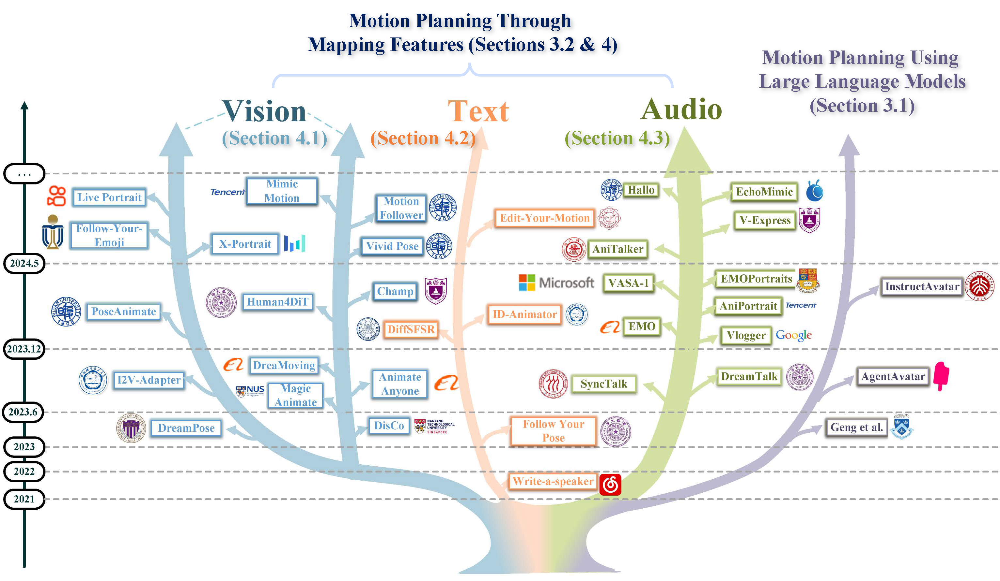

<h1 align="center">🎉 Awesome-Human-Motion-Video-Generation 🔥</h1>

---

<p align="center">
     <a href="assets/Human Motion Video Generation A Survey.pdf">

</p>
    
<p align="center">
<a href='assets/Human Motion Video Generation A Survey.pdf'>

</a>


<br>


---

<details><summary>🎁 >>>>>>>> [English Introduction] <<<<<<<<<< </summary>


> This project provides a thorough summary of the latest advancements in the field of 2D digital human motion video generation, covering papers, datasets, and code repositories.
> 
> The repository is organized into three main conditions: Vision-driven, Text-driven, and Audio-driven, while also considering LLM Planning Papers.
>
> Unlike previous summaries, this project clearly outlines the five key stages in the field of digital human video generation:
> 
> 🌑 Stage 1: Input Phase. Clarifying the driving source (Vision, Text, Audio) and driving region (Part, Holistic), where "Part" mainly refers to the face;
> 
> 🌒 Stage 2: Motion planning Phase. Most work involves feature mapping to learn motion mappings, while a few works use large language models (LLMs) for motion planning;
> 
> 🌓 Stage 3: Motion Video Generation Phase;
> 
> 🌔 Stage 4: Video Refinement Phase, focusing on optimizing specific parts such as the face, lips, teeth, and hands;
> 
> 🌕 Stage 5: Acceleration Phase, aiming to speed up training and deployment inference as much as possible, with the goal of achieving real-time output.
> 
> 🎉 We welcome everyone to contribute your research and submit PRs to collectively advance the technology of human motion video generation. 
> 
> If you have any questions, feel free to contact us at (**WinniyGD@outlook.com**), and we will respond as soon as possible. Additionally, we warmly welcome new members from related fields to join us, learn together, and make endless progress!

</details>


<details><summary>🏆 >>>>>>>> [🧡中文简要介绍💜] <<<<<<<<<< </summary>

<br>

> 
> 
> 本项目认真总结了👍2D数字人动作视频生成👏相关领域的最新进展，包括论文、数据集和代码库。
> 
> Repo以 Vision-driven、Text-driven、Audio-driven 三大方向作以总结，同时考虑 LLM Planning 前沿论文。
> 
> 分类时，我们定义Audio>Text>Vision优先级，当出现文本不出现音频时，归纳为Text-Driven方法，当文本音频同时出现时，归纳为Audio-Driven方法，以此类推。
> 
> 区别于以往的总结，项目明确总结了数字人视频生成领域的五大阶段：
> 
> 🌑 第1阶段 明确驱动源（Vision、Text、Audio）与驱动区域（Part、Holistic），其中Part主要以脸部为主；
> 
> 🌒 第2阶段 动作规划阶段，大多数工作以特征Mapping学习动作映射，少部分工作以大语言模型LLMs进行动作规划；
> 
> 🌓 第3阶段 人体视频生成，大部分工作以Diffusion Models为基础，少部分工作以Transformer为基础；
> 
> 🌔 第4阶段 视频优化阶段，针对脸部、嘴唇、牙齿、手部单独做Refinement优化；
> 
> 🌕 第5阶段 加速输出阶段，尽可能地加速训练与部署推理，目标Real-Time实时输出。

> 🔑本项目由六位核心成员全力推进：
> 
>     - 薛海威（清华大学，负责人）
>     - 罗向阳（清华大学）
>     - 胡璋昊（爱丁堡大学）
>     - 张鑫（西安交通大学）
>     - 向迅之（中国科学院大学）
>     - 戴语琴（南京理工大学）
> 
> 💖核心综述由以下老师全力支持并悉心指导：
> 
>     - 刘健庄老师（中国科学院深圳先进技术研究院）
>     - 张镇嵩博士（华为诺亚2012实验室）
>     - 李明磊博士（零一万物）
>     - 马飞博士（光明实验室）
>     - 吴志勇老师（清华大学/香港中文大学）


> 另外，非常感谢常恒师兄 (https://github.com/SwiftieH)、余伟江师兄的支持！


> 🎉 欢迎大家贡献自己的研究成果并PR，共同推动人体运动视频生成技术的发展。
> 
> 如有任何问题，可以随时联系邮件（**WinniyGD@outlook.com**），我们会尽快回复。
> 
> 另外，我们非常欢迎有新的相关领域的同学一同加入我们，一起学习，无限进步！

</details>

---

<p align="center">
🍦 Exploring the latest papers in human motion video generation. 🍦
<br>
<br>
<br>

</p>

<br>


---


## Introduction

This work delves into Human Motion Video Generation, covering areas such as Portrait Animation, Dance Video Generation, Text2Face, Text2MotionVideo, and Talking Head. We believe this will be the most comprehensive survey to date on human motion video generation technologies. Please stay tuned! 😘😁😀

It's important to note that for the sake of clarity, we have excluded 3DGS and NeRF technologies (2D-3D-2D) from the scope of this paper.

### ✨You are welcome to provide us your work with a topic related to human motion video generation.✨

If you discover any missing work or have any suggestions, 

please feel free to submit a pull request or contact us ( WinniyGD@outlook.com ). 

We will promptly add the missing papers to this repository.

###  🍔 Highlight 

[1] We decompose human motion video generation into five key phases, covering all subtasks across various driving sources and body regions. To the best of our knowledge, this is the first survey to offer such a comprehensive framework for human motion video generation.

[2] We provide an in-depth analysis of human motion video generation from both motion planning and motion generation perspectives, a
dimension that has been underexplored in existing reviews.

[3] We clearly delineate established baselines and evaluation metrics, offering detailed insights into the key challenges shaping this field.

[4] We present a set of potential future research directions, aimed at inspiring and guiding researchers in the field of human motion video generation.

###  🕑 Timeline



## 💙 News

**[2024/09/06] [V1.6 Vision](https://github.com/Winn1y/Awesome-Human-Motion-Video-Generation): Update Method.**

[](https://arxiv.org/abs/2409.03270) SVP (Audio, Fine-Grained Animation)

[](https://arxiv.org/abs/2409.03605) SegTalker (Audio, Lip Synchronization)

----

[2024/09/05] [V1.5 Vision](https://github.com/Winn1y/Awesome-Human-Motion-Video-Generation/tree/1.5): Update Method.

[](https://arxiv.org/abs/2409.02634) Loopy (Audio, Fine-Grained Animation)

[](https://arxiv.org/abs/2409.02657) PoseTalk (Audio, Fine-Grained Animation)


----

[2024/09/04] [V1.4 Vision](https://github.com/Winn1y/Awesome-Human-Motion-Video-Generation/tree/1.4): Update Method.

[](https://arxiv.org/abs/2409.01876) CyberHost (Audio, Holistic Human Driving)

----

[2024/08/28] [V1.3 Vision](https://github.com/Winn1y/Awesome-Human-Motion-Video-Generation/tree/1.3): Update Method.

[](https://arxiv.org/abs/2408.14975) MegActor-Σ (Audio, Fine-Grained Animation)

[](https://arxiv.org/abs/2408.15159) Rafael Azevedo et al. (Text, Text2Face)

----

[2024/08/27] [V1.2 Vision](https://github.com/Winn1y/Awesome-Human-Motion-Video-Generation/tree/1.2): Update Method.

[](https://arxiv.org/abs/2408.13674) GenCA (Text, Text2Face)

----

[2024/08/26] [V1.1 Vision](https://github.com/Winn1y/Awesome-Human-Motion-Video-Generation/tree/1.1): Update Method.

[](https://arxiv.org/abs/2408.13049)  G3FA (Vision, Portrait Animation)

----

[2024/08/21] V1.0 Vision: Initialize the repository. If you find it helpful to you, welcome to star and share our work.


## Vision Guidance

<details open><summary>Part (Face) || Portrait Animation</summary>


|  **Date**  	|                                     **Title**                                     	|                                        **arXiv Link**                                       	| **Motion  Representation** 	|   **Backbone**  	|                  **Venue**                 	|
|:----------:	|:---------------------------------------------------------------------------------:	|:-------------------------------------------------------------------------------------------:	|:--------------------------:	|:---------------:	|:------------------------------------------:	|
| 2024 06 04 	|  Follow-Your-Emoji: Fine-Controllable and Expressive Freestyle Portrait Animation 	| [](https://arxiv.org/abs/2406.01900) 	|          KeyPoint          	| Diffusion Model 	|              SIGGRAPH ASIA2024             	|
| 2024 07 05 	| LivePortrait: Efficient Portrait Animation with Stitching and Retargeting Control 	| [](https://arxiv.org/abs/2407.03168) 	|          KeyPoint          	| Encoder-Decoder 	|                    arXiv                   	|
| 2024 07 09 	|      MobilePortrait: Real-Time One-Shot Neural Head Avatars on Mobile Devices     	| [](https://arxiv.org/abs/2407.05712) 	|          KeyPoint          	| Diffusion Model 	|                    arXiv                   	|
| 2023 10 16 	|      Expression Domain Translation Network for Cross-domain Head Reenactment      	| [](https://arxiv.org/abs/2310.10073) 	|     3D Parameterization    	| Encoder-Decoder 	|                 ICASSP 2024                	|
| 2023 03 26 	|   OTAvatar : One-shot Talking Face Avatar with Controllable Tri-plane Rendering   	| [](https://arxiv.org/abs/2303.14662) 	|     3D Parameterization    	| Encoder-Decoder 	|                  CVPR 2023                 	|
| 2023 03 27 	|             OmniAvatar: Geometry-Guided Controllable 3D Head Synthesis            	| [](https://arxiv.org/abs/2303.15539) 	|           Latent           	|       GAN       	|                  CVPR 2023                 	|
| 2023 12 04 	|        Unsupervised High-Resolution Portrait Gaze Correction and Animation        	| [](https://arxiv.org/abs/2207.00256) 	|           Latent           	|       GAN       	| IEEE Transactions on Image Processing 2022 	|
| 2024 06 08 	|       MegActor: Harness the Power of Raw Video for Vivid Portrait Animation       	| [](https://arxiv.org/abs/2405.20851) 	|           Latent           	| Diffusion Model 	|                    arXiv                   	|
| 2024 05 31 	|    X-Portrait: Expressive Portrait Animation with Hierarchical Motion Attention   	| [](https://arxiv.org/abs/2403.15931) 	|           Latent           	| Diffusion Model 	|              ACM SIGGRAPH 2024             	|
| 2024 08 26 	|                    G3FA: Geometry-guided GAN for Face Animation                   	| [](https://arxiv.org/abs/2408.13049) 	|           Latent           	|       GAN       	|                    arXiv                   	|
| 2024 03 23 	|                   FaceOff: A Video-to-Video Face Swapping System                  	| [](https://arxiv.org/abs/2208.09788) 	|           Latent           	| Encoder-Decoder 	|                  WACV 2023                 	|

</details>


<details><summary>Holistic Human || Video-Guided Dance Video Generation </summary>

|  **Date**  	|                                     **Title**                                    	|                                        **arXiv Link**                                       	| **Motion  Representation** 	|   **Backbone**  	|                       **Venue**                      	|
|:----------:	|:--------------------------------------------------------------------------------:	|:-------------------------------------------------------------------------------------------:	|:--------------------------:	|:---------------:	|:----------------------------------------------------:	|
| 2018 08 22 	|                                Everybody dance now                               	| [](https://arxiv.org/abs/1808.07371) 	|          KeyPoint          	|       GAN       	|                       ICCV 2019                      	|
| 2023 07 02 	| Bidirectional Temporal Diffusion Model for Temporally Consistent Human Animation 	| [](https://arxiv.org/abs/2307.00574) 	|           Region           	| Diffusion Model 	|                         arXiv                        	|
| 2023 02 22 	|      Human MotionFormer: Transferring Human Motions with Vision Transformers     	| [](https://arxiv.org/abs/2302.11306) 	|          KeyPoint          	| Encoder-Decoder 	|                         arXiv                        	|
| 2024 06 24 	|                     Do As I Do: Pose Guided Human Motion Copy                    	| [](https://arxiv.org/abs/2406.16601) 	|          KeyPoint          	|       GAN       	| IEEE Transactions on Dependable and Secure Computing 	|

</details>
  


<details><summary>Holistic Human || Pose-Guided Dance Video Generation </summary>

|   **Date**  	|                                             **Title**                                            	|                                        **arXiv Link**                                       	| **Motion  Representation** 	|   **Backbone**  	|   **Venue**  	|
|:-----------:	|:------------------------------------------------------------------------------------------------:	|:-------------------------------------------------------------------------------------------:	|:--------------------------:	|:---------------:	|:------------:	|
|  2023 06 30 	|                                               DisCo                                              	| [](https://arxiv.org/abs/2307.00040) 	|          KeyPoint          	| Diffusion Model 	|   CVPR2024   	|
|  2023 10 20 	|                                        Dance Your Latents                                        	| [](https://arxiv.org/abs/2310.14780) 	|          KeyPoint          	| Diffusion Model 	|     arxiv    	|
|  2023 11 18 	|                                             MagicPose                                            	| [](https://arxiv.org/abs/2311.12052) 	|          KeyPoint          	| Diffusion Model 	|   ICML2024   	|
|  2023 11 27 	|                                           MagicAnimate                                           	| [](https://arxiv.org/abs/2311.16498) 	|           Region           	| Diffusion Model 	|   CVPR2024   	|
|  2023 11 28 	|                                          Animate Anyone                                          	| [](https://arxiv.org/abs/2311.17117) 	|          KeyPoint          	| Diffusion Model 	|   CVPR2024   	|
|  2023 12 08 	|                                            DreaMoving                                            	| [](https://arxiv.org/abs/2312.05107) 	|          KeyPoint          	| Diffusion Model 	|     arxiv    	|
|  2023 12 27 	|                                            I2V-Adapter                                           	| [](https://arxiv.org/abs/2312.16693) 	|          KeyPoint          	| Diffusion Model 	| SIGGRAPH2024 	|
|  2024 05 26 	|   Disentangling Foreground and Background Motion for Enhanced Realism in Human Video Generation  	| [](https://arxiv.org/abs/2405.16393) 	|          KeyPoint          	| Diffusion Model 	|     arxiv    	|
|  2024 05 28 	|          VividPose: Advancing Stable Video Diffusion for Realistic Human Image Animation         	| [](https://arxiv.org/abs/2405.18156) 	|          KeyPoint          	| Diffusion Model 	|     arxiv    	|
| 2024 05 30  	|            MotionFollower: Editing Video Motion via Lightweight Score-Guided Diffusion           	| [](https://arxiv.org/abs/2405.20325) 	|          KeyPoint          	| Diffusion Model 	|     arxiv    	|
|  2024 06 03 	|      UniAnimate: Taming Unified Video Diffusion Models for Consistent Human Image animation      	| [](https://arxiv.org/pdf/2406.01188) 	|          KeyPoint          	| Diffusion Model 	|     arxiv    	|
|  2024 06 05 	| Follow-Your-Pose v2: Multiple-Condition Guided Character Image Animation for Stable Pose Control 	| [](https://arxiv.org/abs/2406.03035) 	|          KeyPoint          	| Diffusion Model 	|     arxiv    	|
|  2024 05 27 	|             Human4DiT: Free-view Human Video Generation with 4D Diffusion Transformer            	| [](https://arxiv.org/abs/2405.17405) 	|     3D Parameterization    	|   Transformer   	|     arxiv    	|
|  2024 01 19 	|                            Synthesizing Moving People with 3D Control                            	| [](https://arxiv.org/abs/2401.10889) 	|     3D Parameterization    	| Diffusion Model 	|     arxiv    	|
|  2024 03 21 	|       Champ: Controllable and Consistent Human Image Animation with 3D Parametric Guidance       	| [](https://arxiv.org/abs/2403.14781) 	|     3D Parameterization    	| Diffusion Model 	|   ECCV 2024  	|
|  2024 07 01 	|    MimicMotion: High-Quality Human Motion Video Generation with Confidence-aware Pose Guidance   	| [](https://arxiv.org/abs/2406.19680) 	|          KeyPoint          	| Diffusion Model 	|     arxiv    	|
|  2024 07 15 	|   TCAN: Animating Human Images with Temporally Consistent Pose Guidance using Diffusion Models   	| [](https://arxiv.org/abs/2407.09012) 	|          KeyPoint          	| Diffusion Model 	|     arxiv    	|
|  2024 07 16 	|     IDOL: Unified Dual-Modal Latent Diffusion for Human-Centric Joint Video-Depth Generation     	| [](https://arxiv.org/abs/2407.10937) 	|           Region           	| Diffusion Model 	|     arxiv    	|

</details>


<details><summary>Holistic Human || Try-On Video Generation </summary>

|  **Date**  	|                                           **Title**                                          	|                                        **arXiv Link**                                       	| **Motion  Representation** 	|   **Backbone**  	| **Venue** 	|
|:----------:	|:--------------------------------------------------------------------------------------------:	|:-------------------------------------------------------------------------------------------:	|:--------------------------:	|:---------------:	|:---------:	|
| 2024 04 26 	| Tunnel Try-on: Excavating Spatial-temporal Tunnels for High-quality Virtual Try-on in Videos 	| [](https://arxiv.org/abs/2404.17571) 	|          KeyPoint          	| Diffusion Model 	|   arxiv   	|
| 2024 05 20 	|                      ViViD: Video Virtual Try-on using Diffusion Models                      	| [](https://arxiv.org/abs/2405.11794) 	|           Region           	| Diffusion Model 	|   arxiv   	|
| 2024 07 16 	|   WildVidFit: Video Virtual Try-On in the Wild via Image-Based Controlled Diffusion Models   	| [](https://arxiv.org/abs/2407.10625) 	|          KeyPoint          	| Diffusion Model 	|   arxiv   	|

</details>


<details><summary>Holistic Human || Pose2Video </summary>


|  **Date**  	|                                  **Title**                                  	|                                        **arXiv Link**                                       	| **Motion  Representation** 	|   **Backbone**  	| **Venue** 	|
|:----------:	|:---------------------------------------------------------------------------:	|:-------------------------------------------------------------------------------------------:	|:--------------------------:	|:---------------:	|:---------:	|
| 2023 04 12 	|                                  DreamPose                                  	| [](https://arxiv.org/abs/2304.06025) 	|           Region           	| Diffusion Model 	| ICCV 2023 	|
| 2024 03 25 	|      Make-Your-Anchor: A Diffusion-based 2D Avatar Generation Framework     	| [](https://arxiv.org/abs/2403.16510) 	|     3D Parameterization    	| Diffusion Model 	| CVPR 2024 	|
| 2024 04 21 	| PoseAnimate: Zero-shot high fidelity pose controllable character animation  	| [](https://arxiv.org/abs/2404.13680) 	|          KeyPoint          	| Diffusion Model 	|   arxiv   	|

</details>


## Text Guidance

<details open><summary>Part (Face) || Text2Face</summary>

|  **Date**  	|                                                        **Title**                                                        	|                                        **arXiv Link**                                       	| **Motion  Representation** 	|   **Backbone**  	|   **Venue**  	|
|:----------:	|:-----------------------------------------------------------------------------------------------------------------------:	|:-------------------------------------------------------------------------------------------:	|:--------------------------:	|:---------------:	|:------------:	|
| 2021 05 07 	|                       Write-a-speaker: Text-based Emotional and Rhythmic Talking-head Generation                        	| [](https://arxiv.org/abs/2104.07995) 	|          KeyPoint          	|       GAN       	|   AAAI 2021  	|
| 2023 12 11 	| Neural Text to Articulate Talk: Deep Text to Audiovisual Speech Synthesis<br>achieving both Auditory and Photo-realism  	| [](https://arxiv.org/abs/2312.06613) 	|     3D Parameterization    	|       GAN       	|     arXiv    	|
| 2023 06 03 	|                        VideoComposer: Compositional Video Synthesis with Motion Controllability                         	| [](https://arxiv.org/abs/2306.02018) 	|           Region           	| Diffusion Model 	| NeurIPS 2024 	|
| 2024 04 23 	|                            ID-Animator: Zero-Shot Identity-Preserving Human Video Generation                            	| [](https://arxiv.org/abs/2404.15275) 	|           Latent           	| Diffusion Model 	|     arXiv    	|
| 2023 12 09 	|                              FT2TF: First-Person Statement Text-To-Talking Face Generation                              	| [](https://arxiv.org/abs/2312.05430) 	|           Latent           	| Encoder-Decoder 	|     arXiv    	|
| 2024 05 16 	|                         Faces that Speak: Jointly Synthesising Talking Face and Speech from Text                        	| [](https://arxiv.org/abs/2405.10272) 	|           Latent           	|       GAN       	|   CVPR 2024  	|
| 2024 08 27 	|                   GenCA: A Text-conditioned Generative Model for Realistic and Drivable Codec Avatars                   	| [](https://arxiv.org/abs/2408.13674) 	|     3D Parameterization    	| Encoder-Decoder 	|     arXiv    	|
| 2024 08 28 	|       Empowering Sign Language Communication: Integrating Sentiment and Semantics for Facial Expression Synthesis       	| [](https://arxiv.org/abs/2408.15159) 	|          KeyPoint          	| Diffusion Model 	|     arXiv    	|
| 2020 03 01 	|                                        Towards Automatic Face-to-Face Translation                                       	| [](https://arxiv.org/abs/2003.00418) 	|           Latent           	| Encoder-Decoder 	|  ACM MM 2019 	|


</details>

<details><summary>Holistic Human || Text2MotionVideo</summary>

|   **Date**  	|                                                       **Title**                                                      	|                                        **arXiv Link**                                       	| **Motion  Representation** 	|   **Backbone**  	| **Venue** 	|
|:-----------:	|:--------------------------------------------------------------------------------------------------------------------:	|:-------------------------------------------------------------------------------------------:	|:--------------------------:	|:---------------:	|:---------:	|
|  2024 05 08 	|                                                   Edit-Your-Motion                                                   	| [](https://arxiv.org/abs/2405.04496) 	|          KeyPoint          	| Diffusion Model 	|   arXiv   	|
|  2023 08 15 	|             Dancing Avatar: Pose and Text-Guided Human Motion Videos Synthesis with Image Diffusion Model            	| [](https://arxiv.org/abs/2308.07749) 	|          KeyPoint          	| Diffusion Model 	|   arXiv   	|
|  2023 04 03 	|                                                   Follow Your Pose                                                   	| [](https://arxiv.org/abs/2304.01186) 	|          KeyPoint          	| Diffusion Model 	| AAAI 2024 	|
|  2023 08 28 	|                                MagicAvatar: Multimodal Avatar Generation and Animation                               	| [](https://arxiv.org/abs/2308.14748) 	|          KeyPoint          	| Diffusion Model 	|   arXiv   	|
|  2024 02 14 	|                                Magic-Me: Identity-Specific Video Customized Diffusion                                	| [](https://arxiv.org/abs/2402.09368) 	|           Latent           	| Diffusion Model 	|   arXiv   	|
|  2024 04 07 	|            Towards a Simultaneous and Granular Identity-Expression Control in Personalized Face Generation           	| [](https://arxiv.org/abs/2401.01207) 	|           Latent           	| Diffusion Model 	| CVPR 2024 	|
|  2023 04 17 	|                                  Text2Performer: Text-Driven Human Video Generation                                  	| [](https://arxiv.org/abs/2304.08483) 	|           Latent           	| Encoder-Decoder 	| ICCV 2023 	|
| 2024 04 14  	|                                                     LoopAnimate                                                      	| [](https://arxiv.org/abs/2404.09172) 	|           Latent           	| Diffusion Model 	|   arXiv   	|
|  2023 07 10 	|             AnimateDiff: Animate Your Personalized Text-to-Image Diffusion Models without Specific Tuning            	| [](https://arxiv.org/abs/2307.04725) 	|           Latent           	| Diffusion Model 	|   arXiv   	|
|  2023 12 06 	|                           AnimateZero: Video Diffusion Models are Zero-Shot Image Animators                          	| [](https://arxiv.org/abs/2312.03793) 	|           Latent           	| Diffusion Model 	|   arXiv   	|
|  2023 10 30 	|                        VideoCrafter1: Open Diffusion Models for High-Quality Video Generation                        	| [](https://arxiv.org/abs/2310.19512) 	|           Latent           	| Diffusion Model 	|   arXiv   	|
|  2023 07 19 	|                         TokenFlow: Consistent Diffusion Features for Consistent Video Editing                        	| [](https://arxiv.org/abs/2307.10373) 	|           Latent           	| Diffusion Model 	|   arXiv   	|
|  2023 03 23 	|                    Text2Video-Zero: Text-to-Image Diffusion Models are Zero-Shot Video Generators                    	| [](https://arxiv.org/abs/2303.13439) 	|           Latent           	| Diffusion Model 	| ICCV 2023 	|
|  2023 02 02 	|                               Dreamix: Video Diffusion Models are General Video Editors                              	| [](https://arxiv.org/abs/2302.01329) 	|           Latent           	| Diffusion Model 	|   arXiv   	|
|  2023 12 05 	| BIVDiff: A Training-Free Framework for General-Purpose Video Synthesis via Bridging Image and Video Diffusion Models 	| [](https://arxiv.org/abs/2312.02813) 	|           Latent           	| Diffusion Model 	| CVPR 2024 	|
|  2023 12 30 	|                                Dual-Stream Diffusion Net for Text-to-Video Generation                                	| [](https://arxiv.org/abs/2308.08316) 	|           Latent           	| Diffusion Model 	|   arXiv   	|
|  2024 02 22 	|                                                   Customize-A-Video                                                  	| [](https://arxiv.org/abs/2402.14780) 	|           Latent           	| Diffusion Model 	|   arXiv   	|
|  2023 12 12 	|                   LatentMan: Generating Consistent Animated Characters using Image Diffusion Models                  	| [](https://arxiv.org/abs/2312.07133) 	|     3D Parameterization    	| Diffusion Model 	|   arXiv   	|
|  2024 08 15 	|                    DeCo: Decoupled Human-Centered Diffusion Video Editing with Motion Consistency                    	| [](https://arxiv.org/abs/2408.07481) 	|     3D Parameterization    	| Diffusion Model 	|   arXiv   	|
|  2024 01 17 	|                  VideoCrafter2: Overcoming Data Limitations for High-Quality Video Diffusion Models                  	| [](https://arxiv.org/abs/2401.09047) 	|           Latent           	| Diffusion Model 	| CVPR 2024 	|

</details>


## Audio Guidance

<details open><summary>Part (Face) || Lip Synchronization</summary>


|  **Date**  	|                                       **Title**                                      	|                                              **arXiv Link**                                             	| **Motion  Representation** 	|   **Backbone**  	| **Venue** 	|
|:----------:	|:------------------------------------------------------------------------------------:	|:-------------------------------------------------------------------------------------------------------:	|:--------------------------:	|:---------------:	|:---------:	|
| 2020 09 17 	|                      Photorealistic Audio-driven Video Portraits                     	| [](https://ieeexplore.ieee.org/document/9199560) 	|           Region           	| Encoder-Decoder 	|  TVCG2020 	|
| 2019 05 09 	|     Hierarchical cross-modal talking face generation with dynamic pixel-wise loss    	|       [](https://arxiv.org/abs/1905.03820)       	|          KeyPoint          	|  Autoregressive 	|  CVPR2019 	|
| 2019 05 08 	|                Capture, Learning, and Synthesis of 3D Speaking Styles                	|       [](https://arxiv.org/abs/1905.03079)       	|           Latent           	| Encoder-Decoder 	|  CVPR2019 	|
| 2024 08 13 	|               Style-Preserving Lip Sync via Audio-Aware Style Reference              	|       [](https://arxiv.org/abs/2408.05412)       	|           Latent           	| Diffusion Model 	|   arxiv   	|
| 2024 09 06 	| SegTalker: Segmentation-based Talking Face Generation with Mask-guided Local Editing 	|       [](https://arxiv.org/abs/2409.03605)       	|           Latent           	|       GAN       	|   arxiv   	|
| 2023 01 10 	|         Speech driven video editing via an audio-conditioned diffusion model         	|       [](https://arxiv.org/abs/2301.04474)       	|           Latent           	| Diffusion Model 	|  IVC2024  	|


</details>


<details open><summary>Part (Face) || Head Pose Driving</summary>

|  **Date**  	|                                                            **Title**                                                            	|                                                            **arXiv Link**                                                           	|  **Motion  Representation**  	|   **Backbone**  	|                              **Venue**                              	|
|:----------:	|:-------------------------------------------------------------------------------------------------------------------------------:	|:-----------------------------------------------------------------------------------------------------------------------------------:	|:----------------------------:	|:---------------:	|:-------------------------------------------------------------------:	|
| 2017 08 20 	|                           Predicting head pose from speech with a conditional variational autoencoder                           	| [](https://ueaeprints.uea.ac.uk/id/eprint/64846/1/greenwood_Interspeech.pdf) 	|            Latent            	|  Autoregressive 	|                               ISCA2017                              	|
| 2020 04 27 	|                                         MakeItTalk: Speaker-Aware Talking-Head Animation                                        	|                     [](https://arxiv.org/abs/2004.12992)                     	|           KeyPoint           	|  Autoregressive 	|                               TOG2020                               	|
| 2021 09 22 	|                              Live Speech Portraits: Real-Time Photorealistic Talking-Head Animation                             	|                     [](https://arxiv.org/abs/2109.10595)                     	|           KeyPoint           	|  Autoregressive 	|                               TOG2021                               	|
| 2022 01 03 	|                 DFA-NeRF: Personalized Talking Head Generation via Disentangled Face Attributes Neural Rendering                	|                     [](https://arxiv.org/abs/2201.00791)                     	|           KeyPoint           	| Encoder-Decoder 	|                                arxiv                                	|
| 2023 01 10 	|                       DiffTalk: Crafting Diffusion Models for Generalized Audio-Driven Portraits Animation                      	|                     [](https://arxiv.org/abs/2301.03786)                     	|           KeyPoint           	| Diffusion Model 	|                               CVPR2023                              	|
| 2023 05 15 	|                         Identity-Preserving Talking Face Generation with Landmark and Appearance Priors                         	|                     [](https://arxiv.org/abs/2305.08293)                     	|       Muliti-Conditions      	|   Transformer   	|                               CVPR2023                              	|
| 2023 05 01 	|                       GeneFace++: Generalized and Stable Real-Time Audio-Driven 3D Talking Face Generation                      	|                     [](https://arxiv.org/abs/2305.00787)                     	|           KeyPoint           	| Encoder-Decoder 	|                                arxiv                                	|
| 2022 03 16 	|                  StyleHEAT: One-Shot High-Resolution Editable Talking Face Generation via Pre-trained StyleGAN                  	|                     [](https://arxiv.org/abs/2203.04036)                     	|            Region            	|       GAN       	|                               ECCV2022                              	|
| 2023 02 20 	|                    SD-NeRF: Towards Lifelike Talking Head Animation via Spatially-Adaptive Dual-Driven NeRFs                    	|               [](https://ieeexplore.ieee.org/document/10229247)              	|      3D Parameterization     	| Encoder-Decoder 	|                               TMM2023                               	|
| 2024 03 26 	|                                                           AniPortrait                                                           	|                     [](https://arxiv.org/abs/2403.17694)                     	| KeyPoint,3D Parameterization 	| Diffusion Model 	|                                arxiv                                	|
| 2024 06 17 	|                                                       Make Your Actor Talk                                                      	|                     [](https://arxiv.org/abs/2406.08096)                     	|           KeyPoint           	| Diffusion Model 	|                                arxiv                                	|
| 2024 06 12 	|               Emotional Conversation: Empowering Talking Faces with Cohesive Expression, Gaze and Pose Generation               	|                     [](https://arxiv.org/abs/2406.07895)                     	| KeyPoint,3D Parameterization 	| Diffusion Model 	|                                arxiv                                	|
| 2024 06 27 	|      RealTalk: Real-time and Realistic Audio-driven Face Generation with 3D Facial Prior-guided Identity Alignment Network      	|                     [](https://arxiv.org/abs/2406.18284)                     	|      3D Parameterization     	|   Transformer   	|                                arxiv                                	|
| 2021 03 20 	|                             AD-NeRF: Audio Driven Neural Radiance Fields for Talking Head Synthesis                             	|                     [](https://arxiv.org/abs/2103.11078)                     	|            Latent            	| Encoder-Decoder 	|                               ICCV2021                              	|
| 2022 01 19 	|                              Semantic-Aware Implicit Neural Audio-Driven Video Portrait Generation                              	|                     [](https://arxiv.org/abs/2201.07786)                     	|            Latent            	| Encoder-Decoder 	|                               ECCV2022                              	|
| 2021 04 22 	|                 Pose-Controllable Talking Face Generation by Implicitly Modularized Audio-Visual Representation                 	|                     [](https://arxiv.org/abs/2104.11116)                     	|            Latent            	|       GAN       	|                               CVPR2021                              	|
| 2023 01 06 	|                              Diffused Heads: Diffusion Models Beat GANs on Talking-Face Generation                              	|                     [](https://arxiv.org/abs/2301.03396)                     	|            Latent            	| Diffusion Model 	|                                CVPR24                               	|
| 2023 03 30 	|                    DAE-Talker: High Fidelity Speech-Driven Talking Face Generation with Diffusion Autoencoder                   	|                     [](https://arxiv.org/abs/2303.17550)                     	|            Latent            	| Diffusion Model 	|                               ACM MM23                              	|
| 2023 11 26 	|                                            GAIA: Zero-shot Talking Avatar Generation                                            	|                     [](https://arxiv.org/abs/2311.15230)                     	|            Latent            	| Diffusion Model 	|                              ICLR 2024                              	|
| 2023 12 09 	| R2-Talker: Realistic Real-Time Talking Head Synthesis with Hash Grid Landmarks Encoding and Progressive Multilayer Conditioning 	|                     [](https://arxiv.org/abs/2312.05572)                     	|           KeyPoint           	| Encoder-Decoder 	|                                arxiv                                	|
| 2024 05 06 	|                                                            AniTalker                                                            	|                     [](https://arxiv.org/abs/2405.03121)                     	|            Latent            	| Encoder-Decoder 	|                                arxiv                                	|
| 2024 07 12 	|                    EchoMimic: Lifelike Audio-Driven Portrait Animations through Editable Landmark Conditions                    	|                     [](https://arxiv.org/abs/2407.08136)                     	|           KeyPoint           	| Diffusion Model 	|                                arxiv                                	|
| 2024 07 29 	|                     LinguaLinker: Audio-Driven Portraits Animation with Implicit Facial Control Enhancement                     	|                     [](https://arxiv.org/abs/2407.18595)                     	|            Latent            	| Diffusion Model 	|                                arxiv                                	|
| 2024 08 03 	|                Landmark-guided Diffusion Model for High-fidelity and Temporally Coherent Talking Head Generation                	|                     [](https://arxiv.org/abs/2408.01732)                     	|           KeyPoint           	| Diffusion Model 	|                                arxiv                                	|
| 2024 08 13 	|                      High-fidelity and Lip-synced Talking Face Synthesis via Landmark-based Diffusion Model                     	|                     [](https://arxiv.org/abs/2408.05416)                     	|           KeyPoint           	| Diffusion Model 	|                                arxiv                                	|
| 2022 11 22 	|                       Real-time Neural Radiance Talking Portrait Synthesis via Audio-spatial Decomposition                      	|                     [](https://arxiv.org/abs/2211.12368)                     	|            Latent            	| Encoder-Decoder 	|                                arxiv                                	|
| 2023 05 04 	|               High-fidelity Generalized Emotional Talking Face Generation with Multi-modal Emotion Space Learning               	|                     [](https://arxiv.org/abs/2305.02572)                     	|            Latent            	|   Transformer   	|                               CVPR2023                              	|
| 2024 04 02 	|                              EDTalk: Efficient Disentanglement for Emotional Talking Head Synthesis                             	|                     [](https://arxiv.org/abs/2404.01647)                     	|            Latent            	|       GAN       	|                               ECCV2024                              	|
| 2023 11 29 	|                                                             SyncTalk                                                            	|                     [](https://arxiv.org/abs/2311.17590)                     	|      3D Parameterization     	| Encoder-Decoder 	|                                CVPR24                               	|
| 2024 04 23 	|                                                         TalkingGaussian                                                         	|                     [](https://arxiv.org/abs/2404.15264)                     	|      3D Parameterization     	| Encoder-Decoder 	|                               ECCV2024                              	|
| 2024 04 28 	|                                                          GaussianTalker                                                         	|                     [](https://arxiv.org/abs/2404.14037)                     	|      3D Parameterization     	| Encoder-Decoder 	|                              ACM MM2024                             	|
| 2021 12 10 	|                                 FaceFormer: Speech-Driven 3D Facial Animation with Transformers                                 	|                     [](https://arxiv.org/abs/2112.05329)                     	|            Latent            	|   Transformer   	|                                CVPR22                               	|
| 2023 09 15 	|           Towards the generation of synchronized and believable non-verbal facial behaviors of a talking virtual agent          	|                     [](https://arxiv.org/abs/2311.12804)                     	|            Latent            	|       GAN       	|                              ICMI 2023                              	|
| 2023 10 17 	|                 CorrTalk: Correlation Between Hierarchical Speech and Facial Activity Variances for 3D Animation                	|                     [](https://arxiv.org/abs/2310.11295)                     	|            Latent            	| Encoder-Decoder 	| IEEE Transactions on Circuits and Systems for Video Technology 2024 	|

</details>


<details><summary>Holistic Human || Audio-Driven Holistic Body Driving</summary>

|  **Date**  	|                                       **Title**                                      	|                                        **arXiv Link**                                       	| **Motion  Representation** 	|   **Backbone**  	|   **Venue**  	|
|:----------:	|:------------------------------------------------------------------------------------:	|:-------------------------------------------------------------------------------------------:	|:--------------------------:	|:---------------:	|:------------:	|
| 2024 03 13 	|                                        VLOGGER                                       	| [](https://arxiv.org/abs/2403.08764) 	|     3D Parameterization    	| Diffusion Model 	|     arXiv    	|
| 2022 12 05 	|                    Audio-Driven Co-Speech Gesture Video Generation                   	| [](https://arxiv.org/abs/2212.02350) 	|           Latent           	| Encoder-Decoder 	| NeurIPS 2022 	|
| 2024 09 04 	| CyberHost: Taming Audio-driven Avatar Diffusion Model with Region Codebook Attention 	| [](https://arxiv.org/abs/2409.01876) 	|           Latent           	| Diffusion Model 	|     arXiv    	|
| 2024 05 15 	|         Dance Any Beat: Blending Beats with Visuals in Dance Video Generation        	| [](https://arxiv.org/abs/2405.09266) 	|           Region           	| Diffusion Model 	|     arXiv    	|
</details>


<details><summary>Part (Face) || Fine-Grained Style and Emotion-Driven Animation</summary>


|  **Date**  	|                                                **Title**                                               	|                                        **arXiv Link**                                       	| **Motion  Representation** 	|          **Backbone**          	|               **Venue**              	|
|:----------:	|:------------------------------------------------------------------------------------------------------:	|:-------------------------------------------------------------------------------------------:	|:--------------------------:	|:------------------------------:	|:------------------------------------:	|
| 2021 05 19 	|                                 Audio-Driven Emotional Video Portraits                                 	| [](https://arxiv.org/abs/2104.07452) 	|          KeyPoint          	|         Encoder-Decoder        	|               CVPR 2021              	|
| 2023 06 10 	|              StyleTalk: One-shot Talking Head Generation with Controllable Speaking Styles             	| [](https://arxiv.org/abs/2301.01081) 	|     3D Parameterization    	|         Encoder-Decoder        	|               AAAI 2023              	|
| 2024 01 16 	|                    Real3D-Portrait: One-shot Realistic 3D Talking Portrait Synthesis                   	| [](https://arxiv.org/abs/2401.08503) 	|     3D Parameterization    	|         Encoder-Decoder        	|               ICLR 2024              	|
| 2023 12 15 	|         DreamTalk: When Expressive Talking Head Generation Meets Diffusion Probabilistic Models        	| [](https://arxiv.org/abs/2312.09767) 	|     3D Parameterization    	|         Diffusion Model        	|                 arXiv                	|
| 2024 06 04 	|          V-Express: Conditional Dropout for Progressive Training of Portrait Video Generation          	| [](https://arxiv.org/abs/2406.02511) 	|          KeyPoint          	|         Diffusion Model        	|                 arXiv                	|
| 2021 07 21 	|           Speech Driven Talking Face Generation from a Single Image and an Emotion Condition           	| [](https://arxiv.org/abs/2008.03592) 	|           Latent           	|               GAN              	| IEEE Transactions on Multimedia 2021 	|
| 2022 11 22 	|                                                SadTalker                                               	| [](https://arxiv.org/abs/2211.12194) 	|           Latent           	|         Diffusion Model        	|               CVPR 2023              	|
| 2022 11 28 	|        High-fidelity Facial Avatar Reconstruction from Monocular Video with<br>Generative Priors       	| [](https://arxiv.org/abs/2211.15064) 	|     3D Parameterization    	|               GAN              	|               CVPR 2023              	|
| 2023 05 09 	|         StyleSync: High-Fidelity Generalized and Personalized Lip Sync in Style-based Generator        	| [](https://arxiv.org/abs/2305.05445) 	|           Latent           	|               GAN              	|               CVPR 2023              	|
| 2024 02 27 	|                                                   EMO                                                  	| [](https://arxiv.org/abs/2402.17485) 	|           Latent           	|         Diffusion Model        	|                 arXiv                	|
| 2024 03 04 	|    FaceChain-ImagineID: Freely Crafting High-Fidelity Diverse Talking Faces from Disentangled Audio    	| [](https://arxiv.org/abs/2403.01901) 	|           Latent           	|         Diffusion Model        	|               CVPR 2024              	|
| 2024 04 29 	|                                              EMOPortraits                                              	| [](https://arxiv.org/abs/2404.19110) 	|           Latent           	|               GAN              	|               CVPR 2024              	|
| 2024 05 12 	|          Listen, Disentangle, and Control: Controllable Speech-Driven Talking Head Generation          	| [](https://arxiv.org/abs/2405.07257) 	|           Latent           	|               GAN              	|                 arXiv                	|
| 2024 06 16 	|             Hallo: Hierarchical Audio-Driven Visual Synthesis for Portrait Image Animation             	| [](https://arxiv.org/abs/2406.08801) 	|           Latent           	|         Diffusion Model        	|                 arXiv                	|
| 2024 04 16 	|                                                 VASA-1                                                 	| [](https://arxiv.org/abs/2404.10667) 	|           Latent           	| Diffusion Model By Transformer 	|                 arXiv                	|
| 2024 08 20 	|   S^3D-NeRF: Single-Shot Speech-Driven Neural Radiance Field for High Fidelity Talking Head Synthesis  	| [](https://arxiv.org/abs/2408.09347) 	|           Latent           	|         Encoder-Decoder        	|                 arXiv                	|
| 2024 08 20 	|       FD2Talk: Towards Generalized Talking Head Generation with Facial Decoupled Diffusion Model       	| [](https://arxiv.org/abs/2408.09384) 	|     3D Parameterization    	|         Diffusion Model        	|              ACMMM 2024              	|
| 2024 08 28 	|   MegActor-Σ: Unlocking Flexible Mixed-Modal Control in Portrait Animation with Diffusion Transformer  	| [](https://arxiv.org/abs/2408.14975) 	|           Latent           	| Diffusion Model By Transformer 	|                 arXiv                	|
| 2024 09 05 	|               Loopy: Taming Audio-Driven Portrait Avatar with Long-Term Motion Dependency              	| [](https://arxiv.org/abs/2409.02634) 	|           Latent           	|         Diffusion Model        	|                 arXiv                	|
| 2024 09 05 	| PoseTalk: Text-and-Audio-based Pose Control and Motion Refinement for One-Shot Talking Head Generation 	| [](https://arxiv.org/abs/2409.02657) 	|           Latent           	|         Diffusion Model        	|                 arXiv                	|
| 2024 09 06 	|                     SVP: Style-Enhanced Vivid Portrait Talking Head Diffusion Model                    	| [](https://arxiv.org/abs/2409.03270) 	|           Latent           	|         Diffusion Model        	|                 arXiv                	|
| 2024 08 07 	|       ReSyncer: Rewiring Style-based Generator for Unified Audio-Visually Synced Facial Performer      	| [](https://arxiv.org/abs/2408.03284) 	|           Latent           	|         Encoder-Decoder        	|               ECCV 2024              	|
| 2023 01 05 	|                  Expressive Speech-driven Facial Animation with controllable emotions                  	| [](https://arxiv.org/abs/2301.02008) 	|           Latent           	|         Encoder-Decoder        	|              ICMEW 2023              	|
| 2024 01 28 	|             Media2Face: Co-speech Facial Animation Generation With Multi-Modality Guidance             	| [](https://arxiv.org/abs/2401.15687) 	|           Latent           	|         Diffusion Model        	|                 arXiv                	|


</details>


## LLM for Motion Planning

<details open><summary>LLM for 2D</summary>

|  **Date**  	|                                    **Title**                                   	|                                        **arXiv Link**                                       	| **Motion  Representation** 	|   **Backbone**  	|  **Tasks**  	| **Venue** 	|
|:----------:	|:------------------------------------------------------------------------------:	|:-------------------------------------------------------------------------------------------:	|:--------------------------:	|:---------------:	|:-----------:	|:---------:	|
| 2023 01 26 	|              Affective Faces for Goal-Driven Dyadic Communication              	| [](https://arxiv.org/abs/2301.10939) 	|     3D Parameterization    	| Diffusion Model 	|  Text2Face  	|   arxiv   	|
| 2023 11 29 	| Disentangling Planning, Driving and Rendering for Photorealistic Avatar Agents 	| [](https://arxiv.org/abs/2311.17465) 	|           Latent           	| Encoder-Decoder 	| Taking Head 	|   arxiv   	|
| 2024 05 24 	|  InstructAvatar: Text-Guided Emotion and Motion Control for Avatar Generation  	| [](https://arxiv.org/abs/2405.15758) 	|           Latent           	| Diffusion Model 	| Taking Head 	|   arxiv   	|

</details>


<details><summary>LLM for 3D</summary>

|  **Date**  	|                                               **Title**                                               	|                                        **arXiv Link**                                       	| **Motion  Representation** 	|   **Backbone**  	|      **Tasks**      	|   **Venue**  	|
|:----------:	|:-----------------------------------------------------------------------------------------------------:	|:-------------------------------------------------------------------------------------------:	|:--------------------------:	|:---------------:	|:-------------------:	|:------------:	|
| 2023 08 21 	|                                  Can Language Models Learn to Listen?                                 	| [](https://arxiv.org/abs/2308.10897) 	|           Latent           	|  Autoregressive 	| Listener Generation 	|   ICCV 2023  	|
| 2023 06 19 	|                    MotionGPT: Finetuned LLMs Are General-Purpose Motion Generators                    	| [](https://arxiv.org/abs/2306.10900) 	|           Latent           	|  Autoregressive 	|    Text2Motion3D    	|   AAAI 2024  	|
| 2023 11 27 	|              InterControl: Generate Human Motion Interactions by Controlling Every Joint              	| [](https://arxiv.org/abs/2311.15864) 	|           Latent           	| Diffusion Model 	|    Text2Motion3D    	|     arXiv    	|
| 2023 11 28 	|       AvatarGPT: All-in-One Framework for Motion Understanding, Planning, Generation and Beyond       	| [](https://arxiv.org/abs/2311.16468) 	|           Latent           	|  Autoregressive 	|    Text2Motion3D    	|   CVPR 2024  	|
| 2023 12 07 	|                Digital Life Project: Autonomous 3D Characters with Social Intelligence                	| [](https://arxiv.org/abs/2312.04547) 	|           Latent           	| Diffusion Model 	|    Text2Motion3D    	|   CVPR 2024  	|
| 2023 12 19 	|              MotionScript: Natural Language Descriptions for Expressive 3D Human Motions              	| [](https://arxiv.org/abs/2312.12634) 	|           Latent           	| Diffusion Model 	|    Text2Motion3D    	|     arXiv    	|
| 2023 12 22 	|                   Plan, Posture and Go: Towards Open-World Text-to-Motion Generation                  	| [](https://arxiv.org/abs/2312.14828) 	|           Latent           	|  Autoregressive 	|    Text2Motion3D    	|     arXiv    	|
| 2024 08 20 	| Combo: Co-speech holistic 3D human motion generation and efficient customizable adaptation in harmony 	| [](https://arxiv.org/abs/2408.09397) 	|           Latent           	| Encoder-Decoder 	|    Text2Motion3D    	|     arXiv    	|
| 2023 12 22 	|                 FineMoGen: Fine-Grained Spatio-Temporal Motion Generation and Editing                 	| [](https://arxiv.org/abs/2312.15004) 	|           Latent           	|  Autoregressive 	|    Text2Motion3D    	| NeurIPS 2024 	|

</details>


## Cite The Survey
If you find our survey and repository useful for your research project, please consider citing our paper:

```bibtex
    Waiting......

```


## Contributing

Contributions are welcome! Please feel free to create an issue or open a pull request with your contributions.


<table>
  <tbody>
    <tr>
      <td align="center" valign="top" width="14.28%"><a href="https://github.com/Winn1y"><br /><sub><b>Haiwei Xue</b></sub></a><br /><a href="https://github.com/Winn1y" title="Code">💻</a> <a href="https://github.com/Winn1y" title="Design">🎨</a> <a href="https://github.com/Winn1y" title="Ideas, Planning, & Feedback">🤔</a></td>
      <td align="center" valign="top" width="14.28%"><a href="https://github.com/luoxyhappy"><br /><sub><b>Xiangyang Luo</b></sub></a><br /><a href="https://github.com/luoxyhappy" title="Bug reports">🐛</a></td>
      <td align="center" valign="top" width="14.28%"><a href="https://hu-xiaobai.github.io/"><br /><sub><b>Zhanghao Hu</b></sub></a><br /><a href="https://hu-xiaobai.github.io/" title="Bug reports">🥙</a> <a href="https://hu-xiaobai.github.io/" title="Code">💻</a></td>
      </tr>
    <tr>
       <td align="center" valign="top" width="14.28%"><a href="https://github.com/XinZhang0526"><br /><sub><b>Xin Zhang</b></sub></a><br /><a href="https://github.com/XinZhang0526" title="Bug reports">😘🎪</a> <a href="https://github.com/XinZhang0526" title="Code">😍</a></td>
       <td align="center" valign="top" width="14.28%"><a href="https://github.com/xunzhi99"><br /><sub><b>Xunzhi Xiang</b></sub></a><br /><a href="https://github.com/xunzhi99" title="Bug reports">🚄</a> <a href="https://github.com/xunzhi99" title="Code">😍</a></td>
       <td align="center" valign="top" width="14.28%"><a href="https://da1yuqin.github.io"><br /><sub><b>Yuqin Dai</b></sub></a><br /><a href="https://da1yuqin.github.io" title="Bug reports">😘</a> <a href="https://da1yuqin.github.io" title="Code">👸</a></td>
    </tr>
  </tbody>
</table>


## License

This project is licensed under the MIT License - see the [LICENSE](LICENSE) file for details.

## Acknowledgements

We would like to acknowledge the contributions of all researchers and developers in the field of human motion video generation. Their work has been instrumental in the advancement of this technology.


